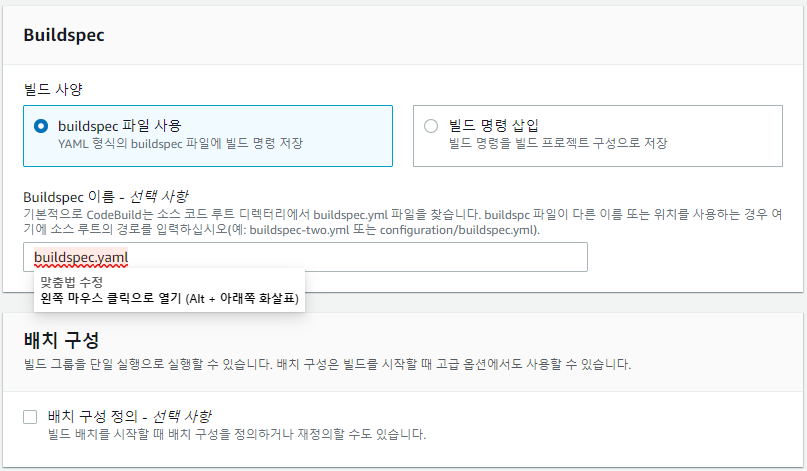
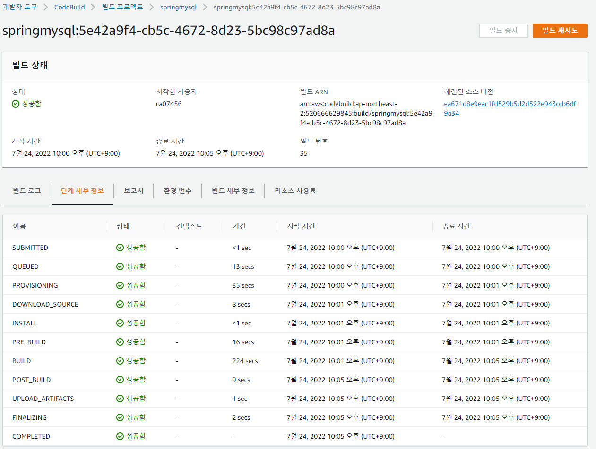

# AWS CodeBuild
- Code Build 및 Test

## 특징
- 소스 컴파일, 테스트, S/W 패키지를 생성하는 완전 관리형 빌드 서비스
- 소스코드 컴파일해주고 빌드해주는 서비스 (Source Repository의 buildspec.yml 파일대로 빌드)
- Java, Node.js, Python, Go, Ruby, Android 및 Docker 를 위한 사전 구성된 빌드 환경 제공
- Docker 이미지 또는 Public Docker Hub 에 업로드하거나 Amazon ECR(EC2 Container Registry) 를 관리하기 위해 Runtime 과 도구를 패키징하여 자신만의 빌드 환경을 구성할 수 있음
- DevOps, CI/CD 수행에 필요한 CI/CD Workflow 를 손쉽게 구현할 수 있음  

## 참고
> [ECR 샘플 CodeBuild](https://docs.aws.amazon.com/ko_kr/codebuild/latest/userguide/sample-ecr.html)  
> [Amazon Elastic File SystemAWS CodeBuild](https://docs.aws.amazon.com/ko_kr/codebuild/latest/userguide/sample-efs.html)  
> [CodeDeploy 샘플 CodeBuild](https://docs.aws.amazon.com/ko_kr/codebuild/latest/userguide/sample-codedeploy.html)  
> [AWS CodePipeline를 와 통합 CodeBuild 배치 빌드](https://docs.aws.amazon.com/ko_kr/codebuild/latest/userguide/sample-pipeline-batch.html)  
> [Terraform AWS CodeBuild](https://github.com/aws-ia/terraform-aws-codebuild)  
> [Terraform with AWS intermediate](https://intermediate.inflearn.devopsart.dev/)
  > [AWS Provisioning](https://github.com/DevopsArtFactory/aws-provisioning)  
> [Intro to AWS CodeCommit, CodePipeline, and CodeBuild with Terraform](https://medium.com/swlh/intro-to-aws-codecommit-codepipeline-and-codebuild-with-terraform-179f4310fe07)   
> [`AWS CodePipeline, 빌드/배포 파이프라인 구성하기`](https://jsonobject.tistory.com/539)  
> [`AWS CodeBuild로 빌드하기(SpringBoot, Maven`)](https://happy-jjang-a.tistory.com/92)  
> [AWS CodeBuild 문제 해결](https://docs.aws.amazon.com/ko_kr/codebuild/latest/userguide/troubleshooting.html#troubleshooting-maven-repos)  

## 동작
### 1. Source Control
- CodeCommit, GitHub, S3

### 2. Build Project
- 소스코드위치, 빌드 환경, 빌드명령, 빌드 결과 저장위치 등 빌드 실행 방식 정의

### 3. Build Environment
- Build Project 기반으로 빌드 환경 생성 및 buildspec 실행
  - Invoke
  - Checkout
  - Build

### 4. Artifacts(빌드 결과물) 저장
- S3
- ECR/Docker Hub

### 5. Notification
- SNS  로 알림 전송, 빌드과정 Log CodeBuild/CloudWatch Logs 에 전송

### 6. Destroy Build Environment 
- Build Environment 삭제 및 Clean Up


## AWS CodeBuild 의 BuildSpec
- 빌드를 실행할 때 사용하는 YAML 형태의 빌드 명령 및 관련 설정의 모음
- `phase`
  - pre_build, build, post_build 3단계에 걸쳐 실행될 명령어 목록을 작성  

  | Phase | Description | Example |
  |:---|:---|:---|
  | Install | 환경 준비나 패키지 설치 작업 수행 | 테스트 프레임워크 설치 |  
  | pre_build | 로그인 단계 또는 종속성 설치와 같은 빌드 전에 실행할 명령 | Amazon ECR 로그인 후 Ruby 또는 npm 실행 |  
  | build | 컴파일 또는 실행 테스트와 같은 빌드 실행 | sbt, Mocha, RSpec 빌드 |  
  | post_build | 빌드의 성공 또는 실패에 따라 명령 실행 | JAR via Maven 빌드 또는 Amazon ECR 로 Docker 이미지 Push |  

- `cache`
  - 빌드 후 어떤 대상 폴더 및 파일을 캐시에 저장할지를 식별하는 역할
  - 특히, Gradle, Maven 빌드시 미리 관련 라이브러리가 캐시되어 있으면 재빌드시 속도가 10분 이상 단축되기 때문에 cache 지정은 필수
- `artifacts`
  - 빌드의 결과로 생성된 파일 목록을 의미
  - `imagedefinitions.json` 
    - 빌드 완료 후 배포 대상이 되는 컨테이너의 정보를 보관
    - 이 정보를 기반으로 Amazon ECS 서비스에 소속된 작업 정의를 개정
    - 서비스를 업데이트하는 과정을 자동으로 진행

### springboot
#### buildspec.yaml
```yaml
version: 0.2

phases:
  install:
    runtime-versions:
      java: corretto8

  pre_build:
    commands:
      - echo Noting to do in the pre build phase ...
      - REGION=ap-northeast-2
      - REPOSITORY_URI=520666629845.dkr.ecr.ap-northeast-2.amazonaws.com
      - IMAGE_NAME=springmysql
      - IMAGE_TAG=0.1.1
      - COMMIT_HASH=$(echo $CODEBUILD_RESOLVED_SOURCE_VERSION | cut -c 1-7)
      - BUILD_TAG=${COMMIT_HASH:=latest}
      - CONTAINER_NAME=springmysql
      - echo Logging in to Amazon ECR...
      - aws --version
      - $(aws ecr get-login --no-include-email --region ap-northeast-2)
      - aws ecr get-login-password --region $REGION | docker login -u AWS --password-stdin $REPOSITORY_URI
    
  build:
    commands:
      - echo starting build stage
      - mvn package
      - mvn install
      - docker tag $REPOSITORY_URI/$IMAGE_NAME:$IMAGE_TAG $REPOSITORY_URI/$IMAGE_NAME:$BUILD_TAG


  post_build:
    commands:
      - pwd
      - echo build completed on `date`
      - echo Pushing the Docker images...
      - docker push $REPOSITORY_URI/$IMAGE_NAME:$IMAGE_TAG
      - docker push $REPOSITORY_URI/$IMAGE_NAME:$BUILD_TAG
      - printf '[{"name":"%s","imageUri":"%s"}]' $CONTAINER_NAME $REPOSITORY_URI/$IMAGE_NAME:$BUILD_TAG > imagedefinitions.json
      - cat imagedefinitions.json

artifacts:
  type: zip
  files:
    - target/*.jar
    - appspec.yml
    - scripts/**
  discard-paths: yes
 
cache:
  paths:
    - '/root/.m2/**/*'
    - '/root/.cache/pip/**/*'
    - '/root/.npm/**/*'
```

### node.js
#### buildspec.yaml
```yaml
version: 0.2

env:
  variables:
    NODE_ENV: "${env}"

phases:
  install:
    runtime-versions:
      nodejs: 12
    commands:
      - npm i
      # - npm run lint
  pre_build:
    commands:
      - npm i
      - npm run test
  build:
    commands:
      - npm run build

artifacts:
  files:
    - "**/*"
  name: "web-dist-${env}"
  base-directory: build

cache:
  paths:
    - /root/.npm/**/*
```

### 빌드 프로젝트 생성
- 개발자 도구 > CodeBuild > 빌드 프로젝트 > 빌드 프로젝트 생성
#### 프로젝트 구성
- 프로젝트 이름 : springmysql


#### 소스
- 리포지토리 : springmysql
- 참조 유형 : 브랜치
 - 브랜치 : master  
  

#### 환경
  

- 권한이 있음
  - `도커 이미지를 빌드하거나 빌드의 권한을 승격하려면 이 플래그를 활성화합니다.` 체크
- 서비스 역활  
  - `arn:aws:iam::520666629845:role/service-role/codebuild-springmysql-service-role`  
  


#### Buildspec
- Root 에 buildspec.yaml 사용하는 것으로 설정  
  


#### 배치 구성
- 선택 안함

#### 아티팩트
  
- 추가 구성
  - Maven Dependency 등을 저장해놓고 쓸 캐시 정보를 설정  
    

#### Log
- CloudWatch
  - 그룹 이름 : springmysql-07456  
  - 스트림 이름 : springmysql-stream  
- S3
  - 버킷 : springmysql-07456  
  - 경로 접두사 : log  
  


### VSCode BuildSpec 위치
  


### 빌드 결과  
#### 단계 세부 정보
  

#### CloudWatch Log
  


## [고급 설정 - AWS CodeBuild](https://docs.aws.amazon.com/ko_kr/codebuild/latest/userguide/setting-up.html)
### `codebuild-springmysql-service-role` 에 아래 정책 연결

- 기존 정책 `AWSCodeCommitFullAccess` 연결
  - ECR Login 을 위함
- 기존 정책 `AmazonEC2ContainerRegistryFullAccess` 연결
- 고객 관리형 정책 `CodeBuildAccessPolicy` 생성 후 연결
```yaml
{
    "Version": "2012-10-17",
    "Statement": [
        {
            "Sid": "CodeBuildAccessPolicy",
            "Effect": "Allow",
            "Action": [
                "codebuild:*"
            ],
            "Resource": "*"
        },
        {
            "Sid": "CodeBuildRolePolicy",
            "Effect": "Allow",
            "Action": [
                "iam:PassRole"
            ],
            "Resource": "arn:aws:iam::520666629845:role/role-name"
        },
        {
            "Sid": "CloudWatchLogsAccessPolicy",
            "Effect": "Allow",
            "Action": [
                "logs:FilterLogEvents",
                "logs:GetLogEvents"
            ],
            "Resource": "*"
        },
        {
            "Sid": "S3AccessPolicy",
            "Effect": "Allow",
            "Action": [
                "s3:CreateBucket",
                "s3:GetObject",
                "s3:List*",
                "s3:PutObject"
            ],
            "Resource": "*"
        },
        {
            "Sid": "S3BucketIdentity",
            "Effect": "Allow",
            "Action": [
                "s3:GetBucketAcl",
                "s3:GetBucketLocation"
            ],
            "Resource": "*"
        },
        {
            "Effect": "Allow",
            "Action": [
                "ecr:GetDownloadUrlForLayer",
                "ecr:PutImage",
                "ecr:InitiateLayerUpload",
                "ecr:UploadLayerPart",
                "ecr:CompleteLayerUpload",
                "ecr:DescribeRepositories",
                "ecr:GetRepositoryPolicy",
                "ecr:ListImages",
                "ecr:DeleteRepository",
                "ecr:BatchDeleteImage",
                "ecr:SetRepositoryPolicy",
                "ecr:DeleteRepositoryPolicy",
                "ecr:GetAuthorizationToken",
                "ecr:BatchCheckLayerAvailability",
                "ecr:BatchGetImage"
            ],
            "Resource": "*"
        }
    ]
}
```

## 역활 생성
### Role : CodeBuildServiceRole
### Policy : CodeBuildServiceRolePolicy


#### AddCodeBuildIAM 그룹 또는 IAM 사용자에 대한 액세스 권한
```
aws iam create-role --role-name CodeBuildServiceRole --assume-role-policy-document file://create-role.json
aws iam put-role-policy --role-name CodeBuildServiceRole --policy-name CodeBuildServiceRolePolicy --policy-document file://put-role-policy.json
```

#### 실행 결과
```
PS D:\workspace\AWSBasic\1.IaaS\CICD> aws iam create-role --role-name CodeBuildServiceRole --assume-role-policy-document file://create-role.json
{
    "Role": {
        "Path": "/",
        "RoleName": "CodeBuildServiceRole",
        "RoleId": "AROAXSORGI3KS6LTOWYUR",
        "Arn": "arn:aws:iam::520666629845:role/CodeBuildServiceRole",
        "CreateDate": "2022-07-24T08:47:00+00:00",
        "AssumeRolePolicyDocument": {
            "Version": "2012-10-17",
            "Statement": [
                {
                    "Effect": "Allow",
                    "Principal": {
                        "Service": "codebuild.amazonaws.com"
                    },
                    "Action": "sts:AssumeRole"
                }
            ]
        }
    }
}

PS D:\workspace\AWSBasic\1.IaaS\CICD> aws iam put-role-policy --role-name CodeBuildServiceRole --policy-name CodeBuildServiceRolePolicy --policy-document file://put-role-policy.json
PS D:\workspace\AWSBasic\1.IaaS\CICD> 
```

### AWS CLI 

```
PS D:\workspace\AWSBasic\1.IaaS\CICD> aws codebuild list-builds
{
    "ids": [
        "springmysql:705df739-1285-461a-8e0a-d11d6696420a",
        "springmysql:d20854b8-2502-4ab3-8998-93eb144d0c20",
        "springmysql:5cecd959-cd12-4b5a-afd0-a120786ee38c",
        "springmysql:73b4d201-ce95-4a5e-ac49-bd902cdd24cc",
        "springmysql:0ce05cfc-a412-4ebf-be58-01e0a6896d24",
        "springmysql:91ac6769-7ec3-445a-9d74-85978c349614",
        "springmysql:ccb9f946-2c51-4dcf-af66-db2cf1e2df30",
        "springmysql:22c9a4ac-3bb6-4918-8f50-121f62d8066e"
    ]
}
```