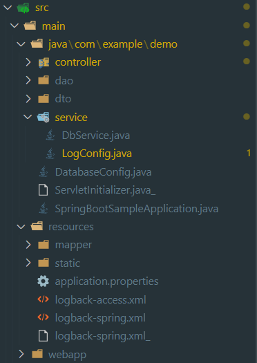

# AccessLog
- Access Log 를 Console 로 출력하기

## src 구조
  


## maven dependency 추가
```
<dependency>
    <groupId>ch.qos.logback</groupId>
    <artifactId>logback-access</artifactId>
    <version>1.2.3</version>
</dependency>
```

## log 구성파일
logback-access.xml
```xml
<?xml version="1.0" encoding="UTF-8"?>
<configuration>
  <appender name="STDOUT" class="ch.qos.logback.core.ConsoleAppender">
    <encoder>
      <!--
      <Pattern>combined</Pattern>
      <Pattern>[ACCESS] %h %l %u %t{yyyy-MM-dd HH:mm:ss.SSS} %s %b %i{Referer} %D ms</Pattern>
      <pattern>%fullRequest%n%n%fullResponse</pattern>
      -->      
      <Pattern>[ACCESS] %h %l %u %t{yyyy-MM-dd HH:mm:ss.SSS} %s %b %i{Referer} %D ms</Pattern>
    </encoder>
  </appender>

  <appender-ref ref="STDOUT" />
</configuration>
```

### Pattern
#### <pattern>%t{yyyy-MM-dd HH:mm:ss}\t%a\t%r\t%s\t%i{Referer}\t%i{User-Agent}\t%D\t%I</pattern>
```
2022-08-11 00:10:26     0:0:0:0:0:0:0:1 GET /index.html HTTP/1.1        200     http://localhost:8080/home.do   Mozilla/5.0 (Windows NT 10.0; Win64; x64) AppleWebKit/537.36 (KHTML, like Gecko) Chrome/104.0.0.0 Safari/537.36   1       http-nio-8080-exec-7      
2022-08-11 00:10:26     0:0:0:0:0:0:0:1 GET /img/apache_tomcat_logo.png HTTP/1.1        200     http://localhost:8080/index.html Mozilla/5.0 (Windows NT 10.0; Win64; x64) AppleWebKit/537.36 (KHTML, like Gecko) Chrome/104.0.0.0 Safari/537.36  4       http-nio-8080-exec-8
2022-08-11 00:10:26     0:0:0:0:0:0:0:1 GET /worddata.csv HTTP/1.1      200     http://localhost:8080/index.html        Mozilla/5.0 (Windows NT 10.0; Win64; x64) AppleWebKit/537.36 (KHTML, like Gecko) Chrome/104.0.0.0 Safari/537.36   5       http-nio-8080-exec-9
```

#### <Pattern>[ACCESS] %h %l %u %t{yyyy-MM-dd HH:mm:ss.SSS} %s %i{Referer} %b %D ms</Pattern>
```
[ACCESS] 127.0.0.1 - - 2022-08-11 00:28:05.081 200 http://localhost:8080/index.html 19735 2 ms
[ACCESS] 127.0.0.1 - - 2022-08-11 00:28:05.090 200 http://localhost:8080/index.html 682 1 ms
[ACCESS] 127.0.0.1 - - 2022-08-11 00:28:06.191 200 http://localhost:8080/index.html - 2 ms
[ACCESS] 127.0.0.1 - - 2022-08-11 00:28:06.205 200 http://localhost:8080/home.do 19735 2 ms
[ACCESS] 0:0:0:0:0:0:0:1 - - 2022-08-11 00:28:06.207 200 http://localhost:8080/home.do 11798 2 ms
```

#### <pattern>%fullRequest%n%n%fullResponse</pattern>
```
GET /home.do HTTP/1.1
host: localhost:8080
connection: keep-alive
sec-ch-ua: "Chromium";v="104", " Not A;Brand";v="99", "Google Chrome";v="104"
sec-ch-ua-mobile: ?0
sec-ch-ua-platform: "Windows"
upgrade-insecure-requests: 1
user-agent: Mozilla/5.0 (Windows NT 10.0; Win64; x64) AppleWebKit/537.36 (KHTML, like Gecko) Chrome/104.0.0.0 Safari/537.36       
accept: text/html,application/xhtml+xml,application/xml;q=0.9,image/avif,image/webp,image/apng,*/*;q=0.8,application/signed-exchange;v=b3;q=0.9
sec-fetch-site: same-origin
sec-fetch-mode: navigate
sec-fetch-user: ?1
sec-fetch-dest: document
referer: http://localhost:8080/index.html
accept-encoding: gzip, deflate, br
accept-language: ko,ko-KR;q=0.9,en-US;q=0.8,en;q=0.7,ja;q=0.6,zh-CN;q=0.5,zh-TW;q=0.4,zh-HK;q=0.3,zh;q=0.2
cookie: JSESSIONID=A099AFA83D78AF6902E02A27BFB9D4F0


HTTP/1.1 200 OK


GET /img/apache_tomcat_logo.png HTTP/1.1
host: localhost:8080
connection: keep-alive
sec-ch-ua: "Chromium";v="104", " Not A;Brand";v="99", "Google Chrome";v="104"
sec-ch-ua-mobile: ?0
user-agent: Mozilla/5.0 (Windows NT 10.0; Win64; x64) AppleWebKit/537.36 (KHTML, like Gecko) Chrome/104.0.0.0 Safari/537.36       
sec-ch-ua-platform: "Windows"
accept: image/avif,image/webp,image/apng,image/svg+xml,image/*,*/*;q=0.8
sec-fetch-site: same-origin
sec-fetch-mode: no-cors
sec-fetch-dest: image
referer: http://localhost:8080/home.do
accept-encoding: gzip, deflate, br
accept-language: ko,ko-KR;q=0.9,en-US;q=0.8,en;q=0.7,ja;q=0.6,zh-CN;q=0.5,zh-TW;q=0.4,zh-HK;q=0.3,zh;q=0.2
cookie: JSESSIONID=A099AFA83D78AF6902E02A27BFB9D4F0


HTTP/1.1 200 OK
Accept-Ranges: bytes
Keep-Alive: timeout=60
Cache-Control: no-store
Connection: keep-alive
Vary: Origin
Last-Modified: Wed, 10 Aug 2022 15:07:47 GMT
Content-Length: 19735
Date: Wed, 10 Aug 2022 15:09:56 GMT
Content-Type: image/png

[IMAGE CONTENTS SUPPRESSED]

GET /img/springboot-logo.png HTTP/1.1
host: localhost:8080
connection: keep-alive
sec-ch-ua: "Chromium";v="104", " Not A;Brand";v="99", "Google Chrome";v="104"
sec-ch-ua-mobile: ?0
user-agent: Mozilla/5.0 (Windows NT 10.0; Win64; x64) AppleWebKit/537.36 (KHTML, like Gecko) Chrome/104.0.0.0 Safari/537.36       
sec-ch-ua-platform: "Windows"
accept: image/avif,image/webp,image/apng,image/svg+xml,image/*,*/*;q=0.8
sec-fetch-site: same-origin
sec-fetch-mode: no-cors
sec-fetch-dest: image
referer: http://localhost:8080/home.do
accept-encoding: gzip, deflate, br
accept-language: ko,ko-KR;q=0.9,en-US;q=0.8,en;q=0.7,ja;q=0.6,zh-CN;q=0.5,zh-TW;q=0.4,zh-HK;q=0.3,zh;q=0.2
cookie: JSESSIONID=A099AFA83D78AF6902E02A27BFB9D4F0


HTTP/1.1 200 OK
Accept-Ranges: bytes
Keep-Alive: timeout=60
Cache-Control: no-store
Connection: keep-alive
Vary: Origin
Last-Modified: Wed, 10 Aug 2022 15:07:47 GMT
Content-Length: 11798
Date: Wed, 10 Aug 2022 15:09:56 GMT
Content-Type: image/png

[IMAGE CONTENTS SUPPRESSED]
```

## Source
LogConfig.java
```
package com.example.demo.service;

import ch.qos.logback.access.tomcat.LogbackValve;
import org.springframework.beans.factory.annotation.Autowired;

import org.springframework.boot.web.embedded.tomcat.TomcatContextCustomizer;
import org.springframework.boot.web.server.WebServerFactoryCustomizer;
import org.springframework.boot.web.embedded.tomcat.TomcatServletWebServerFactory;

import org.springframework.context.annotation.Bean;
import org.springframework.context.annotation.Configuration;
import org.springframework.core.io.ResourceLoader;


@Configuration
public class LogConfig {

    @Autowired
    ResourceLoader resourceLoader;

    @Bean
    public WebServerFactoryCustomizer embeddedServletContainerCustomizer() {
        return container -> {
            if (container instanceof TomcatServletWebServerFactory) {
                ((TomcatServletWebServerFactory) container).addContextCustomizers((TomcatContextCustomizer) context -> {
                    LogbackValve valve = new LogbackValve();
                    valve.setFilename(resourceLoader.getResource(ResourceLoader.CLASSPATH_URL_PREFIX + "logback-access.xml").getFilename());
                    context.getPipeline().addValve(valve);
                });
            }
        };
    }
}
```