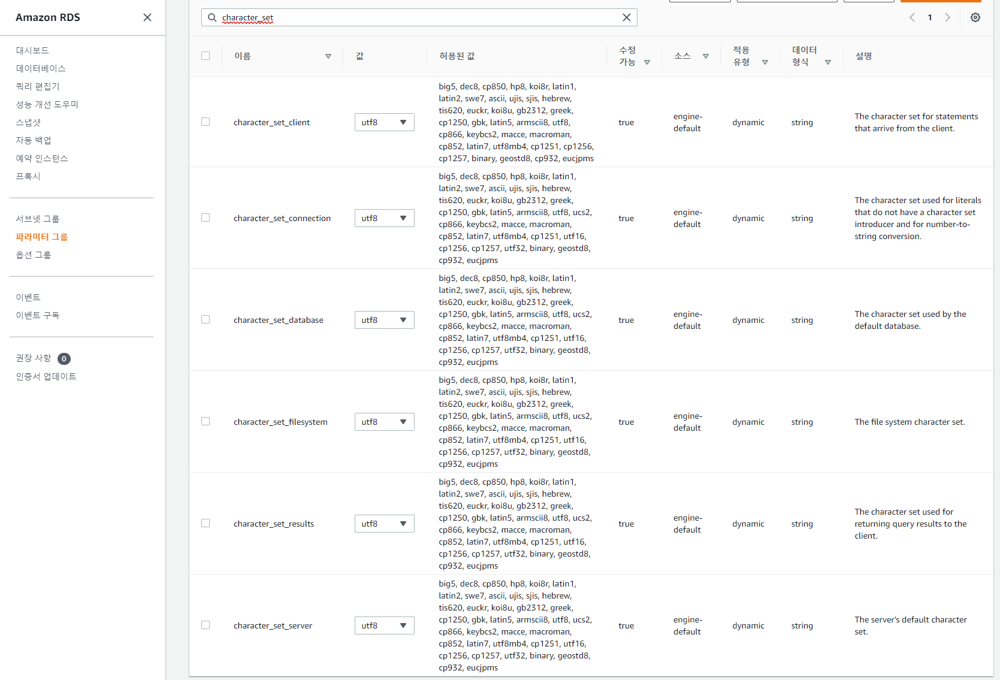
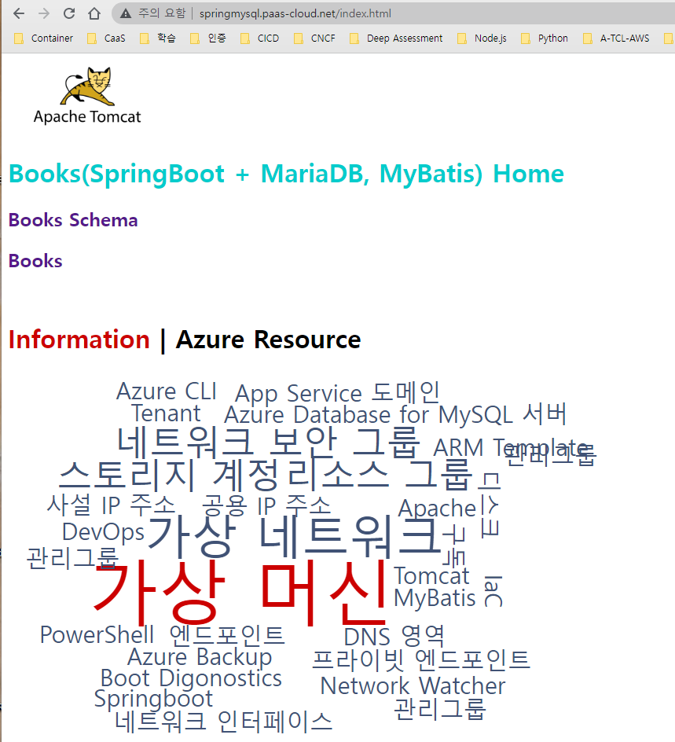
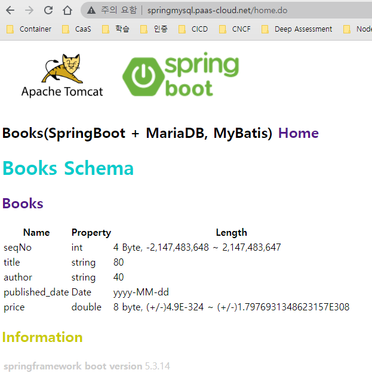
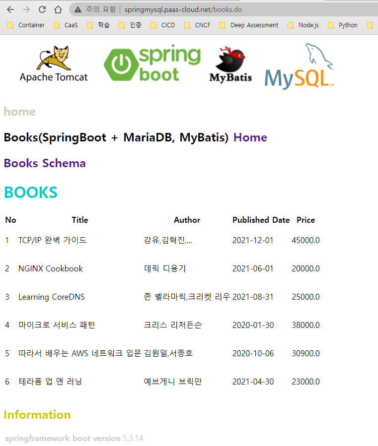

# Amazon Aurora MySQL

## Client 설치
```
[root@ip-100-64-8-139 resources]# yum install mysql
Loaded plugins: extras_suggestions, langpacks, priorities, update-motd
amzn2-core                                                                           | 3.7 kB  00:00:00
Resolving Dependencies
--> Running transaction check
---> Package mariadb.x86_64 1:5.5.68-1.amzn2 will be installed
--> Finished Dependency Resolution

Dependencies Resolved

============================================================================================================
 Package               Arch                 Version                          Repository                Size
============================================================================================================
Installing:
 mariadb               x86_64               1:5.5.68-1.amzn2                 amzn2-core               8.8 M

Transaction Summary
============================================================================================================
Install  1 Package

Total download size: 8.8 M
Installed size: 49 M
Is this ok [y/d/N]: y
Downloading packages:
mariadb-5.5.68-1.amzn2.x86_64.rpm                                                    | 8.8 MB  00:00:00
Running transaction check
Running transaction test
Transaction test succeeded
Running transaction
  Installing : 1:mariadb-5.5.68-1.amzn2.x86_64                                                          1/1
  Verifying  : 1:mariadb-5.5.68-1.amzn2.x86_64                                                          1/1

Installed:
  mariadb.x86_64 1:5.5.68-1.amzn2

Complete!
[root@ip-100-64-8-139 resources]# ls
application.properties  mapper  static
[root@ip-100-64-8-139 resources]# mysql -V
mysql  Ver 15.1 Distrib 5.5.68-MariaDB, for Linux (x86_64) using readline 5.1
[root@ip-100-64-8-139 resources]#

```

## Properties 설정
- 엔드 포인트 : rds-homepage-dev.cluster-ciwtbght62jx.ap-northeast-2.rds.amazonaws.com
- "application.properties"
```
spring.datasource.url=jdbc:mysql://rds-homepage-dev.cluster-ciwtbght62jx.ap-northeast-2.rds.amazonaws.com:3306/tutorial
spring.datasource.username=tutorial
spring.datasource.password=tutorial

```


## 테스트 DB 및 TABLE, DATA 입력

### 한글 문제
#### 파라미터 그룹에서 utf8 설정
- character_set 검색 후 utf8 로 편집 저장
  

#### 화면에서 한글이 깨지는 경우 기존 테이블 삭제 후 아래의 설정 후 테이블을 다시 만들고 데이터를 넣으면 정상적으로 출력됨
- show variables like 'c%';
-  alter database tutorial character set = 'utf8' collate = 'utf8_general_ci';
```
MySQL [mysql]> show variables like 'c%';
+--------------------------+---------------------------------------------------------------+
| Variable_name            | Value                                                         |
+--------------------------+---------------------------------------------------------------+
| character_set_client     | utf8                                                          |
| character_set_connection | utf8                                                          |
| character_set_database   | latin1                                                        |
| character_set_filesystem | binary                                                        |
| character_set_results    | utf8                                                          |
| character_set_server     | latin1                                                        |
| character_set_system     | utf8                                                          |
| character_sets_dir       | /rdsdbbin/oscar-5.7.mysql_aurora.2.10.2.0.4.0/share/charsets/ |
| check_proxy_users        | OFF                                                           |
| collation_connection     | utf8_general_ci                                               |
| collation_database       | latin1_swedish_ci                                             |
| collation_server         | latin1_swedish_ci                                             |
| completion_type          | NO_CHAIN                                                      |
| concurrent_insert        | AUTO                                                          |
| connect_timeout          | 10                                                            |
| core_file                | ON                                                            |
+--------------------------+---------------------------------------------------------------+
16 rows in set (0.00 sec)

MySQL [mysql]> alter database tutorial character set = 'utf8' collate = 'utf8_general_ci';
Query OK, 1 row affected (0.01 sec)

MySQL [mysql]>

```

### 접속
```
mysql -u mysqladm -p -h rds-homepage-dev.cluster-ciwtbght62jx.ap-northeast-2.rds.amazonaws.com --port 3306
```

- select version( );
- create database tutorial ;
- show databases ;
- 사용자 생성
```
create user 'tutorial'@'%' identified by 'tutorial';
```

- 테이블 생성
```
CREATE TABLE IF NOT EXISTS tutorial.Books
(
  SeqNo INT NOT NULL AUTO_INCREMENT,
  Title VARCHAR(20) NOT NULL,
  Author VARCHAR(20) NOT NULL,
  Price DOUBLE NOT NULL DEFAULT 0,
  published_date DATE NOT NULL,
  PRIMARY KEY(SeqNo)
);
```

- 데이터 넣기
```
insert into Books (Title, Author, Price, published_date)
values ('TCP/IP 완벽 가이드', '강유,김혁진,...', 45000, '2021-12-01');
insert into Books (Title, Author, Price, published_date)
values ('NGINX Cookbook', '데릭 디용기', 20000, '2021-06-01');
insert into Books (Title, Author, Price, published_date)
values ('Learning CoreDNS', '존 벨라마릭,크리켓 리우', 25000, '2021-08-31');
```
## 실행결과
```
MySQL [tutorial]> CREATE TABLE IF NOT EXISTS tutorial.books
    -> (
    ->   SeqNo INT NOT NULL AUTO_INCREMENT,
    ->   Title VARCHAR(20) NOT NULL,
    ->   Author VARCHAR(20) NOT NULL,
    ->   Price DOUBLE NOT NULL DEFAULT 0,
    ->   published_date DATE NOT NULL,
    ->   PRIMARY KEY(SeqNo)
    -> );
Query OK, 0 rows affected (0.03 sec)

MySQL [tutorial]> show tables ;
+--------------------+
| Tables_in_tutorial |
+--------------------+
| books              |
+--------------------+
1 row in set (0.00 sec)

MySQL [tutorial]> describe books ;
+----------------+-------------+------+-----+---------+----------------+
| Field          | Type        | Null | Key | Default | Extra          |
+----------------+-------------+------+-----+---------+----------------+
| SeqNo          | int(11)     | NO   | PRI | NULL    | auto_increment |
| Title          | varchar(20) | NO   |     | NULL    |                |
| Author         | varchar(20) | NO   |     | NULL    |                |
| Price          | double      | NO   |     | 0       |                |
| published_date | date        | NO   |     | NULL    |                |
+----------------+-------------+------+-----+---------+----------------+
5 rows in set (0.00 sec)

MySQL [tutorial]>
```
```
MySQL [(none)]> use mysql
Reading table information for completion of table and column names
You can turn off this feature to get a quicker startup with -A

Database changed
MySQL [mysql]> select host,user,authentication_string from user ;
+-----------+-----------+-------------------------------------------+
| host      | user      | authentication_string                     |
+-----------+-----------+-------------------------------------------+
| %         | mysqladm  | *FC689E8E1CB50A5DB5FF12A04DFE39C0ABC0E1CC |
| localhost | mysql.sys | *THISISNOTAVALIDPASSWORDTHATCANBEUSEDHERE |
| localhost | rdsadmin  | *F46D348D94ED6BB10869BD2C0F02066D3C0D690C |
| localhost | tutorial  | *A74AAAE111D6801C32E1042F47AC1DF0EE557559 |
+-----------+-----------+-------------------------------------------+
4 rows in set (0.03 sec)

MySQL [mysql]> grant all privileges on tutorial.* to 'tutorial'@'%';
Query OK, 0 rows affected, 1 warning (0.01 sec)

MySQL [mysql]> select host,user,authentication_string from user ;
+-----------+-----------+-------------------------------------------+
| host      | user      | authentication_string                     |
+-----------+-----------+-------------------------------------------+
| %         | mysqladm  | *FC689E8E1CB50A5DB5FF12A04DFE39C0ABC0E1CC |
| %         | tutorial  |                                           |
| localhost | mysql.sys | *THISISNOTAVALIDPASSWORDTHATCANBEUSEDHERE |
| localhost | rdsadmin  | *F46D348D94ED6BB10869BD2C0F02066D3C0D690C |
| localhost | tutorial  | *A74AAAE111D6801C32E1042F47AC1DF0EE557559 |
+-----------+-----------+-------------------------------------------+
5 rows in set (0.00 sec)

MySQL [mysql]> grant all privileges on tutorial.* to 'tutorial'@'%' by 'tutorial';
ERROR 1064 (42000): You have an error in your SQL syntax; check the manual that corresponds to your MySQL server version for the right syntax to use near 'by 'tutorial'' at line 1
MySQL [mysql]> grant all privileges on tutorial.* to 'tutorial'@'%' identified by 'tutorial';
Query OK, 0 rows affected, 1 warning (0.00 sec)

MySQL [mysql]> select host,user,authentication_string from user ;
+-----------+-----------+-------------------------------------------+
| host      | user      | authentication_string                     |
+-----------+-----------+-------------------------------------------+
| %         | mysqladm  | *FC689E8E1CB50A5DB5FF12A04DFE39C0ABC0E1CC |
| %         | tutorial  | *A74AAAE111D6801C32E1042F47AC1DF0EE557559 |
| localhost | mysql.sys | *THISISNOTAVALIDPASSWORDTHATCANBEUSEDHERE |
| localhost | rdsadmin  | *F46D348D94ED6BB10869BD2C0F02066D3C0D690C |
| localhost | tutorial  | *A74AAAE111D6801C32E1042F47AC1DF0EE557559 |
+-----------+-----------+-------------------------------------------+
5 rows in set (0.00 sec)

MySQL [mysql]> use tutorial
Reading table information for completion of table and column names
You can turn off this feature to get a quicker startup with -A

Database changed

MySQL [mysql]> flush privileges ;
Query OK, 0 rows affected (0.00 sec)

MySQL [tutorial]> show tables ;
+--------------------+
| Tables_in_tutorial |
+--------------------+
| books              |
+--------------------+
1 row in set (0.00 sec)

MySQL [tutorial]> alter table books rename Books ;
Query OK, 0 rows affected (0.03 sec)

MySQL [tutorial]> show tables ;
+--------------------+
| Tables_in_tutorial |
+--------------------+
| Books              |
+--------------------+
1 row in set (0.00 sec)

MySQL [tutorial]>

```

## java 설치
- sudo yum install -y java-1.8.0-openjdk-devel.x86_64
- java -version
```
[root@ip-100-64-8-139 springmysql]# java -version
openjdk version "1.8.0_312"
OpenJDK Runtime Environment (build 1.8.0_312-b07)
OpenJDK 64-Bit Server VM (build 25.312-b07, mixed mode)

```

## maven 설치
- yum install maven
```
[root@ip-100-64-8-139 springmysql]# mvn --version
Apache Maven 3.0.5 (Red Hat 3.0.5-17)
Maven home: /usr/share/maven
Java version: 1.8.0_312, vendor: Red Hat, Inc.
Java home: /usr/lib/jvm/java-1.8.0-openjdk-1.8.0.312.b07-1.amzn2.0.2.x86_64/jre
Default locale: en_US, platform encoding: UTF-8
OS name: "linux", version: "5.10.102-99.473.amzn2.x86_64", arch: "amd64", family: "unix"
[root@ip-100-64-8-139 springmysql]#
```

## Maven 빌드
- mvn package

### 실행
- mvn spring-boot:run

```
[root@ip-100-64-8-139 springmysql]# mvn spring-boot:run
[INFO] Scanning for projects...
[WARNING]
[WARNING] Some problems were encountered while building the effective model for com.example:SpringBootSample:war:0.0.1-SNAPSHOT
[WARNING] 'dependencies.dependency.(groupId:artifactId:type:classifier)' must be unique: org.springframework.boot:spring-boot-starter-tomcat:jar -> duplicate declaration of version (?) @ line 99, column 15
[WARNING] 'dependencyManagement.dependencies.dependency.exclusions.exclusion.artifactId' for org.quartz-scheduler:quartz:jar with value '*' does not match a valid id pattern. @ org.springframework.boot:spring-boot-dependencies:2.6.2, /root/.m2/repository/org/springframework/boot/spring-boot-dependencies/2.6.2/spring-boot-dependencies-2.6.2.pom, line 1595, column 25
[WARNING]
[WARNING] It is highly recommended to fix these problems because they threaten the stability of your build.
[WARNING]
[WARNING] For this reason, future Maven versions might no longer support building such malformed projects.
[WARNING]
[INFO]
[INFO] ------------------------------------------------------------------------
[INFO] Building SpringBootSample 0.0.1-SNAPSHOT
[INFO] ------------------------------------------------------------------------
[INFO]
[INFO] >>> spring-boot-maven-plugin:2.6.2:run (default-cli) @ SpringBootSample >>>
[INFO]
[INFO] --- maven-resources-plugin:3.1.0:resources (default-resources) @ SpringBootSample ---
[INFO] Using 'UTF-8' encoding to copy filtered resources.
[INFO] Copying 1 resource
[INFO] Copying 13 resources
[INFO]
[INFO] --- maven-compiler-plugin:3.8.1:compile (default-compile) @ SpringBootSample ---
[INFO] Nothing to compile - all classes are up to date
[INFO]
[INFO] --- maven-resources-plugin:3.1.0:testResources (default-testResources) @ SpringBootSample ---
[INFO] Using 'UTF-8' encoding to copy filtered resources.
[INFO] skip non existing resourceDirectory /root/springmysql/src/test/resources
[INFO]
[INFO] --- maven-compiler-plugin:3.8.1:testCompile (default-testCompile) @ SpringBootSample ---
[INFO] Nothing to compile - all classes are up to date
[INFO]
[INFO] <<< spring-boot-maven-plugin:2.6.2:run (default-cli) @ SpringBootSample <<<
[INFO]
[INFO] --- spring-boot-maven-plugin:2.6.2:run (default-cli) @ SpringBootSample ---
[INFO] Attaching agents: []
05:16:48.879 [Thread-0] DEBUG org.springframework.boot.devtools.restart.classloader.RestartClassLoader - Created RestartClassLoader org.springframework.boot.devtools.restart.classloader.RestartClassLoader@27b2d3dc

  .   ____          _            __ _ _
 /\\ / ___'_ __ _ _(_)_ __  __ _ \ \ \ \
( ( )\___ | '_ | '_| | '_ \/ _` | \ \ \ \
 \\/  ___)| |_)| | | | | || (_| |  ) ) ) )
  '  |____| .__|_| |_|_| |_\__, | / / / /
 =========|_|==============|___/=/_/_/_/
 :: Spring Boot ::                (v2.6.2)

2022-04-21 05:16:49.420  INFO 32137 --- [  restartedMain] c.e.demo.SpringBootSampleApplication     : Starting SpringBootSampleApplication using Java 1.8.0_312 on ip-100-64-8-139.ap-northeast-2.compute.internal with PID 32137 (/root/springmysql/target/classes started by root in /root/springmysql)
2022-04-21 05:16:49.421  INFO 32137 --- [  restartedMain] c.e.demo.SpringBootSampleApplication     : No active profile set, falling back to default profiles: default
2022-04-21 05:16:49.487  INFO 32137 --- [  restartedMain] .e.DevToolsPropertyDefaultsPostProcessor : Devtools property defaults active! Set 'spring.devtools.add-properties' to 'false' to disable
2022-04-21 05:16:49.488  INFO 32137 --- [  restartedMain] .e.DevToolsPropertyDefaultsPostProcessor : For additional web related logging consider setting the 'logging.level.web' property to 'DEBUG'
2022-04-21 05:16:50.994  INFO 32137 --- [  restartedMain] o.s.b.w.embedded.tomcat.TomcatWebServer  : Tomcat initialized with port(s): 8080 (http)
2022-04-21 05:16:51.013  INFO 32137 --- [  restartedMain] o.apache.catalina.core.StandardService   : Starting service [Tomcat]
2022-04-21 05:16:51.014  INFO 32137 --- [  restartedMain] org.apache.catalina.core.StandardEngine  : Starting Servlet engine: [Apache Tomcat/9.0.56]
2022-04-21 05:16:51.398  INFO 32137 --- [  restartedMain] org.apache.jasper.servlet.TldScanner     : At least one JAR was scanned for TLDs yet contained no TLDs. Enable debug logging for this logger for a complete list of JARs that were scanned but no TLDs were found in them. Skipping unneeded JARs during scanning can improve startup time and JSP compilation time.
2022-04-21 05:16:51.407  INFO 32137 --- [  restartedMain] o.a.c.c.C.[Tomcat].[localhost].[/]       : Initializing Spring embedded WebApplicationContext
2022-04-21 05:16:51.408  INFO 32137 --- [  restartedMain] w.s.c.ServletWebServerApplicationContext : Root WebApplicationContext: initialization completed in 1918 ms
2022-04-21 05:16:52.178  INFO 32137 --- [  restartedMain] o.s.b.a.w.s.WelcomePageHandlerMapping    : Adding welcome page: class path resource [static/index.html]
2022-04-21 05:16:52.322  INFO 32137 --- [  restartedMain] o.s.b.d.a.OptionalLiveReloadServer       : LiveReload server is running on port 35729
2022-04-21 05:16:52.372  INFO 32137 --- [  restartedMain] o.s.b.w.embedded.tomcat.TomcatWebServer  : Tomcat started on port(s): 8080 (http) with context path ''
2022-04-21 05:16:52.384  INFO 32137 --- [  restartedMain] c.e.demo.SpringBootSampleApplication     : Started SpringBootSampleApplication in 3.495 seconds (JVM running for 4.204)

```

  
  



