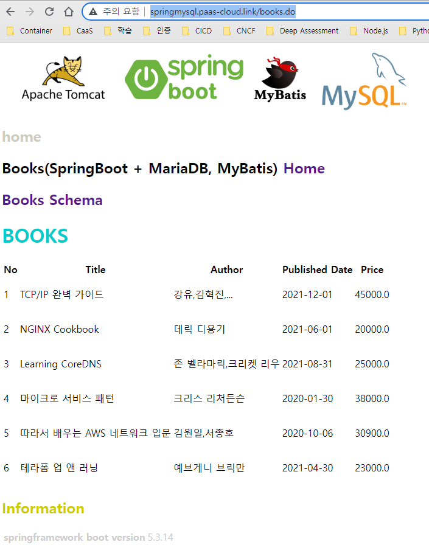

# Amazon Aurora MySQL

> [Amazon Aurora DB 클러스터에 연결](https://docs.aws.amazon.com/ko_kr/AmazonRDS/latest/AuroraUserGuide/Aurora.Connecting.html)  
> [Amazon Aurora 연결 관리](https://docs.aws.amazon.com/ko_kr/AmazonRDS/latest/AuroraUserGuide/Aurora.Overview.Endpoints.html)  
> [MySQL용 Amazon Web Services JDBC 드라이버로 신속하게 데이터베이스 장애 조치](https://aws.amazon.com/ko/about-aws/whats-new/2022/03/amazon-web-services-jdbc-driver-mysql-failover/)  
> [Amazon Web Services (AWS) JDBC Driver for MySQL](https://github.com/awslabs/aws-mysql-jdbc#amazon-web-services-aws-jdbc-driver-for-mysql)  
> [HikariCP](https://github.com/brettwooldridge/HikariCP)  


> [Using the MariaDB JDBC driver with Amazon Aurora with MySQL compatibility](https://aws.amazon.com/ko/blogs/database/using-the-mariadb-jdbc-driver-with-amazon-aurora-with-mysql-compatibility/)  
> [`MariaDB Connector/J failover support – case Amazon Aurora`](https://mariadb.org/mariadb-connectorj-failover-support-case-amazon-aurora/)  
> [Amazon Web Services (AWS) JDBC Driver for MySQL](https://awslabs.github.io/aws-mysql-jdbc/)  
> [Download and Install MariaDB Connector/J](https://mariadb.com/kb/en/installing-mariadb-connectorj/)  


## 설치 - Aurora MySQL JDBC Driver
### [MySQL Connector/J](https://github.com/mysql/mysql-connector-j)  
### pom.xml
```
    <!--  for mysql -->   
    <!-- For Connector/J 8.0.29 and earlier, use the following Maven coordinates: 
    groupId: mysql
    artifactId: mysql-connector-java -->
    <dependency>
      <groupId>mysql</groupId>
      <artifactId>mysql-connector-java</artifactId>
      <scope>runtime</scope>
      <version>8.0.29</version>
    </dependency>
```

### application.properties
```
# MySQL 연결 설정
# 이전 버전 : com.mysql.jdbc.Driver
# 신   버전 : com.mysql.cj.jdbc.Driver
spring.datasource.driver-class-name=com.mysql.cj.jdbc.Driver
# spring.datasource.driver-class-name=com.mysql.jdbc.Driver - 옛날 버전
spring.datasource.url=jdbc:mysql:aws://rds-skcc-07456-p-aurora-mysql.cluster-cgxth7zggvw1.ap-northeast-2.rds.amazonaws.com:3306/tutorial?serverTimezone=UTC&characterEncoding=UTF-8
spring.datasource.username=tutorial
spring.datasource.password=tutorial
```

### [Amazon Web Services (AWS) JDBC Driver for MySQL](https://github.com/awslabs/aws-mysql-jdbc)
### pom.xml
```
<dependencies>
  <dependency>
    <groupId>software.aws.rds</groupId>
    <artifactId>aws-mysql-jdbc</artifactId>
    <version>1.1.14</version>
  </dependency>
</dependencies>
```

### build.gradle
```
dependencies {
    implementation group: 'software.aws.rds', name: 'aws-mysql-jdbc', version: '1.1.14'
}
```

### application.properties
```
spring.datasource.driver-class-name=software.aws.rds.jdbc.mysql.Driver
spring.datasource.url=jdbc:mysql:aws://rds-skcc-07456-p-aurora-mysql.cluster-cgxth7zggvw1.ap-northeast-2.rds.amazonaws.com:3306/tutorial?serverTimezone=UTC&characterEncoding=UTF-8
spring.datasource.username=tutorial
spring.datasource.password=tutorial

spring.datasource.autoReconnect=true
spring.datasource.validationQuery=select 1
```

- http://springmysql.pass-cloud.link/  
  

## 설치 - MariaDB jdbc driver
### [git](https://github.com/mariadb-corporation/mariadb-connector-j)
```
git clone https://github.com/MariaDB/mariadb-connector-j.git
```

### pom.xml
#### java 8
```
<dependency>
    <groupId>org.mariadb.jdbc</groupId>
    <artifactId>java-client</artifactId>
    <version>3.0.7</version>
</dependency>
```
```
```

####
```
<repositories>
    <repository>
        <id>sonatype-nexus-snapshots</id>
        <name>Sonatype Nexus Snapshots</name>
        <url>https://oss.sonatype.org/content/repositories/snapshots</url>
    </repository>
</repositories>

<dependencies>
    <dependency>
        <groupId>org.mariadb.jdbc</groupId>
        <artifactId>mariadb-java-client</artifactId>
        <version>3.0.8-SNAPSHOT</version>
    </dependency>
```

#### Test
```
./mvnw -Dmaven.test.skip=true package 
```

- 실행결과
```
PS D:\workspace\dtv3\springmysql> ./mvnw -Dmaven.test.skip=true package 
[INFO] Scanning for projects...
[WARNING] 
[WARNING] Some problems were encountered while building the effective model for com.example:SpringBootSample:war:0.0.1-SNAPSHOT
[WARNING] 'dependencies.dependency.(groupId:artifactId:type:classifier)' must be unique: org.springframework.boot:spring-boot-starter-tomcat:jar -> duplicate declaration of version (?) @ line 91, column 15
[WARNING]
[WARNING] It is highly recommended to fix these problems because they threaten the stability of your build.
[WARNING]
[WARNING] For this reason, future Maven versions might no longer support building such malformed projects.
[WARNING]
[INFO] 
[INFO] --------------------< com.example:SpringBootSample >--------------------
[INFO] Building SpringBootSample 0.0.1-SNAPSHOT
[INFO] --------------------------------[ war ]---------------------------------
[INFO] ------------------------------------------------------------------------
[INFO] BUILD FAILURE
[INFO] ------------------------------------------------------------------------
[INFO] Total time:  0.233 s
[INFO] Finished at: 2022-08-10T22:53:16+09:00
[INFO] ------------------------------------------------------------------------
[ERROR] Unknown lifecycle phase ".test.skip=true". You must specify a valid lifecycle phase or a goal in the format <plugin-prefix>:<goal> or <plugin-group-id>:<plugin-artifact-id>[:<plugin-version>]:<goal>. Available lifecycle phases are: validate, initialize, generate-sources, process-sources, generate-resources, process-resources, compile, process-classes, generate-test-sources, process-test-sources, generate-test-resources, process-test-resources, test-compile, process-test-classes, test, prepare-package, package, pre-integration-test, integration-test, post-integration-test, verify, install, deploy, pre-clean, clean, post-clean, pre-site, site, post-site, site-deploy. -> [Help 1]
[ERROR]
[ERROR] To see the full stack trace of the errors, re-run Maven with the -e switch.
[ERROR] Re-run Maven using the -X switch to enable full debug logging.
[ERROR]
[ERROR] For more information about the errors and possible solutions, please read the following articles:
[ERROR] [Help 1] http://cwiki.apache.org/confluence/display/MAVEN/LifecyclePhaseNotFoundException
PS D:\workspace\dtv3\springmysql> 
```

## Aurora Cluster endpoint 보기
```
aws rds describe-db-clusters --query '*[].{Endpoint:Endpoint,ReaderEndpoint:ReaderEndpoint,CustomEndpoints:CustomEndpoints}'
```

### 실행 결과
```
PS D:\workspace\dtv3\springmysql> aws rds describe-db-clusters --query '*[].{Endpoint:Endpoint,ReaderEndpoint:ReaderEndpoint,CustomEndpoints:CustomEndpoints}'
[
    {
        "Endpoint": "aurora-cluster-dtlv3-t7-v1-prd-an2-mysql.cluster-cu37xjbblrns.ap-northeast-2.rds.amazonaws.com",
        "ReaderEndpoint": "aurora-cluster-dtlv3-t7-v1-prd-an2-mysql.cluster-ro-cu37xjbblrns.ap-northeast-2.rds.amazonaws.com",
        "CustomEndpoints": null
    }
]
```

## 사용자 지정 endpoint 만들기
### 사용자 지정 endpoint
- 선택한 DB 인스턴스 집합
- 엔드포인트에 연결하면 Aurora가 로드 밸런싱을 수행하고 그룹에서 연결을 처리할 인스턴스 중 하나를 선택
- 최대 다섯 개의 사용자 지정 엔드포인트를 만들수 있음

### 형식
```
endpointName.cluster-custom-customerDnsIdentifier.dnsSuffix
```
```
aurora-cluster-dtlv3-t7-v1-prd-an2-mysql-endpoint
```

### 만들기
```
$AURORA_ENDPOINT="aurora-cluster-dtlv3-t7-v1-prd-an2-mysql-endpoint"
$DB_CLUSTERID_ID="aurora-cluster-dtlv3-t7-v1-prd-an2-mysql"
$REGION="ap-northeast-2"
$WRITER="aurora-ins-dtlv3-t7-v1-prd-an2-mysql-1"
$READER="aurora-ins-dtlv3-t7-v1-prd-an2-mysql-0"

aws rds create-db-cluster-endpoint --db-cluster-endpoint-identifier $AURORA_ENDPOINT `
  --endpoint-type reader `
  --db-cluster-identifier $DB_CLUSTERID_ID

aws rds modify-db-cluster-endpoint --db-cluster-endpoint-identifier $AURORA_ENDPOINT `
  --static-members $WRITER $READER
```

### 보기
```
aws rds describe-db-cluster-endpoints --region $REGION `
  --db-cluster-identifier $DB_CLUSTERID_ID
```

### 편집
```
aws rds modify-db-cluster-endpoint --db-cluster-endpoint-identifier $AURORA_ENDPOINT `
  --static-members db-instance-id-1 db-instance-id-2 db-instance-id-3 `
  --region $REGION

aws rds modify-db-cluster-endpoint --db-cluster-endpoint-identifier $AURORA_ENDPOINT `
  --excluded-members db-instance-id-4 db-instance-id-5 `
  --region $REGION
```

### 삭제
```
aws rds delete-db-cluster-endpoint --db-cluster-endpoint-identifier $AURORA_ENDPOINT `
  --region $REGION

```