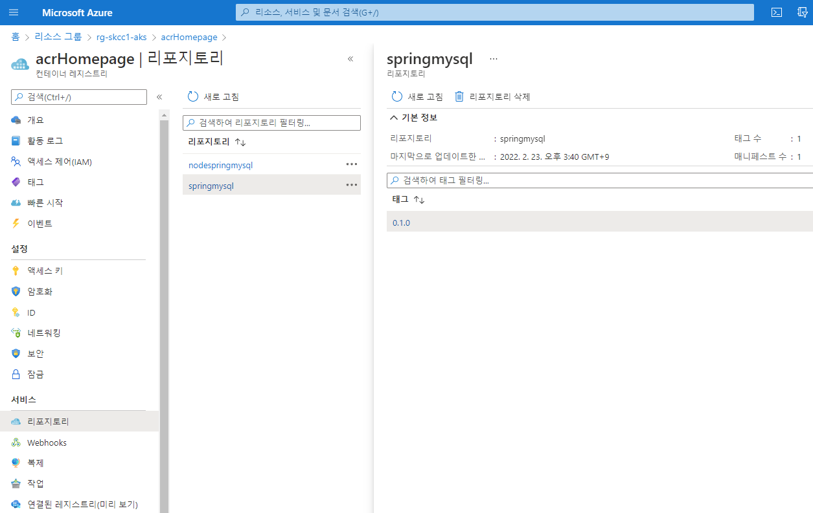
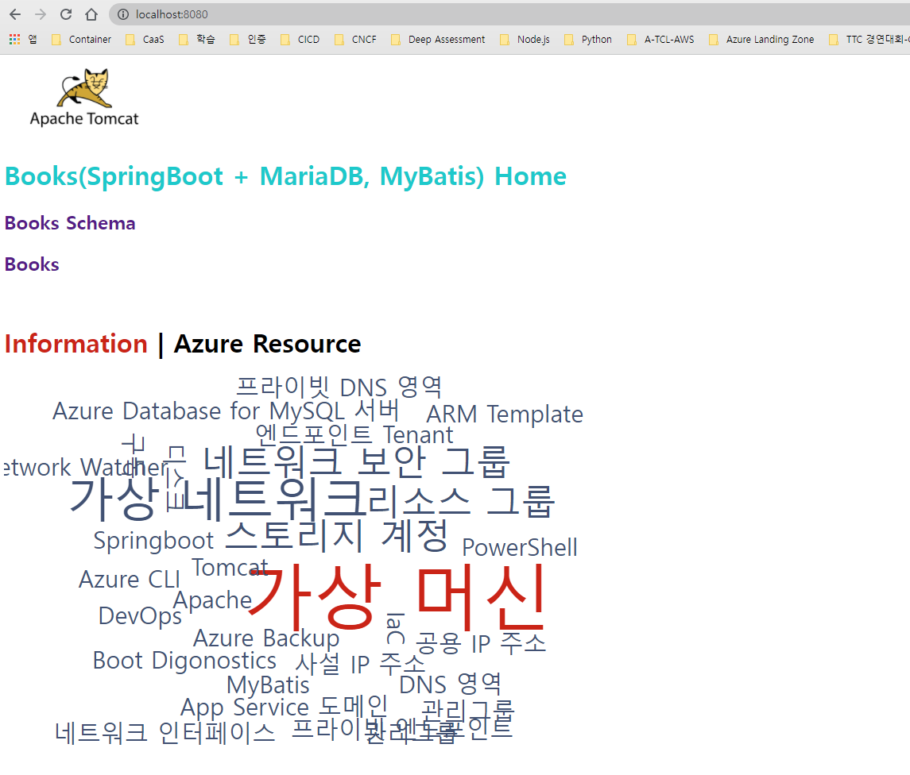

# Azure ACR

### acr build
```
$groupName = 'rg-skcc1-aks'
$locationName = 'koreacentral'


$serviceName = 'Homepage'
$ownerName = 'SeoTaeYeol'
$environment = 'Dev'
$personalInformation = 'No'
$tags="owner=$ownerName environment=$environment serviceTitle=$serviceName personalInformation=$personalInformation"


$acrName = 'acr' + $serviceName

$clusterName = 'aks-cluster-' + $serviceName  
$nodeGroupName = 'rg-' + $clusterName

$repositoryName = 'springmysql'


az acr create --resource-group $groupName --name $acrName --sku Basic
az acr list -o table
az acr login --name $acrName --expose-token

az acr build `
  --image "${repositoryName}:0.1.0" `
  --registry $acrName `
  --file Dockerfile .

az acr repository list -o table -n $acrName
az acr repository show-tags -o table -n $acrName --repository ${repositoryName}

docker pull "acrhomepage.azurecr.io/${repositoryName}:0.1.0"
docker run --network=host "${repositoryName}:0.1.0" --name springmysql -p 8080:8080 -d -it  
```

#### 빌드 로그
```
PS C:\workspace\SpringBootMySQL> az acr build `
>>   --image "${repositoryName}:0.1.0" `
>>   --registry $acrName `
>>   --file Dockerfile .
Packing source code into tar to upload...
Excluding '.git' based on default ignore rules
Excluding '.gitignore' based on default ignore rules
Uploading archived source code from 'C:\Users\taeey\AppData\Local\Temp\build_archive_439119378cf543958869c8bf9959e572.tar.gz'...
Sending context (62.101 MiB) to registry: acrHomepage...
Queued a build with ID: de2
Waiting for an agent...
2022/02/23 06:40:09 Downloading source code...
2022/02/23 06:40:11 Finished downloading source code
2022/02/23 06:40:11 Using acb_vol_c3381a27-48bf-4bca-9638-a97264eabf98 as the home volume
2022/02/23 06:40:11 Setting up Docker configuration...
2022/02/23 06:40:12 Successfully set up Docker configuration
2022/02/23 06:40:12 Logging in to registry: acrhomepage.azurecr.io
2022/02/23 06:40:12 Successfully logged into acrhomepage.azurecr.io
2022/02/23 06:40:12 Executing step ID: build. Timeout(sec): 28800, Working directory: '', Network: ''
2022/02/23 06:40:12 Scanning for dependencies...
2022/02/23 06:40:13 Successfully scanned dependencies
2022/02/23 06:40:13 Launching container with name: build
Sending build context to Docker daemon  70.44MB
Step 1/13 : FROM openjdk:8-jdk-alpine
8-jdk-alpine: Pulling from library/openjdk
e7c96db7181b: Pulling fs layer
f910a506b6cb: Pulling fs layer
c2274a1a0e27: Pulling fs layer
f910a506b6cb: Verifying Checksum
f910a506b6cb: Download complete
e7c96db7181b: Verifying Checksum
e7c96db7181b: Download complete
e7c96db7181b: Pull complete
f910a506b6cb: Pull complete
c2274a1a0e27: Verifying Checksum
c2274a1a0e27: Download complete
c2274a1a0e27: Pull complete
Digest: sha256:94792824df2df33402f201713f932b58cb9de94a0cd524164a0f2283343547b3
Status: Downloaded newer image for openjdk:8-jdk-alpine
 ---> a3562aa0b991
Step 2/13 : RUN addgroup -S spring && adduser -S spring -G spring
 ---> Running in d7b5ee649112
Removing intermediate container d7b5ee649112
 ---> d288cb5d4724
Step 3/13 : USER spring:spring
 ---> Running in 6400fb38c324
Removing intermediate container 6400fb38c324
 ---> bc99a866f99d
Step 4/13 : ARG WAR_FILE=target/*.war
 ---> Running in d428d95c420f
Removing intermediate container d428d95c420f
 ---> 56fe003089f7
Step 5/13 : ARG APP_NAME=app
 ---> Running in f23ace0e750b
Removing intermediate container f23ace0e750b
 ---> b7a2bcad4bd8
Step 6/13 : ARG DEPENDENCY=target/classes
 ---> Running in b4ecd606895f
Removing intermediate container b4ecd606895f
 ---> d89cc4c7b824
Step 7/13 : RUN mkdir -p /home/spring
 ---> Running in bc47d2e4c371
Removing intermediate container bc47d2e4c371
 ---> e10827b70ac9
Step 8/13 : WORKDIR /home/spring
 ---> Running in 581a217508f6
Removing intermediate container 581a217508f6
 ---> a75dc5b4b89d
Step 9/13 : COPY ${WAR_FILE} /home/spring/app.war
 ---> 2c94e8de0714
Step 10/13 : COPY jmx-exporter/jmx_prometheus.yml /home/spring/jmx_prometheus.yml
 ---> ce3cd7dbf928
Step 11/13 : COPY ./jmx-exporter/jmx_prometheus_javaagent-0.16.1.jar /home/spring/jmx_prometheus_javaagent.jar
 ---> fe4ca0371e7d
Step 12/13 : EXPOSE 8088
 ---> Running in 2967e7dc32e1
Removing intermediate container 2967e7dc32e1
 ---> 1118a3d34286
Step 13/13 : ENTRYPOINT java -cp app:app/lib/* -Xms512m -Xmx512m -XX:NewSize=256m -XX:MaxNewSize=256m -XX:MaxMetaspaceSize=128m -XX:MetaspaceSize=128m -XX:ParallelGCThreads=3          -XX:+PrintGCDetails -XX:+PrintGCDateStamps -XX:+PrintHeapAtGC -Xloggc:/gclog/gc_${HOSTNAME}_$(date +%Y%m%d%H%M%S).log -Dgclog_file=/gclog/gc_${HOSTNAME}_$(date +%Y%m%d%H%M%S).log           -XX:+HeapDumpOnOutOfMemoryError -XX:HeapDumpPath=/gclog/${HOSTNAME}.log              -javaagent:/home/spring/jmx_prometheus_javaagent.jar=8090:/home/spring/jmx_prometheus.yml               -Djava.security.egd=file:/dev/./urandom -jar /home/spring/app.war
 ---> Running in 3d4bb244aece
Removing intermediate container 3d4bb244aece
 ---> 9aa2d19df772
Successfully built 9aa2d19df772
Successfully tagged acrhomepage.azurecr.io/springmysql:0.1.0
2022/02/23 06:40:33 Successfully executed container: build
2022/02/23 06:40:33 Executing step ID: push. Timeout(sec): 3600, Working directory: '', Network: ''
2022/02/23 06:40:33 Pushing image: acrhomepage.azurecr.io/springmysql:0.1.0, attempt 1
The push refers to repository [acrhomepage.azurecr.io/springmysql]
8a111967a657: Preparing
7fef9e4db3f8: Preparing
dfb511b289e4: Preparing
55e77c6a97a7: Preparing
ceaf9e1ebef5: Preparing
9b9b7f3d56a0: Preparing
f1b5933fe4b5: Preparing
9b9b7f3d56a0: Waiting
f1b5933fe4b5: Waiting
8a111967a657: Pushed
7fef9e4db3f8: Pushed
55e77c6a97a7: Pushed
9b9b7f3d56a0: Pushed
dfb511b289e4: Pushed
f1b5933fe4b5: Pushed
ceaf9e1ebef5: Pushed
0.1.0: digest: sha256:610ea411daf92e45941dd677cb6e32c9b034a2f64ffd30b80c1b327f3aa9bbf0 size: 1784
2022/02/23 06:40:39 Successfully pushed image: acrhomepage.azurecr.io/springmysql:0.1.0
2022/02/23 06:40:39 Step ID: build marked as successful (elapsed time in seconds: 20.397836)
2022/02/23 06:40:39 Populating digests for step ID: build...
2022/02/23 06:40:40 Successfully populated digests for step ID: build
2022/02/23 06:40:40 Step ID: push marked as successful (elapsed time in seconds: 6.608986)
2022/02/23 06:40:40 The following dependencies were found:
2022/02/23 06:40:40
- image:
    registry: acrhomepage.azurecr.io
    repository: springmysql
    tag: 0.1.0
    digest: sha256:610ea411daf92e45941dd677cb6e32c9b034a2f64ffd30b80c1b327f3aa9bbf0
  runtime-dependency:
    registry: registry.hub.docker.com
    repository: library/openjdk
    tag: 8-jdk-alpine
    digest: sha256:94792824df2df33402f201713f932b58cb9de94a0cd524164a0f2283343547b3
  git: {}

Run ID: de2 was successful after 32s
PS C:\workspace\SpringBootMySQL> az acr repository list -o table -n $acrName
Result
---------------
nodespringmysql
springmysql
PS C:\workspace\SpringBootMySQL> az acr repository show-tags -o table -n $acrName --repository ${repositoryName}
Result
--------
0.1.0
```

## acr login
```
acrName="acrHomepage"
alias docker="podman"
```
```
ubuntu@DESKTOP-QR555PR:/mnt/c/workspace/SpringBootMySQL$ acrName="acrHomepage"
ubuntu@DESKTOP-QR555PR:/mnt/c/workspace/SpringBootMySQL$ az acr login --name $acrName --expose-token
You can perform manual login using the provided access token below, for example: 'docker login loginServer -u 00000000-0000-0000-0000-000000000000 -p accessToken'
{
  "accessToken": "eyJhbGciOiJSUzI1NiIsInR5cCI6IkpXVCIsImtpZCI6IlVWVzc6T1JDQjozVkNIOjY2UEI6R1kyWjpOU01KOldIVVE6Qjc3WDpLWTdaOlRaU1A6UkZZWDpIVTdRIn0.eyJqdGkiOiI3ZWRlYWU3Yi1jYTcxLTQxMDctODA0YS03MjNkYzA5NzJkYmIiLCJzdWIiOiJjYTA3NDU2QHNrdGRhLm9ubWljcm9zb2Z0LmNvbSIsIm5iZiI6MTY0NTU5ODI0NiwiZXhwIjoxNjQ1NjA5OTQ2LCJpYXQiOjE2NDU1OTgyNDYsImlzcyI6IkF6dXJlIENvbnRhaW5lciBSZWdpc3RyeSIsImF1ZCI6ImFjcmhvbWVwYWdlLmF6dXJlY3IuaW8iLCJ2ZXJzaW9uIjoiMS4wIiwicmlkIjoiYTgxMWMwOTVjZTM2NDdiYWI3MzQ1ZDlhZmU2MzUyN2UiLCJncmFudF90eXBlIjoicmVmcmVzaF90b2tlbiIsImFwcGlkIjoiMDRiMDc3OTUtOGRkYi00NjFhLWJiZWUtMDJmOWUxYmY3YjQ2IiwidGVuYW50IjoiMTYwYmFjZWEtNzc2MS00YzgzLWJmYTAtMzU0ZjliMDQ3ZjVhIiwicGVybWlzc2lvbnMiOnsiQWN0aW9ucyI6WyJyZWFkIiwid3JpdGUiLCJkZWxldGUiXSwiTm90QWN0aW9ucyI6bnVsbH0sInJvbGVzIjpbXX0.H2vYtCljgOz5t3eWhsKjMlfDTY4otaui1_CZmbNhEjjUXk00MoAWFyIsr4ITslvjO5s7_wqf7NNu6dUAeSCenoCcqCYMtiJeOSOfvn_2XaPkG5HxQJQLR5zNgIcLCHNw9KtRNn8fQdlHnR4GEHkApqpj2FBF91_kP2dPEllywSFo6gJ-SmntyxD-qceX1pZKEsQpU4m-n0eMc8YKYFZbH_-pdHJO2ajmb2qnu1RuvYHMxQ7DAxIBb5n0p_kaCqY5TP_2UxJlWWy5kzCC0V8V4YYLyfjAjbmwYzYH1kh5iGm2dinlmagP0ZDWb0jBuU-fhaZX1Kd19M2QLNSgKTcTkQ",
  "loginServer": "acrhomepage.azurecr.io"
}
accessToken="eyJhbGciOiJSUzI1NiIsInR5cCI6IkpXVCIsImtpZCI6IlVWVzc6T1JDQjozVkNIOjY2UEI6R1kyWjpOU01KOldIVVE6Qjc3WDpLWTdaOlRaU1A6UkZZWDpIVTdRIn0.eyJqdGkiOiI3ZWRlYWU3Yi1jYTcxLTQxMDctODA0YS03MjNkYzA5NzJkYmIiLCJzdWIiOiJjYTA3NDU2QHNrdGRhLm9ubWljcm9zb2Z0LmNvbSIsIm5iZiI6MTY0NTU5ODI0NiwiZXhwIjoxNjQ1NjA5OTQ2LCJpYXQiOjE2NDU1OTgyNDYsImlzcyI6IkF6dXJlIENvbnRhaW5lciBSZWdpc3RyeSIsImF1ZCI6ImFjcmhvbWVwYWdlLmF6dXJlY3IuaW8iLCJ2ZXJzaW9uIjoiMS4wIiwicmlkIjoiYTgxMWMwOTVjZTM2NDdiYWI3MzQ1ZDlhZmU2MzUyN2UiLCJncmFudF90eXBlIjoicmVmcmVzaF90b2tlbiIsImFwcGlkIjoiMDRiMDc3OTUtOGRkYi00NjFhLWJiZWUtMDJmOWUxYmY3YjQ2IiwidGVuYW50IjoiMTYwYmFjZWEtNzc2MS00YzgzLWJmYTAtMzU0ZjliMDQ3ZjVhIiwicGVybWlzc2lvbnMiOnsiQWN0aW9ucyI6WyJyZWFkIiwid3JpdGUiLCJkZWxldGUiXSwiTm90QWN0aW9ucyI6bnVsbH0sInJvbGVzIjpbXX0.H2vYtCljgOz5t3eWhsKjMlfDTY4otaui1_CZmbNhEjjUXk00MoAWFyIsr4ITslvjO5s7_wqf7NNu6dUAeSCenoCcqCYMtiJeOSOfvn_2XaPkG5HxQJQLR5zNgIcLCHNw9KtRNn8fQdlHnR4GEHkApqpj2FBF91_kP2dPEllywSFo6gJ-SmntyxD-qceX1pZKEsQpU4m-n0eMc8YKYFZbH_-pdHJO2ajmb2qnu1RuvYHMxQ7DAxIBb5n0p_kaCqY5TP_2UxJlWWy5kzCC0V8V4YYLyfjAjbmwYzYH1kh5iGm2dinlmagP0ZDWb0jBuU-fhaZX1Kd19M2QLNSgKTcTkQ"
ubuntu@DESKTOP-QR555PR:/mnt/c/workspace/SpringBootMySQL$ docker login "acrhomepage.azurecr.io" -u 00000000-0000-0000-0000-000000000000 -p "$accessToken"
Login Succeeded!
ubuntu@DESKTOP-QR555PR:/mnt/c/workspace/SpringBootMySQL$ docker pull acrhomepage.azurecr.io/springmysql:0.1.0
Trying to pull acrhomepage.azurecr.io/springmysql:0.1.0...
Getting image source signatures
Copying blob c2274a1a0e27 skipped: already exists
Copying blob e7c96db7181b skipped: already exists
Copying blob f910a506b6cb skipped: already exists
Copying blob 84face05b5be done
Copying blob 5c629d690b2e done
Copying blob 47af10362bd5 done
Copying blob 0db068a461a2 done
Copying config 9aa2d19df7 done                                                                                                                                                                       
Writing manifest to image destination
Storing signatures
9aa2d19df772f8b77a3394a03b3aa8b29d7846454a44c27c789460f3f255dd0a
ubuntu@DESKTOP-QR555PR:/mnt/c/workspace/SpringBootMySQL$ docker run --network=host springmysql:0.1.0 --name springmysql -p 8080:8080 -d -it  
OpenJDK 64-Bit Server VM warning: Cannot open file /gclog/gc_DESKTOP-QR555PR_20220223070107.log due to No such file or directory


  .   ____          _            __ _ _
 /\\ / ___'_ __ _ _(_)_ __  __ _ \ \ \ \
( ( )\___ | '_ | '_| | '_ \/ _` | \ \ \ \
 \\/  ___)| |_)| | | | | || (_| |  ) ) ) )
  '  |____| .__|_| |_|_| |_\__, | / / / /
 =========|_|==============|___/=/_/_/_/
 :: Spring Boot ::                (v2.6.2)

2022-02-23 07:01:08.691  INFO 1 --- [           main] c.e.demo.SpringBootSampleApplication     : Starting SpringBootSampleApplication v0.0.1-SNAPSHOT using Java 1.8.0_212 on DESKTOP-QR555PR with PID 1 (/home/spring/app.war started by spring in /home/spring)
2022-02-23 07:01:08.693  INFO 1 --- [           main] c.e.demo.SpringBootSampleApplication     : No active profile set, falling back to default profiles: default
2022-02-23 07:01:09.628  INFO 1 --- [           main] o.s.b.w.embedded.tomcat.TomcatWebServer  : Tomcat initialized with port(s): 8080 (http)
2022-02-23 07:01:09.639  INFO 1 --- [           main] o.apache.catalina.core.StandardService   : Starting service [Tomcat]
2022-02-23 07:01:09.640  INFO 1 --- [           main] org.apache.catalina.core.StandardEngine  : Starting Servlet engine: [Apache Tomcat/9.0.56]
2022-02-23 07:01:10.092  INFO 1 --- [           main] o.a.c.c.C.[Tomcat].[localhost].[/]       : Initializing Spring embedded WebApplicationContext
2022-02-23 07:01:10.092  INFO 1 --- [           main] w.s.c.ServletWebServerApplicationContext : Root WebApplicationContext: initialization completed in 1356 ms
2022-02-23 07:01:10.635  INFO 1 --- [           main] o.s.b.a.w.s.WelcomePageHandlerMapping    : Adding welcome page: class path resource [static/index.html]
2022-02-23 07:01:10.767  INFO 1 --- [           main] o.s.b.w.embedded.tomcat.TomcatWebServer  : Tomcat started on port(s): 8080 (http) with context path ''
2022-02-23 07:01:10.778  INFO 1 --- [           main] c.e.demo.SpringBootSampleApplication     : Started SpringBootSampleApplication in 2.393 seconds (JVM running for 3.08)
2022-02-23 07:01:13.372  INFO 1 --- [nio-8080-exec-1] o.a.c.c.C.[Tomcat].[localhost].[/]       : Initializing Spring DispatcherServlet 'dispatcherServlet'
2022-02-23 07:01:13.372  INFO 1 --- [nio-8080-exec-1] o.s.web.servlet.DispatcherServlet        : Initializing Servlet 'dispatcherServlet'
2022-02-23 07:01:13.373  INFO 1 --- [nio-8080-exec-1] o.s.web.servlet.DispatcherServlet        : Completed initialization in 1 ms
```

  

### 실행
```
docker run --network=host springmysql:0.1.0 --name springmysql -p 8080:8080 -d -it  
```
