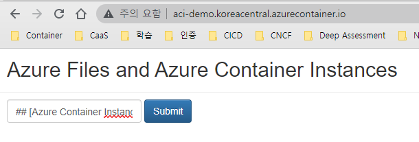

# [Azure Container Instance](https://docs.microsoft.com/ko-kr/azure/container-instances/container-instances-overview)    
- ACI Private VNet 배포의 경우 'koreacentral'로 잘 안만들어지는 경우가 발생함(eastus 에서는 잘 만들어짐)  
- ACI Public 은 한국중부(koreacentral) 에서도 잘 만들어짐  
- [Azure Container Instances에서 Azure 파일 공유 탑재](https://docs.microsoft.com/ko-kr/azure/container-instances/container-instances-volume-azure-files)

> [Azure 지역의 Azure Container Instances에 대한 리소스 가용성](https://docs.microsoft.com/ko-kr/azure/container-instances/container-instances-region-availability)  
> [Azure Container Instances 할당량 및 제한](https://docs.microsoft.com/ko-kr/azure/container-instances/container-instances-quotas)  

## 환경
| 구분 | 값 | 비고 |
|:---|:---|:---|
| O/S | Windows | |
| Shell | PowerShell | 7.2.2 |  
| Command | az | Azure CLI |  
| image | mcr.microsoft.com/azuredocs/aci-helloworld:latest | 1 CPU, 1.5 GiB |  
| registry-login-server | acrhomeeee.azurecr.io | |
| registry-username | acrHomeeee | |
| registry-password | Ax2BMk0y828RhmnGQyxOhH=H2Ggun1bt | |
| image | acrhomeeee.azurecr.io/springmysql:0.2.2 | springboot | 
| os-type | linux | default value |  
| cpu | 1 | default value |  
| memory | 1.5 | default value |  
| ports | 8080 | default 80 |  
| dns-name | springmysql | public 일 경우만 사용 |  
| vnet | vnet-skcc7-dev |  |  
| vnet-address-prefix | 10.0.0.0/16  | default value : 10.0.0.0/16 |  
| subnet | snet-skcc7-dev-frontend | |
| subnet-address-prefix | '10.0.0.0/24' | default value : '10.0.0.0/24' |


### public ip 를 가진 container 만들기 (잘됨)
#### 명령어
```
az container create `
    --resource-group rg-aci `
    --name springmysql `
    --image acrhomeeee.azurecr.io/springmysql:0.2.2 `
    --registry-username 'acrHomeeee' `
    --registry-password 'Ax2BMk0y828RhmnGQyxOhH=H2Ggun1bt' `
    --location 'koreacentral' `
    --os-type linux `
    --cpu 1 `
    --memory 1.5 `
    --restart-policy Always `
    --dns-name-label springmysql `
    --restart-policy Always `
    --environment-variables NumWords=3 MinLength=5 `
    --ports 8080 `
    --protocol TCP
```

#### 실행결과
```
PS D:\workspace\SpringBootMySQL> az container create `
>>     --resource-group rg-aci `
>>     --name springmysql `
>>     --image acrhomeeee.azurecr.io/springmysql:0.2.2 `
>>     --registry-username 'acrHomeeee' `
>>     --registry-password 'Ax2BMk0y828RhmnGQyxOhH=H2Ggun1bt' `
>>     --location 'koreacentral' `
>>     --os-type linux `
>>     --cpu 1 `
>>     --memory 1.5 `
>>     --restart-policy Always `
>>     --dns-name-label springmysql `
>>     --restart-policy Always `
>>     --environment-variables NumWords=3 MinLength=5 `
>>     --ports 8080 `
>>     --protocol TCP
{
  "containers": [
    {
      "command": null,
      "environmentVariables": [
        {
          "name": "NumWords",
          "secureValue": null,
          "value": "3"
        },
        {
          "name": "MinLength",
          "secureValue": null,
          "value": "5"
        }
      ],
      "image": "acrhomeeee.azurecr.io/springmysql:0.2.2",
      "instanceView": {
        "currentState": {
          "detailStatus": "",
          "exitCode": null,
          "finishTime": null,
          "startTime": "2022-04-16T07:31:10.936000+00:00",
          "state": "Running"
        },
        "events": null,
        "previousState": null,
        "restartCount": 0
      },
      "livenessProbe": null,
      "name": "springmysql",
      "ports": [
        {
          "port": 8080,
          "protocol": "TCP"
        }
      ],
      "readinessProbe": null,
      "resources": {
        "limits": null,
        "requests": {
          "cpu": 1.0,
          "gpu": null,
          "memoryInGb": 1.5
        }
      },
      "volumeMounts": null
    }
  ],
  "diagnostics": null,
  "dnsConfig": null,
  "encryptionProperties": null,
  "id": "/subscriptions/9ebb0d63-8327-402a-bdd4-e222b01329a1/resourceGroups/rg-aci/providers/Microsoft.ContainerInstance/containerGroups/springmysql",
  "identity": null,
  "imageRegistryCredentials": [
    {
      "identity": null,
      "identityUrl": null,
      "password": null,
      "server": "acrhomeeee.azurecr.io",
      "username": "acrHomeeee"
    }
  ],
  "initContainers": [],
  "instanceView": {
    "events": [],
    "state": "Running"
  },
  "ipAddress": {
    "autoGeneratedDomainNameLabelScope": "Unsecure",
    "dnsNameLabel": "springmysql",
    "fqdn": "springmysql.koreacentral.azurecontainer.io",
    "ip": "20.200.236.234",
    "ports": [
      {
        "port": 8080,
        "protocol": "TCP"
      }
    ],
    "type": "Public"
  },
  "location": "koreacentral",
  "name": "springmysql",
  "osType": "Linux",
  "provisioningState": "Succeeded",
  "resourceGroup": "rg-aci",
  "restartPolicy": "Always",
  "sku": "Standard",
  "subnetIds": null,
  "tags": {},
  "type": "Microsoft.ContainerInstance/containerGroups",
  "volumes": null,
  "zones": null
}
PS D:\workspace\SpringBootMySQL> 
```

- 배포 결과 보기
```
az container show `
  --resource-group rg-aci `
  --name springmysql `
  --query "{FQDN:ipAddress.fqdn,ProvisioningState:provisioningState}" `
  --out table
```

- container 목록 보기
```
az container list  -g rg-aci  -o table 
```

- 로그 보기
```
az container logs --resource-group rg-aci --name springmysql
```

### Private 영역에 Container 배포 (기본 값으로 배포가 안됨)
```
az container create `
    --resource-group rg-aci `
    --name aci-springmysql `
    --registry-login-server 'acrhomeeee.azurecr.io' `
    --registry-username 'acrHomeeee' `
    --registry-password 'Ax2BMk0y828RhmnGQyxOhH=H2Ggun1bt' `
    --image acrhomeeee.azurecr.io/springmysql:0.2.2 `
    --ip-address private `
    --location 'koreacentral' `
    --os-type linux `
    --cpu 1 `
    --memory 1.5 `
    --vnet vnet-skcc7-dev `
    --vnet-address-prefix '10.0.0.0/16' `
    --subnet snet-skcc7-dev-frontend `
    --subnet-address-prefix '10.0.0.0/24' `
    --restart-policy Always `
    --environment-variables NumWords=3 MinLength=5 `
    --ports 8080 `
    --protocol TCP
```

#### 오류로그
- 버그 인것 같은데 azure 에서 종종 나타나는 현상처럼 보임
- [Azure Container Instances VNET Error](https://docs.microsoft.com/en-us/answers/questions/31325/azure-container-instances-vnet-error.html)
```
(ServiceUnavailable) The requested resource is not available in the location 'koreacentral' at this moment. Please retry with a different resource request or in another location. Resource requested: '1' CPU '1.5' GB memory 'Linux' OS virtual network
Code: ServiceUnavailable
Message: The requested resource is not available in the location 'koreacentral' at this moment. Please retry with a different resource request or in another location. Resource requested: '1' CPU '1.5' GB memory 'Linux' OS virtual network
```

### 'eastus' 에 vnet 만들고 재 실행
| 항목 | 값 | 비고 |
| VNet | vnet-aci | 10.2.0.0/16 |  
| subnet | snet-aci-dev-frontend | 10.2.1.0/24 |
```
az container create `
    --resource-group rg-aci `
    --name aci-springmysql `
    --registry-login-server 'acrhomeeee.azurecr.io' `
    --registry-username 'acrHomeeee' `
    --registry-password 'Ax2BMk0y828RhmnGQyxOhH=H2Ggun1bt' `
    --image acrhomeeee.azurecr.io/springmysql:0.2.2 `
    --ip-address private `
    --location 'eastus' `
    --os-type linux `
    --cpu 1 `
    --memory 1.5 `
    --vnet vnet-aci `
    --vnet-address-prefix '10.2.0.0/16' `
    --subnet snet-aci-dev-frontend `
    --subnet-address-prefix '10.2.1.0/24' `
    --restart-policy Always `
    --environment-variables NumWords=3 MinLength=5 `
    --ports 8080 `
    --protocol TCP
```

### 실행 결과
```
PS D:\workspace\SpringBootMySQL> az network vnet list -g rg-aci -o table
Name            ResourceGroup    Location      NumSubnets    Prefixes     DnsServers    DDOSProtection
--------------  ---------------  ------------  ------------  -----------  ------------  ----------------
vnet-aci        rg-aci           eastus        2             10.2.0.0/16                False
vnet-skcc7-dev  rg-aci           koreacentral  1             10.0.0.0/16                False
PS D:\workspace\SpringBootMySQL> az container create `
>>     --resource-group rg-aci `
>>     --name aci-springmysql `
>>     --registry-login-server 'acrhomeeee.azurecr.io' `
>>     --registry-username 'acrHomeeee' `
>>     --registry-password 'Ax2BMk0y828RhmnGQyxOhH=H2Ggun1bt' `
>>     --image acrhomeeee.azurecr.io/springmysql:0.2.2 `
>>     --ip-address private `
>>     --location 'eastus' `
>>     --os-type linux `
>>     --cpu 1 `
>>     --memory 1.5 `
>>     --vnet vnet-aci `
>>     --vnet-address-prefix '10.2.0.0/16' `
>>     --subnet snet-aci-dev-frontend `
>>     --subnet-address-prefix '10.2.1.0/24' `
>>     --restart-policy Always `
>>     --environment-variables NumWords=3 MinLength=5 `
>>     --ports 8080 `
>>     --protocol TCP
{
  "containers": [
    {
      "command": null,
      "environmentVariables": [
        {
          "name": "NumWords",
          "secureValue": null,
          "value": "3"
        },
        {
          "name": "MinLength",
          "secureValue": null,
          "value": "5"
        }
      ],
      "image": "acrhomeeee.azurecr.io/springmysql:0.2.2",
      "instanceView": {
        "currentState": {
          "detailStatus": "",
          "exitCode": null,
          "finishTime": null,
          "startTime": "2022-04-16T08:14:22+00:00",
          "state": "Running"
        },
        "events": [
          {
            "count": 1,
            "firstTimestamp": "2022-04-16T08:13:44+00:00",
            "lastTimestamp": "2022-04-16T08:13:44+00:00",
            "message": "Pulling image \"acrhomeeee.azurecr.io/springmysql:0.2.2\"",
            "name": "Pulling",
            "type": "Normal"
          },
          {
            "count": 1,
            "firstTimestamp": "2022-04-16T08:14:21+00:00",
            "lastTimestamp": "2022-04-16T08:14:21+00:00",
            "message": "Successfully pulled image \"acrhomeeee.azurecr.io/springmysql:0.2.2\" in 36.539967124s",
            "name": "Pulled",
            "type": "Normal"
          },
          {
            "count": 1,
            "firstTimestamp": "2022-04-16T08:14:21+00:00",
            "lastTimestamp": "2022-04-16T08:14:21+00:00",
            "message": "Created container aci-springmysql",
            "name": "Created",
            "type": "Normal"
          },
          {
            "count": 1,
            "firstTimestamp": "2022-04-16T08:14:22+00:00",
            "lastTimestamp": "2022-04-16T08:14:22+00:00",
            "message": "Started container aci-springmysql",
            "name": "Started",
            "type": "Normal"
          }
        ],
        "previousState": null,
        "restartCount": 0
      },
      "livenessProbe": null,
      "name": "aci-springmysql",
      "ports": [
        {
          "port": 8080,
          "protocol": "TCP"
        }
      ],
      "readinessProbe": null,
      "resources": {
        "limits": null,
        "requests": {
          "cpu": 1.0,
          "gpu": null,
          "memoryInGb": 1.5
        }
      },
      "volumeMounts": null
    }
  ],
  "diagnostics": null,
  "dnsConfig": null,
  "encryptionProperties": null,
  "id": "/subscriptions/9ebb0d63-8327-402a-bdd4-e222b01329a1/resourceGroups/rg-aci/providers/Microsoft.ContainerInstance/containerGroups/aci-springmysql",
  "identity": null,
  "imageRegistryCredentials": [
    {
      "identity": null,
      "identityUrl": null,
      "password": null,
      "server": "acrhomeeee.azurecr.io",
      "username": "acrHomeeee"
    }
  ],
  "initContainers": [],
  "instanceView": {
    "events": [
      {
        "count": 1,
        "firstTimestamp": "2022-04-16T08:12:23+00:00",
        "lastTimestamp": "2022-04-16T08:12:23+00:00",
        "message": "Prepare network succeeded.",
        "name": "PrepareNetwork",
        "type": "Normal"
      },
      {
        "count": 1,
        "firstTimestamp": "2022-04-16T08:13:08+00:00",
        "lastTimestamp": "2022-04-16T08:13:08+00:00",
        "message": "Join network failed for \"25451599-9383-4fb1-98d0-986abf78abb5\": Timeout.",
        "name": "JoinNetwork",
        "type": "Warning"
      },
      {
        "count": 1,
        "firstTimestamp": "2022-04-16T08:13:30+00:00",
        "lastTimestamp": "2022-04-16T08:13:30+00:00",
        "message": "Join network succeeded.",
        "name": "JoinNetwork",
        "type": "Normal"
      },
      {
        "count": 1,
        "firstTimestamp": "2022-04-16T08:13:31+00:00",
        "lastTimestamp": "2022-04-16T08:13:31+00:00",
        "message": "Delegate subnet succeeded.",
        "name": "DelegateSubnet",
        "type": "Normal"
      },
      {
        "count": 1,
        "firstTimestamp": "2022-04-16T08:13:34+00:00",
        "lastTimestamp": "2022-04-16T08:13:34+00:00",
        "message": "Provision network interface succeeded.",
        "name": "ProvisionNetworkInterface",
        "type": "Normal"
      }
    ],
    "state": "Running"
  },
  "ipAddress": {
    "autoGeneratedDomainNameLabelScope": "Unsecure",
    "dnsNameLabel": null,
    "fqdn": null,
    "ip": "10.2.1.4",
    "ports": [
      {
        "port": 8080,
        "protocol": "TCP"
      }
    ],
    "type": "Private"
  },
  "location": "eastus",
  "name": "aci-springmysql",
  "osType": "Linux",
  "provisioningState": "Succeeded",
  "resourceGroup": "rg-aci",
  "restartPolicy": "Always",
  "sku": "Standard",
  "subnetIds": [
    {
      "id": "/subscriptions/9ebb0d63-8327-402a-bdd4-e222b01329a1/resourceGroups/rg-aci/providers/Microsoft.Network/virtualNetworks/vnet-aci/subnets/snet-aci-dev-frontend",
      "name": null,
      "resourceGroup": "rg-aci"
    }
  ],
  "tags": {},
  "type": "Microsoft.ContainerInstance/containerGroups",
  "volumes": null,
  "zones": null
}
PS D:\workspace\SpringBootMySQL> 
```

### container 목록 보기
- az container list  -g rg-aci  -o table 
```
PS D:\workspace\SpringBootMySQL> az container list  -g rg-aci  -o table 
Name             ResourceGroup    Status     Image                                    IP:ports             Network    CPU/Memory       OsType    Location
---------------  ---------------  ---------  ---------------------------------------  -------------------  ---------  ---------------  --------  ------------
aci-springmysql  rg-aci           Succeeded  acrhomeeee.azurecr.io/springmysql:0.2.2  10.2.1.4:8080,8080   Private    1.0 core/1.5 gb  Linux     eastus
springmysql      rg-aci           Succeeded  acrhomeeee.azurecr.io/springmysql:0.2.2  20.200.236.234:8080  Public     1.0 core/1.5 gb  Linux     koreacentral
PS D:\workspace\SpringBootMySQL> 
```

### 프로비전 상태가 표시
- az container show -g rg-aci -n aci-springmysql --query "{FQDN:ipAddress.fqdn,ProvisioningState:provisioningState}" --out table
```
PS D:\workspace\SpringBootMySQL> az container show -g rg-aci -n 'aci-springmysql' --query "{FQDN:ipAddress.fqdn,ProvisioningState:provisioningState}" --out table                                ProvisioningState
-------------------
Succeeded
PS D:\workspace\SpringBootMySQL> az container show -g rg-aci -n springmysql --query "{FQDN:ipAddress.fqdn,ProvisioningState:provisioningState}" --out table
FQDN                                        ProvisioningState
------------------------------------------  -------------------
springmysql.koreacentral.azurecontainer.io  Succeeded
PS D:\workspace\SpringBootMySQL> az container show -g rg-aci -n aci-springmysql --query "{FQDN:ipAddress.fqdn,ProvisioningState:provisioningState}" --out table
ProvisioningState
-------------------
Succeeded
PS D:\workspace\SpringBootMySQL> 
```


### Container 보기
- az container show -g rg-aci -n aci-springmysql
```powershell
PS D:\workspace\SpringBootMySQL> az container show -g rg-aci -n aci-springmysql
{
  "containers": [
    {
      "command": null,
      "environmentVariables": [
        {
          "name": "NumWords",
          "secureValue": null,
          "value": "3"
        },
        {
          "name": "MinLength",
          "secureValue": null,
          "value": "5"
        }
      ],
      "image": "acrhomeeee.azurecr.io/springmysql:0.2.2",
      "instanceView": {
        "currentState": {
          "detailStatus": "",
          "exitCode": null,
          "finishTime": null,
          "startTime": "2022-04-16T08:14:22+00:00",
          "state": "Running"
        },
        "events": [
          {
            "count": 1,
            "firstTimestamp": "2022-04-16T08:13:44+00:00",
            "lastTimestamp": "2022-04-16T08:13:44+00:00",
            "message": "Pulling image \"acrhomeeee.azurecr.io/springmysql:0.2.2\"",
            "name": "Pulling",
            "type": "Normal"
          },
          {
            "count": 1,
            "firstTimestamp": "2022-04-16T08:14:21+00:00",
            "lastTimestamp": "2022-04-16T08:14:21+00:00",
            "message": "Successfully pulled image \"acrhomeeee.azurecr.io/springmysql:0.2.2\" in 36.539967124s",
            "name": "Pulled",
            "type": "Normal"
          },
          {
            "count": 1,
            "firstTimestamp": "2022-04-16T08:14:21+00:00",
            "lastTimestamp": "2022-04-16T08:14:21+00:00",
            "message": "Created container aci-springmysql",
            "name": "Created",
            "type": "Normal"
          },
          {
            "count": 1,
            "firstTimestamp": "2022-04-16T08:14:22+00:00",
            "lastTimestamp": "2022-04-16T08:14:22+00:00",
            "message": "Started container aci-springmysql",
            "name": "Started",
            "type": "Normal"
          }
        ],
        "previousState": null,
        "restartCount": 0
      },
      "livenessProbe": null,
      "name": "aci-springmysql",
      "ports": [
        {
          "port": 8080,
          "protocol": "TCP"
        }
      ],
      "readinessProbe": null,
      "resources": {
        "limits": null,
        "requests": {
          "cpu": 1.0,
          "gpu": null,
          "memoryInGb": 1.5
        }
      },
      "volumeMounts": null
    }
  ],
  "diagnostics": null,
  "dnsConfig": null,
  "encryptionProperties": null,
  "id": "/subscriptions/9ebb0d63-8327-402a-bdd4-e222b01329a1/resourceGroups/rg-aci/providers/Microsoft.ContainerInstance/containerGroups/aci-springmysql",
  "identity": null,
  "imageRegistryCredentials": [
    {
      "identity": null,
      "identityUrl": null,
      "password": null,
      "server": "acrhomeeee.azurecr.io",
      "username": "acrHomeeee"
    }
  ],
  "initContainers": [],
  "instanceView": {
    "events": [
      {
        "count": 1,
        "firstTimestamp": "2022-04-16T08:12:23+00:00",
        "lastTimestamp": "2022-04-16T08:12:23+00:00",
        "message": "Prepare network succeeded.",
        "name": "PrepareNetwork",
        "type": "Normal"
      },
      {
        "count": 1,
        "firstTimestamp": "2022-04-16T08:13:08+00:00",
        "lastTimestamp": "2022-04-16T08:13:08+00:00",
        "message": "Join network failed for \"25451599-9383-4fb1-98d0-986abf78abb5\": Timeout.",
        "name": "JoinNetwork",
        "type": "Warning"
      },
      {
        "count": 1,
        "firstTimestamp": "2022-04-16T08:13:30+00:00",
        "lastTimestamp": "2022-04-16T08:13:30+00:00",
        "message": "Join network succeeded.",
        "name": "JoinNetwork",
        "type": "Normal"
      },
      {
        "count": 1,
        "firstTimestamp": "2022-04-16T08:13:31+00:00",
        "lastTimestamp": "2022-04-16T08:13:31+00:00",
        "message": "Delegate subnet succeeded.",
        "name": "DelegateSubnet",
        "type": "Normal"
      },
      {
        "count": 1,
        "firstTimestamp": "2022-04-16T08:13:34+00:00",
        "lastTimestamp": "2022-04-16T08:13:34+00:00",
        "message": "Provision network interface succeeded.",
        "name": "ProvisionNetworkInterface",
        "type": "Normal"
      }
    ],
    "state": "Running"
  },
  "ipAddress": {
    "autoGeneratedDomainNameLabelScope": "Unsecure",
    "dnsNameLabel": null,
    "fqdn": null,
    "ip": "10.2.1.4",
    "ports": [
      {
        "port": 8080,
        "protocol": "TCP"
      }
    ],
    "type": "Private"
  },
  "location": "eastus",
  "name": "aci-springmysql",
  "osType": "Linux",
  "provisioningState": "Succeeded",
  "resourceGroup": "rg-aci",
  "restartPolicy": "Always",
  "sku": "Standard",
  "subnetIds": [
    {
      "id": "/subscriptions/9ebb0d63-8327-402a-bdd4-e222b01329a1/resourceGroups/rg-aci/providers/Microsoft.Network/virtualNetworks/vnet-aci/subnets/snet-aci-dev-frontend",
      "name": null,
      "resourceGroup": "rg-aci"
    }
  ],
  "tags": {},
  "type": "Microsoft.ContainerInstance/containerGroups",
  "volumes": null,
  "zones": null
}
PS D:\workspace\SpringBootMySQL>  
```
### 로그 보기
- az container logs -g rg-aci -n aci-springmysql
```powershell
PS D:\workspace\SpringBootMySQL> az container logs -g rg-aci -n aci-springmysql
OpenJDK 64-Bit Server VM warning: Cannot open file /gclog/gc_wk-caas-48e4787ece04460896abc9b5859a4d13-b097c2d6e5c1b5d6d62e6c_20220416081422.log due to No such file or directory


  .   ____          _            __ _ _
 /\\ / ___'_ __ _ _(_)_ __  __ _ \ \ \ \
( ( )\___ | '_ | '_| | '_ \/ _` | \ \ \ \
 \\/  ___)| |_)| | | | | || (_| |  ) ) ) )
  '  |____| .__|_| |_|_| |_\__, | / / / /
 =========|_|==============|___/=/_/_/_/
 :: Spring Boot ::                (v2.6.2)

2022-04-16 08:14:25.009  INFO 1 --- [           main] c.e.demo.SpringBootSampleApplication     : Starting SpringBootSampleApplication v0.0.1-SNAPSHOT using Java 1.8.0_212 on wk-caas-48e4787ece04460896abc9b5859a4d13-b097c2d6e5c1b5d6d62e6c with PID 1 (/home/spring/app.war started by spring in /home/spring)
2022-04-16 08:14:25.013  INFO 1 --- [           main] c.e.demo.SpringBootSampleApplication     : No active profile set, falling back to default profiles: default
2022-04-16 08:14:29.003  INFO 1 --- [           main] o.s.b.w.embedded.tomcat.TomcatWebServer  : Tomcat initialized with port(s): 8080 (http)
2022-04-16 08:14:29.019  INFO 1 --- [           main] o.apache.catalina.core.StandardService   : Starting service [Tomcat]
2022-04-16 08:14:29.019  INFO 1 --- [           main] org.apache.catalina.core.StandardEngine  : Starting Servlet engine: [Apache Tomcat/9.0.56]
2022-04-16 08:14:32.678  INFO 1 --- [           main] org.apache.jasper.servlet.TldScanner     : At least one JAR was scanned for TLDs yet contained no TLDs. Enable debug logging for this logger for a complete list of JARs that were scanned but no TLDs were found in them. Skipping unneeded JARs during scanning can improve startup time and JSP compilation time.
2022-04-16 08:14:33.215  INFO 1 --- [           main] o.a.c.c.C.[Tomcat].[localhost].[/]       : Initializing Spring embedded WebApplicationContext
2022-04-16 08:14:33.215  INFO 1 --- [           main] w.s.c.ServletWebServerApplicationContext : Root WebApplicationContext: initialization completed in 8019 ms
2022-04-16 08:14:35.198  INFO 1 --- [           main] o.s.b.a.w.s.WelcomePageHandlerMapping    : Adding welcome page: class path resource [static/index.html]
2022-04-16 08:14:35.598  INFO 1 --- [           main] o.s.b.w.embedded.tomcat.TomcatWebServer  : Tomcat started on port(s): 8080 (http) with context path ''
2022-04-16 08:14:35.610  INFO 1 --- [           main] c.e.demo.SpringBootSampleApplication     : Started SpringBootSampleApplication in 11.933 seconds (JVM running for 13.557)
2022-04-16 08:38:56.516  INFO 1 --- [nio-8080-exec-1] o.a.c.c.C.[Tomcat].[localhost].[/]       : Initializing Spring DispatcherServlet 'dispatcherServlet'
2022-04-16 08:38:56.516  INFO 1 --- [nio-8080-exec-1] o.s.web.servlet.DispatcherServlet        : Initializing Servlet 'dispatcherServlet'
2022-04-16 08:38:56.518  INFO 1 --- [nio-8080-exec-1] o.s.web.servlet.DispatcherServlet        : Completed initialization in 2 ms
2022-04-16 09:14:49.226  INFO 1 --- [io-8080-exec-10] com.zaxxer.hikari.HikariDataSource       : HikariPool-1 - Starting...
2022-04-16 09:14:52.785  INFO 1 --- [io-8080-exec-10] com.zaxxer.hikari.HikariDataSource       : HikariPool-1 - Start completed.
2022-04-16 09:31:09.483  WARN 1 --- [nio-8080-exec-4] com.zaxxer.hikari.pool.PoolBase          : HikariPool-1 - Failed to validate connection com.mysql.cj.jdbc.ConnectionImpl@451f0f33 (No operations allowed after connection closed.). Possibly consider using a shorter maxLifetime value.
2022-04-16 09:31:09.494  WARN 1 --- [nio-8080-exec-4] com.zaxxer.hikari.pool.PoolBase          : HikariPool-1 - Failed to validate connection com.mysql.cj.jdbc.ConnectionImpl@7eee01e (No operations allowed after connection closed.). Possibly consider using a shorter maxLifetime value.
2022-04-16 09:31:09.497  WARN 1 --- [nio-8080-exec-4] com.zaxxer.hikari.pool.PoolBase          : HikariPool-1 - Failed to validate connection com.mysql.cj.jdbc.ConnectionImpl@3a350147 (No operations allowed after connection closed.). Possibly consider using a shorter maxLifetime value.
2022-04-16 09:31:09.501  WARN 1 --- [nio-8080-exec-4] com.zaxxer.hikari.pool.PoolBase          : HikariPool-1 - Failed to validate connection com.mysql.cj.jdbc.ConnectionImpl@3c68f9a6 (No operations allowed after connection closed.). Possibly consider using a shorter maxLifetime value.
2022-04-16 09:31:09.506  WARN 1 --- [nio-8080-exec-4] com.zaxxer.hikari.pool.PoolBase          : HikariPool-1 - Failed to validate connection com.mysql.cj.jdbc.ConnectionImpl@6b1d684c (No operations allowed after connection closed.). Possibly consider using a shorter maxLifetime value.
2022-04-16 09:31:09.509  WARN 1 --- [nio-8080-exec-4] com.zaxxer.hikari.pool.PoolBase          : HikariPool-1 - Failed to validate connection com.mysql.cj.jdbc.ConnectionImpl@1b039b21 (No operations allowed after connection closed.). Possibly consider using a shorter maxLifetime value.
2022-04-16 09:31:09.512  WARN 1 --- [nio-8080-exec-4] com.zaxxer.hikari.pool.PoolBase          : HikariPool-1 - Failed to validate connection com.mysql.cj.jdbc.ConnectionImpl@9ae8e3f (No operations allowed after connection closed.). Possibly consider using a shorter maxLifetime value.
2022-04-16 09:31:09.516  WARN 1 --- [nio-8080-exec-4] com.zaxxer.hikari.pool.PoolBase          : HikariPool-1 - Failed to validate connection com.mysql.cj.jdbc.ConnectionImpl@72afba6f (No operations allowed after connection closed.). Possibly consider using a shorter maxLifetime value.
2022-04-16 09:31:09.520  WARN 1 --- [nio-8080-exec-4] com.zaxxer.hikari.pool.PoolBase          : HikariPool-1 - Failed to validate connection com.mysql.cj.jdbc.ConnectionImpl@75f2ed88 (No operations allowed after connection closed.). Possibly consider using a shorter maxLifetime value.
2022-04-16 09:31:09.524  WARN 1 --- [nio-8080-exec-4] com.zaxxer.hikari.pool.PoolBase          : HikariPool-1 - Failed to validate connection com.mysql.cj.jdbc.ConnectionImpl@8504a7f (No operations allowed after connection closed.). Possibly consider using a shorter maxLifetime value.

PS D:\workspace\SpringBootMySQL> 
```


### 출력 스트림 연결
```powershell
az container logs `
  --resource-group $groupName `
  --name $containerName
```
#### 실행 결과
```powershell
PS D:\workspace\AzureBasic> az container attach `
>>   --resource-group rg-aci `    
>>   --name aci-springmysql
Container 'aci-springmysql' is in state 'Running'...
(count: 1) (last timestamp: 2022-04-16 08:13:44+00:00) Pulling image "acrhomeeee.azurecr.io/springmysql:0.2.2"
(count: 1) (last timestamp: 2022-04-16 08:14:21+00:00) Successfully pulled image "acrhomeeee.azurecr.io/springmysql:0.2.2" in 36.539967124s
(count: 1) (last timestamp: 2022-04-16 08:14:21+00:00) Created container aci-springmysql
(count: 1) (last timestamp: 2022-04-16 08:14:22+00:00) Started container aci-springmysql

Start streaming logs:
OpenJDK 64-Bit Server VM warning: Cannot open file /gclog/gc_wk-caas-48e4787ece04460896abc9b5859a4d13-b097c2d6e5c1b5d6d62e6c_20220416081422.log due to No such file or directory


  .   ____          _            __ _ _
 /\\ / ___'_ __ _ _(_)_ __  __ _ \ \ \ \
( ( )\___ | '_ | '_| | '_ \/ _` | \ \ \ \
 \\/  ___)| |_)| | | | | || (_| |  ) ) ) )
  '  |____| .__|_| |_|_| |_\__, | / / / /
 =========|_|==============|___/=/_/_/_/
 :: Spring Boot ::                (v2.6.2)

2022-04-16 08:14:25.009  INFO 1 --- [           main] c.e.demo.SpringBootSampleApplication     : Starting SpringBootSampleApplication v0.0.1-SNAPSHOT using Java 1.8.0_212 on wk-caas-48e4787ece04460896abc9b5859a4d13-b097c2d6e5c1b5d6d62e6c with PID 1 (/home/spring/app.war started by spring in /home/spring)
2022-04-16 08:14:25.013  INFO 1 --- [           main] c.e.demo.SpringBootSampleApplication     : No active profile set, falling back to default profiles: default
2022-04-16 08:14:29.003  INFO 1 --- [           main] o.s.b.w.embedded.tomcat.TomcatWebServer  : Tomcat initialized with port(s): 8080 (http)
2022-04-16 08:14:29.019  INFO 1 --- [           main] o.apache.catalina.core.StandardService   : Starting service [Tomcat]
2022-04-16 08:14:29.019  INFO 1 --- [           main] org.apache.catalina.core.StandardEngine  : Starting Servlet engine: [Apache Tomcat/9.0.56]
2022-04-16 08:14:32.678  INFO 1 --- [           main] org.apache.jasper.servlet.TldScanner     : At least one JAR was scanned for TLDs yet contained no TLDs. Enable debug logging for this logger for a complete list of JARs that were scanned but no TLDs were found in them. Skipping unneeded JARs during scanning can improve startup time and JSP compilation time.
2022-04-16 08:14:33.215  INFO 1 --- [           main] o.a.c.c.C.[Tomcat].[localhost].[/]       : Initializing Spring embedded WebApplicationContext
2022-04-16 08:14:33.215  INFO 1 --- [           main] w.s.c.ServletWebServerApplicationContext : Root WebApplicationContext: initialization completed in 8019 ms
2022-04-16 08:14:35.198  INFO 1 --- [           main] o.s.b.a.w.s.WelcomePageHandlerMapping    : Adding welcome page: class path resource [static/index.html]
2022-04-16 08:14:35.598  INFO 1 --- [           main] o.s.b.w.embedded.tomcat.TomcatWebServer  : Tomcat started on port(s): 8080 (http) with context path ''
2022-04-16 08:14:35.610  INFO 1 --- [           main] c.e.demo.SpringBootSampleApplication     : Started SpringBootSampleApplication in 11.933 seconds (JVM running for 13.557)
2022-04-16 08:38:56.516  INFO 1 --- [nio-8080-exec-1] o.a.c.c.C.[Tomcat].[localhost].[/]       : Initializing Spring DispatcherServlet 'dispatcherServlet'
2022-04-16 08:38:56.516  INFO 1 --- [nio-8080-exec-1] o.s.web.servlet.DispatcherServlet        : Initializing Servlet 'dispatcherServlet'
2022-04-16 08:38:56.518  INFO 1 --- [nio-8080-exec-1] o.s.web.servlet.DispatcherServlet        : Completed initialization in 2 ms
2022-04-16 09:14:49.226  INFO 1 --- [io-8080-exec-10] com.zaxxer.hikari.HikariDataSource       : HikariPool-1 - Starting...
2022-04-16 09:14:52.785  INFO 1 --- [io-8080-exec-10] com.zaxxer.hikari.HikariDataSource       : HikariPool-1 - Start completed.
2022-04-16 09:31:09.483  WARN 1 --- [nio-8080-exec-4] com.zaxxer.hikari.pool.PoolBase          : HikariPool-1 - Failed to validate connection com.mysql.cj.jdbc.ConnectionImpl@451f0f33 (No operations allowed after connection closed.). Possibly consider using a shorter maxLifetime value.
2022-04-16 09:31:09.494  WARN 1 --- [nio-8080-exec-4] com.zaxxer.hikari.pool.PoolBase          : HikariPool-1 - Failed to validate connection com.mysql.cj.jdbc.ConnectionImpl@7eee01e (No operations allowed after connection closed.). Possibly consider using a shorter maxLifetime value.
2022-04-16 09:31:09.497  WARN 1 --- [nio-8080-exec-4] com.zaxxer.hikari.pool.PoolBase          : HikariPool-1 - Failed to validate connection com.mysql.cj.jdbc.ConnectionImpl@3a350147 (No operations allowed after connection closed.). Possibly consider using a shorter maxLifetime value.
2022-04-16 09:31:09.501  WARN 1 --- [nio-8080-exec-4] com.zaxxer.hikari.pool.PoolBase          : HikariPool-1 - Failed to validate connection com.mysql.cj.jdbc.ConnectionImpl@3c68f9a6 (No operations allowed after connection closed.). Possibly consider using a shorter maxLifetime value.
2022-04-16 09:31:09.506  WARN 1 --- [nio-8080-exec-4] com.zaxxer.hikari.pool.PoolBase          : HikariPool-1 - Failed to validate connection com.mysql.cj.jdbc.ConnectionImpl@6b1d684c (No operations allowed after connection closed.). Possibly consider using a shorter maxLifetime value.
2022-04-16 09:31:09.509  WARN 1 --- [nio-8080-exec-4] com.zaxxer.hikari.pool.PoolBase          : HikariPool-1 - Failed to validate connection com.mysql.cj.jdbc.ConnectionImpl@1b039b21 (No operations allowed after connection closed.). Possibly consider using a shorter maxLifetime value.
2022-04-16 09:31:09.512  WARN 1 --- [nio-8080-exec-4] com.zaxxer.hikari.pool.PoolBase          : HikariPool-1 - Failed to validate connection com.mysql.cj.jdbc.ConnectionImpl@9ae8e3f (No operations allowed after connection closed.). Possibly consider using a shorter maxLifetime value.
2022-04-16 09:31:09.516  WARN 1 --- [nio-8080-exec-4] com.zaxxer.hikari.pool.PoolBase          : HikariPool-1 - Failed to validate connection com.mysql.cj.jdbc.ConnectionImpl@72afba6f (No operations allowed after connection closed.). Possibly consider using a shorter maxLifetime value.
2022-04-16 09:31:09.520  WARN 1 --- [nio-8080-exec-4] com.zaxxer.hikari.pool.PoolBase          : HikariPool-1 - Failed to validate connection com.mysql.cj.jdbc.ConnectionImpl@75f2ed88 (No operations allowed after connection closed.). Possibly consider using a shorter maxLifetime value.
2022-04-16 09:31:09.524  WARN 1 --- [nio-8080-exec-4] com.zaxxer.hikari.pool.PoolBase          : HikariPool-1 - Failed to validate connection com.mysql.cj.jdbc.ConnectionImpl@8504a7f (No operations allowed after connection closed.). Possibly consider using a shorter maxLifetime value.

OpenJDK 64-Bit Server VM warning: Cannot open file /gclog/gc_wk-caas-48e4787ece04460896abc9b5859a4d13-b097c2d6e5c1b5d6d62e6c_20220416081422.log due to No such file or directory


  .   ____          _            __ _ _
 /\\ / ___'_ __ _ _(_)_ __  __ _ \ \ \ \
( ( )\___ | '_ | '_| | '_ \/ _` | \ \ \ \
 \\/  ___)| |_)| | | | | || (_| |  ) ) ) )
  '  |____| .__|_| |_|_| |_\__, | / / / /
 =========|_|==============|___/=/_/_/_/
 :: Spring Boot ::                (v2.6.2)

2022-04-16 08:14:25.009  INFO 1 --- [           main] c.e.demo.SpringBootSampleApplication     : Starting SpringBootSampleApplication v0.0.1-SNAPSHOT using Java 1.8.0_212 on wk-caas-48e4787ece04460896abc9b5859a4d13-b097c2d6e5c1b5d6d62e6c with PID 1 (/home/spring/app.war started by spring in /home/spring)
2022-04-16 08:14:25.013  INFO 1 --- [           main] c.e.demo.SpringBootSampleApplication     : No active profile set, falling back to default profiles: default
2022-04-16 08:14:29.003  INFO 1 --- [           main] o.s.b.w.embedded.tomcat.TomcatWebServer  : Tomcat initialized with port(s): 8080 (http)
2022-04-16 08:14:29.019  INFO 1 --- [           main] o.apache.catalina.core.StandardService   : Starting service [Tomcat]
2022-04-16 08:14:29.019  INFO 1 --- [           main] org.apache.catalina.core.StandardEngine  : Starting Servlet engine: [Apache Tomcat/9.0.56]
2022-04-16 08:14:32.678  INFO 1 --- [           main] org.apache.jasper.servlet.TldScanner     : At least one JAR was scanned for TLDs yet contained no TLDs. Enable debug logging for this logger for a complete list of JARs that were scanned but no TLDs were found in them. Skipping unneeded JARs during scanning can improve startup time and JSP compilation time.
2022-04-16 08:14:33.215  INFO 1 --- [           main] o.a.c.c.C.[Tomcat].[localhost].[/]       : Initializing Spring embedded WebApplicationContext
2022-04-16 08:14:33.215  INFO 1 --- [           main] w.s.c.ServletWebServerApplicationContext : Root WebApplicationContext: initialization completed in 8019 ms
2022-04-16 08:14:35.198  INFO 1 --- [           main] o.s.b.a.w.s.WelcomePageHandlerMapping    : Adding welcome page: class path resource [static/index.html]
2022-04-16 08:14:35.598  INFO 1 --- [           main] o.s.b.w.embedded.tomcat.TomcatWebServer  : Tomcat started on port(s): 8080 (http) with context path ''
2022-04-16 08:14:35.610  INFO 1 --- [           main] c.e.demo.SpringBootSampleApplication     : Started SpringBootSampleApplication in 11.933 seconds (JVM running for 13.557)
2022-04-16 08:38:56.516  INFO 1 --- [nio-8080-exec-1] o.a.c.c.C.[Tomcat].[localhost].[/]       : Initializing Spring DispatcherServlet 'dispatcherServlet'
2022-04-16 08:38:56.516  INFO 1 --- [nio-8080-exec-1] o.s.web.servlet.DispatcherServlet        : Initializing Servlet 'dispatcherServlet'
2022-04-16 08:38:56.518  INFO 1 --- [nio-8080-exec-1] o.s.web.servlet.DispatcherServlet        : Completed initialization in 2 ms
2022-04-16 09:14:49.226  INFO 1 --- [io-8080-exec-10] com.zaxxer.hikari.HikariDataSource       : HikariPool-1 - Starting...
2022-04-16 09:14:52.785  INFO 1 --- [io-8080-exec-10] com.zaxxer.hikari.HikariDataSource       : HikariPool-1 - Start completed.
2022-04-16 09:31:09.483  WARN 1 --- [nio-8080-exec-4] com.zaxxer.hikari.pool.PoolBase          : HikariPool-1 - Failed to validate connection com.mysql.cj.jdbc.ConnectionImpl@451f0f33 (No operations allowed after connection closed.). Possibly consider using a shorter maxLifetime value.
2022-04-16 09:31:09.494  WARN 1 --- [nio-8080-exec-4] com.zaxxer.hikari.pool.PoolBase          : HikariPool-1 - Failed to validate connection com.mysql.cj.jdbc.ConnectionImpl@7eee01e (No operations allowed after connection closed.). Possibly consider using a shorter maxLifetime value.
2022-04-16 09:31:09.497  WARN 1 --- [nio-8080-exec-4] com.zaxxer.hikari.pool.PoolBase          : HikariPool-1 - Failed to validate connection com.mysql.cj.jdbc.ConnectionImpl@3a350147 (No operations allowed after connection closed.). Possibly consider using a shorter maxLifetime value.
2022-04-16 09:31:09.501  WARN 1 --- [nio-8080-exec-4] com.zaxxer.hikari.pool.PoolBase          : HikariPool-1 - Failed to validate connection com.mysql.cj.jdbc.ConnectionImpl@3c68f9a6 (No operations allowed after connection closed.). Possibly consider using a shorter maxLifetime value.
2022-04-16 09:31:09.506  WARN 1 --- [nio-8080-exec-4] com.zaxxer.hikari.pool.PoolBase          : HikariPool-1 - Failed to validate connection com.mysql.cj.jdbc.ConnectionImpl@6b1d684c (No operations allowed after connection closed.). Possibly consider using a shorter maxLifetime value.
2022-04-16 09:31:09.509  WARN 1 --- [nio-8080-exec-4] com.zaxxer.hikari.pool.PoolBase          : HikariPool-1 - Failed to validate connection com.mysql.cj.jdbc.ConnectionImpl@1b039b21 (No operations allowed after connection closed.). Possibly consider using a shorter maxLifetime value.
2022-04-16 09:31:09.512  WARN 1 --- [nio-8080-exec-4] com.zaxxer.hikari.pool.PoolBase          : HikariPool-1 - Failed to validate connection com.mysql.cj.jdbc.ConnectionImpl@9ae8e3f (No operations allowed after connection closed.). Possibly consider using a shorter maxLifetime value.
2022-04-16 09:31:09.516  WARN 1 --- [nio-8080-exec-4] com.zaxxer.hikari.pool.PoolBase          : HikariPool-1 - Failed to validate connection com.mysql.cj.jdbc.ConnectionImpl@72afba6f (No operations allowed after connection closed.). Possibly consider using a shorter maxLifetime value.
2022-04-16 09:31:09.520  WARN 1 --- [nio-8080-exec-4] com.zaxxer.hikari.pool.PoolBase          : HikariPool-1 - Failed to validate connection com.mysql.cj.jdbc.ConnectionImpl@75f2ed88 (No operations allowed after connection closed.). Possibly consider using a shorter maxLifetime value.
2022-04-16 09:31:09.524  WARN 1 --- [nio-8080-exec-4] com.zaxxer.hikari.pool.PoolBase          : HikariPool-1 - Failed to validate connection com.mysql.cj.jdbc.ConnectionImpl@8504a7f (No operations allowed after connection closed.). Possibly consider using a shorter maxLifetime value.

OpenJDK 64-Bit Server VM warning: Cannot open file /gclog/gc_wk-caas-48e4787ece04460896abc9b5859a4d13-b097c2d6e5c1b5d6d62e6c_20220416081422.log due to No such file or directory


  .   ____          _            __ _ _
 /\\ / ___'_ __ _ _(_)_ __  __ _ \ \ \ \
( ( )\___ | '_ | '_| | '_ \/ _` | \ \ \ \
 \\/  ___)| |_)| | | | | || (_| |  ) ) ) )
  '  |____| .__|_| |_|_| |_\__, | / / / /
 =========|_|==============|___/=/_/_/_/
 :: Spring Boot ::                (v2.6.2)

2022-04-16 08:14:25.009  INFO 1 --- [           main] c.e.demo.SpringBootSampleApplication     : Starting SpringBootSampleApplication v0.0.1-SNAPSHOT using Java 1.8.0_212 on wk-caas-48e4787ece04460896abc9b5859a4d13-b097c2d6e5c1b5d6d62e6c with PID 1 (/home/spring/app.war started by spring in /home/spring)
2022-04-16 08:14:25.013  INFO 1 --- [           main] c.e.demo.SpringBootSampleApplication     : No active profile set, falling back to default profiles: default
2022-04-16 08:14:29.003  INFO 1 --- [           main] o.s.b.w.embedded.tomcat.TomcatWebServer  : Tomcat initialized with port(s): 8080 (http)
2022-04-16 08:14:29.019  INFO 1 --- [           main] o.apache.catalina.core.StandardService   : Starting service [Tomcat]
2022-04-16 08:14:29.019  INFO 1 --- [           main] org.apache.catalina.core.StandardEngine  : Starting Servlet engine: [Apache Tomcat/9.0.56]
2022-04-16 08:14:32.678  INFO 1 --- [           main] org.apache.jasper.servlet.TldScanner     : At least one JAR was scanned for TLDs yet contained no TLDs. Enable debug logging for this logger for a complete list of JARs that were scanned but no TLDs were found in them. Skipping unneeded JARs during scanning can improve startup time and JSP compilation time.
2022-04-16 08:14:33.215  INFO 1 --- [           main] o.a.c.c.C.[Tomcat].[localhost].[/]       : Initializing Spring embedded WebApplicationContext
2022-04-16 08:14:33.215  INFO 1 --- [           main] w.s.c.ServletWebServerApplicationContext : Root WebApplicationContext: initialization completed in 8019 ms
2022-04-16 08:14:35.198  INFO 1 --- [           main] o.s.b.a.w.s.WelcomePageHandlerMapping    : Adding welcome page: class path resource [static/index.html]
2022-04-16 08:14:35.598  INFO 1 --- [           main] o.s.b.w.embedded.tomcat.TomcatWebServer  : Tomcat started on port(s): 8080 (http) with context path ''
2022-04-16 08:14:35.610  INFO 1 --- [           main] c.e.demo.SpringBootSampleApplication     : Started SpringBootSampleApplication in 11.933 seconds (JVM running for 13.557)
2022-04-16 08:38:56.516  INFO 1 --- [nio-8080-exec-1] o.a.c.c.C.[Tomcat].[localhost].[/]       : Initializing Spring DispatcherServlet 'dispatcherServlet'
2022-04-16 08:38:56.516  INFO 1 --- [nio-8080-exec-1] o.s.web.servlet.DispatcherServlet        : Initializing Servlet 'dispatcherServlet'
2022-04-16 08:38:56.518  INFO 1 --- [nio-8080-exec-1] o.s.web.servlet.DispatcherServlet        : Completed initialization in 2 ms
2022-04-16 09:14:49.226  INFO 1 --- [io-8080-exec-10] com.zaxxer.hikari.HikariDataSource       : HikariPool-1 - Starting...
2022-04-16 09:14:52.785  INFO 1 --- [io-8080-exec-10] com.zaxxer.hikari.HikariDataSource       : HikariPool-1 - Start completed.
2022-04-16 09:31:09.483  WARN 1 --- [nio-8080-exec-4] com.zaxxer.hikari.pool.PoolBase          : HikariPool-1 - Failed to validate connection com.mysql.cj.jdbc.ConnectionImpl@451f0f33 (No operations allowed after connection closed.). Possibly consider using a shorter maxLifetime value.
2022-04-16 09:31:09.494  WARN 1 --- [nio-8080-exec-4] com.zaxxer.hikari.pool.PoolBase          : HikariPool-1 - Failed to validate connection com.mysql.cj.jdbc.ConnectionImpl@7eee01e (No operations allowed after connection closed.). Possibly consider using a shorter maxLifetime value.
2022-04-16 09:31:09.497  WARN 1 --- [nio-8080-exec-4] com.zaxxer.hikari.pool.PoolBase          : HikariPool-1 - Failed to validate connection com.mysql.cj.jdbc.ConnectionImpl@3a350147 (No operations allowed after connection closed.). Possibly consider using a shorter maxLifetime value.
2022-04-16 09:31:09.501  WARN 1 --- [nio-8080-exec-4] com.zaxxer.hikari.pool.PoolBase          : HikariPool-1 - Failed to validate connection com.mysql.cj.jdbc.ConnectionImpl@3c68f9a6 (No operations allowed after connection closed.). Possibly consider using a shorter maxLifetime value.
2022-04-16 09:31:09.506  WARN 1 --- [nio-8080-exec-4] com.zaxxer.hikari.pool.PoolBase          : HikariPool-1 - Failed to validate connection com.mysql.cj.jdbc.ConnectionImpl@6b1d684c (No operations allowed after connection closed.). Possibly consider using a shorter maxLifetime value.
2022-04-16 09:31:09.509  WARN 1 --- [nio-8080-exec-4] com.zaxxer.hikari.pool.PoolBase          : HikariPool-1 - Failed to validate connection com.mysql.cj.jdbc.ConnectionImpl@1b039b21 (No operations allowed after connection closed.). Possibly consider using a shorter maxLifetime value.
2022-04-16 09:31:09.512  WARN 1 --- [nio-8080-exec-4] com.zaxxer.hikari.pool.PoolBase          : HikariPool-1 - Failed to validate connection com.mysql.cj.jdbc.ConnectionImpl@9ae8e3f (No operations allowed after connection closed.). Possibly consider using a shorter maxLifetime value.
2022-04-16 09:31:09.516  WARN 1 --- [nio-8080-exec-4] com.zaxxer.hikari.pool.PoolBase          : HikariPool-1 - Failed to validate connection com.mysql.cj.jdbc.ConnectionImpl@72afba6f (No operations allowed after connection closed.). Possibly consider using a shorter maxLifetime value.
2022-04-16 09:31:09.520  WARN 1 --- [nio-8080-exec-4] com.zaxxer.hikari.pool.PoolBase          : HikariPool-1 - Failed to validate connection com.mysql.cj.jdbc.ConnectionImpl@75f2ed88 (No operations allowed after connection closed.). Possibly consider using a shorter maxLifetime value.
2022-04-16 09:31:09.524  WARN 1 --- [nio-8080-exec-4] com.zaxxer.hikari.pool.PoolBase          : HikariPool-1 - Failed to validate connection com.mysql.cj.jdbc.ConnectionImpl@8504a7f (No operations allowed after connection closed.). Possibly consider using a shorter maxLifetime value.
```

## [Azure Container Instances에서 Azure 파일 공유 탑재](https://docs.microsoft.com/ko-kr/azure/container-instances/container-instances-volume-azure-files)  

### Azure 파일 공유 만들기
```powershell
$groupName='rg-aci'
$locationName='koreacentral'
$serviceName='Homeeee'
$acrName="acr$serviceName"

$repositoryName="springmysql"
$tag='0.2.2'
$clusterName='aks-cluster-Homeeee'

# export loginServer="acrhomepage.azurecr.io"
$loginServer="${acrName}.azurecr.io"

$storagAccountName='skcc7devacidev01'
$location='eastus'
$shareName='acishare'

# az aks get-credentials --resource-group $groupName --name $clusterName --overwrite-existing

# if ($accessToken -eq $null) {
#   $accessToken=az acr login --name $acrName --expose-token | jq .accessToken | %{$_ -replace('"', '')}
#}

# Create the storage account with the parameters
az storage account create `
  --resource-group $groupName `
  --name $storagAccountName `
  --location $location `
  --sku Standard_LRS

# Create the file share
az storage share create `
  --name $shareName `
  --account-name $storagAccountName
```

### 스토리지 자격 증명 가져오기
```
echo $storagAccountName
$storageKey=$(az storage account keys list --resource-group $groupName --account-name $storagAccountName --query "[0].value" --output tsv)
echo $storageKey
```

### 컨테이너 및 탑재 볼륨 배포 - CLI
- 예시 프로그램은 파일을 공유 볼륨에 upload 하는 것임    
- [aci-hellofiles - github](https://github.com/Azure-Samples/aci-hellofiles)  
```
az container create `
  --resource-group $groupName `
  --name hellofiles `
  --image mcr.microsoft.com/azuredocs/aci-hellofiles `
  --dns-name-label aci-demo `
  --ports 80 `
  --azure-file-volume-account-name $storagAccountName `
  --azure-file-volume-account-key $storageKey `
  --azure-file-volume-share-name $shareName `
  --azure-file-volume-mount-path /aci/logs/
```

#### Node.js Source
- Text 를 올리면 날짜에 '.txt' 확장자를 붙여 저장하는 프로그램
```javascript
const express = require('express');
const bodyParser = require('body-parser');
const fs = require('fs');

const app = express();

app.use(bodyParser.urlencoded({extended: true}))

app.get('/', (req, res) => {
  res.sendFile(__dirname + '/index.html')
})

app.post('/values', (req, res) => {
  console.log(req.body)

  var filename = "/aci/logs/" + Date.now() + ".txt";

  fs.writeFile(filename, req.body.name, function(err) {
    if(err) {
      return console.log(err);
    }
    
    console.log("Wrote to file");
  });

  res.redirect('/');
})

app.listen(process.env.PORT || 80, function() {
 console.log('listening on port ' + process.env.PORT || 80);
});
```
- 결과를 보는 View 가 없는데 Azure Storage Explorer 를 이용하여 볼수 있음

### 탑재된 볼륨의 파일 관리
```
az container show --resource-group $groupName `
  --name hellofiles --query ipAddress.fqdn --output tsv
```
- aci-demo.koreacentral.azurecontainer.io  
    
    

#### [수행결과](./AzureContainerInstance-fileshare-수행결과.md)