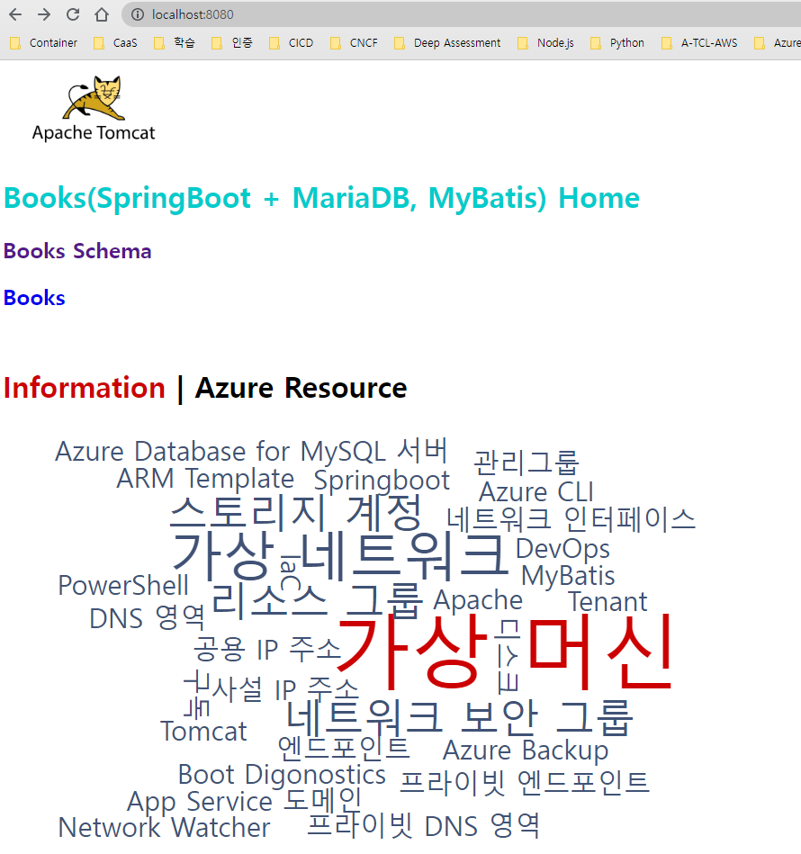
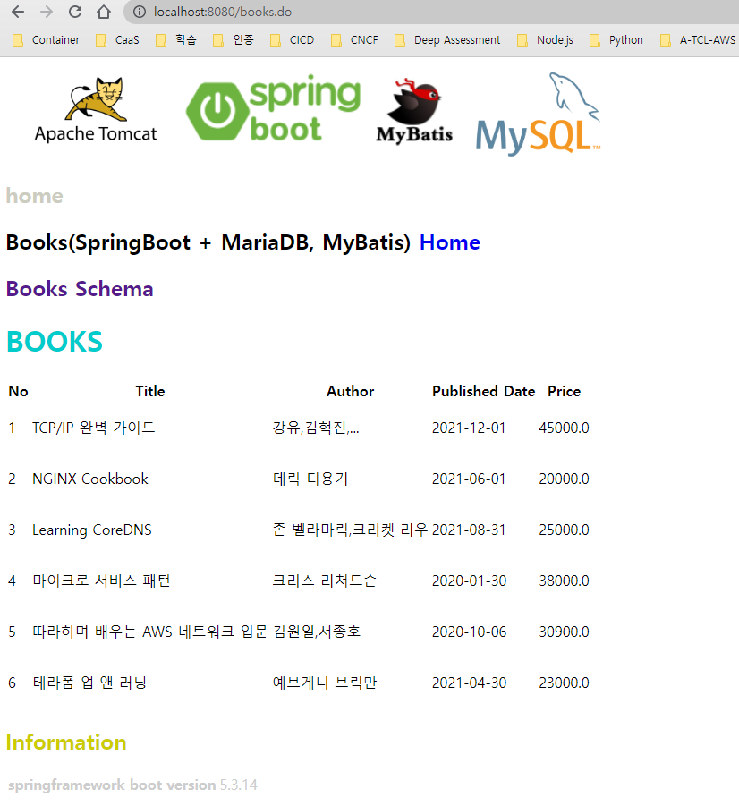
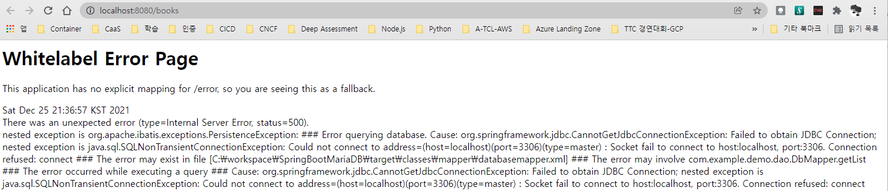
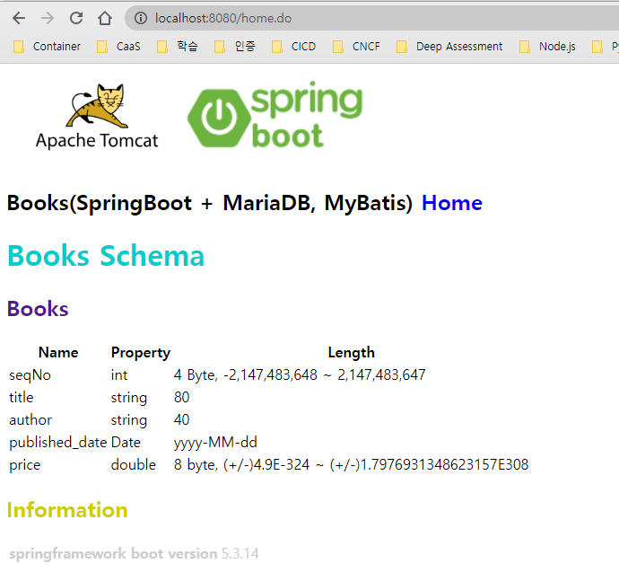
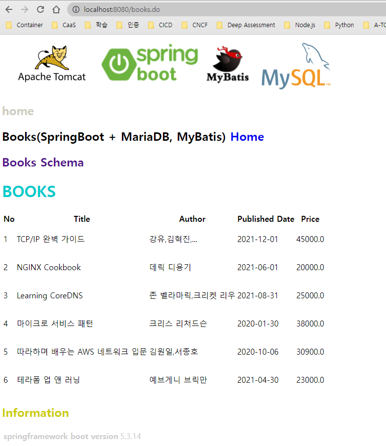
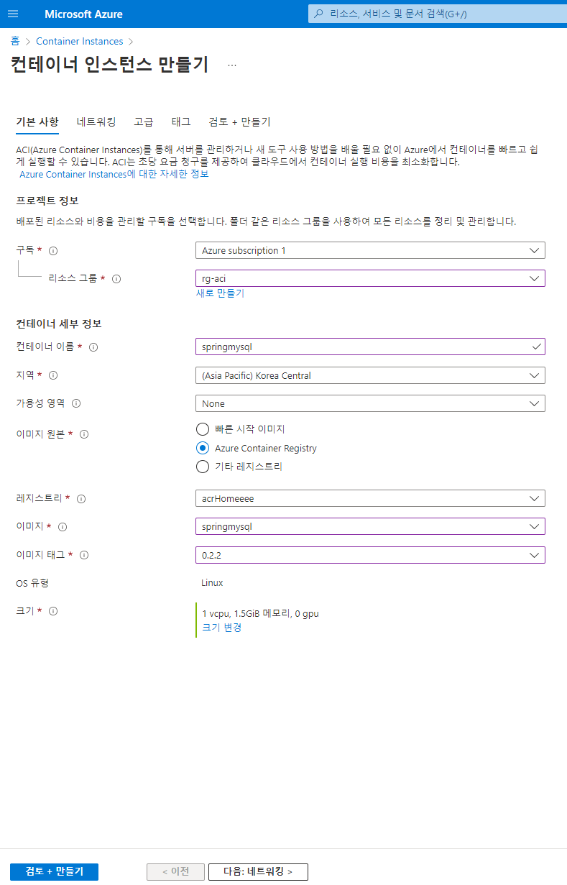
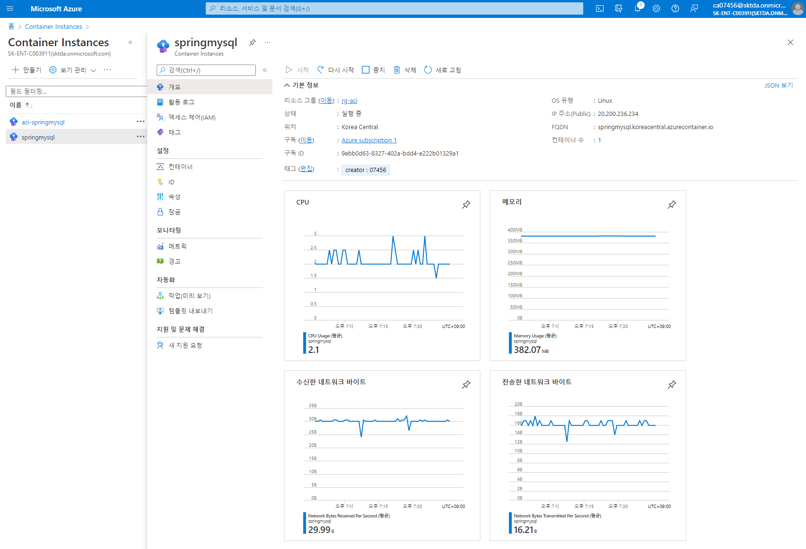
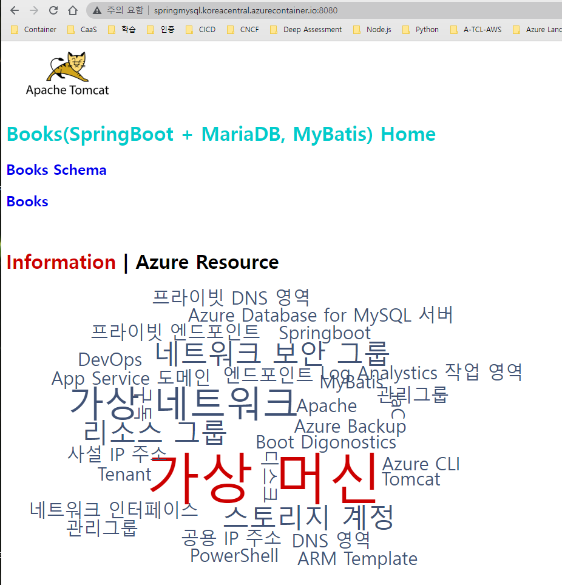

# SpringBoot MySQL Sample

## 다루는 내용
- [Maven Build](./Maven.md)  
- [Apache](./Apache-Windows.md), [Tomcat](./Tomcat-Windows.md for Windows) 구성, pc, linux 에서 3-tier 구성 테슽
- [Springboot 테스트](./SpringbootMySQLSample.md) 
- [Dockerizing](./podman.md): podman 을 사용한 Container Image 만들기
- ACR(Azure Container Regitry) 에 repostory(springmysql) 생성 및  image 넣기 
- [ACI(Azure Container Instance)](./AzureContainerInstance.md) 생성
  - [Azure Load Balancer 생성 및 연결](./AzureLoadbalancer.md)
  - Azure DNS 등록  
- [Jenkinsfiles](./Jenkinsfile) : Jenkins CI 예시
- [k8s Manifests](./k8s/README.md)
  - [Deployments](./k8s/springmysql-deploy.yaml)
  - [Autoscaler](./k8s/springmysql-hpa.yaml)
  - [Service](./k8s/springmysql-svc.yaml)
  - [Ingress](./k8s/springmysql-ing.yaml)


## 실행 환경  

| 구분 | 항목 | 버전 | 설치 관련 |
|:---|:---|:---|:---|
| 운영체계 | Windows/Ubuntu | 10,11/18.04 LTS | |  
| 웹서버 | [Apache](https://httpd.apache.org/) | [2.4.52](https://www.apachelounge.com/download/) | [Windows](./Apache-Windows.md) / [Ubuntu](./Apache-Ubuntu.md)|  
| WAS 연계 모듈 | [mod_jk](https://downloads.apache.org/tomcat/tomcat-connectors/jk/) | [1.2.48](https://www.apachelounge.com/download/VS16/modules/mod_jk-1.2.48-win64-VS16.zip) | |  
| WAS 서버 | [Tomcat](https://tomcat.apache.org/) | [9.0.56](https://dlcdn.apache.org/tomcat/tomcat-9/v9.0.56/bin/apache-tomcat-9.0.56.exe) / [10.0.14](https://dlcdn.apache.org/tomcat/tomcat-10/v10.0.14/bin/apache-tomcat-10.0.14.exe) |[Windows](./Tomcat-Windows.md) / [Ubuntu](./Tomcat-Ubuntu.md)|  
| 개발/실행 도구 | [OpenJDK](https://openjdk.java.net/)| [17.0.1](https://jdk.java.net/17/) | |  
| 통합개발환경 | [Visual Studio Code](https://code.visualstudio.com/) | 1.63.2 | |   
| 프레임워크 | [Spring Boot](https://spring.io/projects/spring-boot) | 2.6.2 | [Springboot](./Springboot.md) |  
| 빌드 툴 | [Maven](https://maven.apache.org/) | 2.5.2 | [Maven](./MariaDB.md) |  
| 퍼시스턴스 프레임워크 | [MyBatis](https://mybatis.org/mybatis-3/ko/index.html) | 3.4.1 | |  
| 데이터베이스 | [MariaDB](https://mariadb.org/)| [10.6.0](https://mariadb.org/download/?t=mariadb&p=mariadb&r=10.6.5&os=windows&cpu=x86_64&pkg=msi&m=yongbok) | [Windows](./MariaDB.md) |  
| 데이터베이스 | [MySQL](https://www.mysql.com/)| [5.7](https://dev.mysql.com/downloads/windows/installer/5.7.html), [5.7.36](https://downloads.mysql.com/archives/get/p/23/file/mysql-5.7.36-winx64.zip) | [Ubuntu](./SpringbootMySQLSample.md) |  
| 컨테이너 도구 | [podman](https://podman.io/getting-started/installation) | | [Ubuntu](./podman.md) |   
| Windows 용 OpenJDK | (jdk-8u322-x64 ZIP)[https://developers.redhat.com/content-gateway/file/java-1.8.0-openjdk-1.8.0.322-2.b06.dev.redhat.windows.x86_64.zip] </BR> [OpenJDK 8 Windows 64­-bit](https://developers.redhat.com/content-gateway/file/java-1.8.0-openjdk-1.8.0.322-2.b06.dev.redhat.windows.x86_64.msi) | 1.8.0.322-2.b06 | Windows |  


## OpenJDK 정보
```
PS D:\workspace\SpringBootMySQL> java -version
openjdk version "1.8.0_322"
OpenJDK Runtime Environment (build 1.8.0_322-b06)
OpenJDK 64-Bit Server VM (build 25.322-b06, mixed mode)
PS D:\workspace\SpringBootMySQL> 
```

## MariaDB 정보
| 항목 | 내용 |
|:---|:---|
| port | 13306 |  
| user | tutorial | 
| database | tutorial | 
| table | tutorial |

### 테이블(tutorial)
| Field | Type | Null | Key | Default | Extra  |
|:---|:---|:---|:---|:---|:---|
| SeqNo          | int(11)     | NO   | PRI | NULL | auto_increment |
| Title          | varchar(20) | NO   |     | NULL |                |
| Author         | varchar(20) | NO   |     | NULL |                |
| Price          | double      | NO   |     | 0    |                |
| published_date | date        | NO   |     | NULL |                |

## [Maven 빌드 & 실행](./Maven.md)
```
./mvnw clean install
./mvnw spring-boot:run  
```
### 접속
http://localhost:8080/

#### 정상 동작 화면
  
---   
  

#### 실행 로그
```powershell
PS C:\workspace\SpringBootMariaDB> ./mvnw spring-boot:run

[INFO] Scanning for projects...
[INFO] 
[INFO] --------------------< com.example:SpringBootSample >--------------------
[INFO] Building SpringBootSample 0.0.1-SNAPSHOT
[INFO] --------------------------------[ war ]---------------------------------
[INFO] 
[INFO] >>> spring-boot-maven-plugin:2.2.3.RELEASE:run (default-cli) > test-compile @ SpringBootSample >>>
[INFO] 
[INFO] --- maven-resources-plugin:3.1.0:resources (default-resources) @ SpringBootSample ---
[INFO] Using 'UTF-8' encoding to copy filtered resources.
[INFO] Copying 1 resource
[INFO] Copying 1 resource
[INFO]
[INFO] --- maven-compiler-plugin:3.8.1:compile (default-compile) @ SpringBootSample ---
[INFO] Nothing to compile - all classes are up to date
[INFO]
[INFO] --- maven-resources-plugin:3.1.0:testResources (default-testResources) @ SpringBootSample ---
[INFO] Using 'UTF-8' encoding to copy filtered resources.
[INFO] skip non existing resourceDirectory C:\workspace\SpringBootMariaDB\src\test\resources
[INFO]
[INFO] --- maven-compiler-plugin:3.8.1:testCompile (default-testCompile) @ SpringBootSample ---
[INFO] Nothing to compile - all classes are up to date
[INFO]
[INFO] <<< spring-boot-maven-plugin:2.2.3.RELEASE:run (default-cli) < test-compile @ SpringBootSample <<<
[INFO]
[INFO]
[INFO] --- spring-boot-maven-plugin:2.2.3.RELEASE:run (default-cli) @ SpringBootSample ---
[INFO] Attaching agents: []

  .   ____          _            __ _ _
 /\\ / ___'_ __ _ _(_)_ __  __ _ \ \ \ \
( ( )\___ | '_ | '_| | '_ \/ _` | \ \ \ \
 \\/  ___)| |_)| | | | | || (_| |  ) ) ) )
  '  |____| .__|_| |_|_| |_\__, | / / / /
 =========|_|==============|___/=/_/_/_/
 :: Spring Boot ::        (v2.2.3.RELEASE)

2021-12-26 12:47:21.118  INFO 24152 --- [           main] c.e.demo.SpringBootSampleApplication     : Starting SpringBootSampleApplication on DESKTOP-QR555PR with PID 24152 (C:\workspace\SpringBootMariaDB\target\classes started by taeey in C:\workspace\SpringBootMariaDB)
2021-12-26 12:47:21.120  INFO 24152 --- [           main] c.e.demo.SpringBootSampleApplication     : No active profile set, falling back to default profiles: default
2021-12-26 12:47:22.453  INFO 24152 --- [           main] o.s.b.w.embedded.tomcat.TomcatWebServer  : Tomcat initialized with port(s): 8080 (http)
2021-12-26 12:47:22.461  INFO 24152 --- [           main] o.apache.catalina.core.StandardService   : Starting service [Tomcat]
2021-12-26 12:47:22.461  INFO 24152 --- [           main] org.apache.catalina.core.StandardEngine  : Starting Servlet engine: [Apache Tomcat/9.0.30]
2021-12-26 12:47:22.639  INFO 24152 --- [           main] org.apache.jasper.servlet.TldScanner     : At least one JAR was scanned for TLDs yet contained no TLDs. Enable debug logging for this logger for a complete list of JARs that were scanned but no TLDs were found in them. Skipping unneeded JARs during scanning can improve startup time and JSP compilation time.
2021-12-26 12:47:22.646  INFO 24152 --- [           main] o.a.c.c.C.[Tomcat].[localhost].[/]       : Initializing Spring embedded WebApplicationContext
2021-12-26 12:47:22.647  INFO 24152 --- [           main] o.s.web.context.ContextLoader            : Root WebApplicationContext: initialization completed in 1502 ms
2021-12-26 12:47:22.855  INFO 24152 --- [           main] o.s.s.concurrent.ThreadPoolTaskExecutor  : Initializing ExecutorService 'applicationTaskExecutor'
2021-12-26 12:47:22.896  INFO 24152 --- [           main] o.s.b.a.w.s.WelcomePageHandlerMapping    : Adding welcome page template: index
2021-12-26 12:47:22.977  INFO 24152 --- [           main] o.s.b.w.embedded.tomcat.TomcatWebServer  : Tomcat started on port(s): 8080 (http) with context path ''
2021-12-26 12:47:22.980  INFO 24152 --- [           main] c.e.demo.SpringBootSampleApplication     : Started SpringBootSampleApplication in 2.093 seconds (JVM running for 2.356)
2021-12-26 12:47:32.980  INFO 24152 --- [nio-8080-exec-1] o.a.c.c.C.[Tomcat].[localhost].[/]       : Initializing Spring DispatcherServlet 'dispatcherServlet'
2021-12-26 12:47:32.981  INFO 24152 --- [nio-8080-exec-1] o.s.web.servlet.DispatcherServlet        : Initializing Servlet 'dispatcherServlet'
2021-12-26 12:47:32.986  INFO 24152 --- [nio-8080-exec-1] o.s.web.servlet.DispatcherServlet        : Completed initialization in 4 ms
2021-12-26 12:47:33.969  WARN 24152 --- [nio-8080-exec-1] o.a.c.util.SessionIdGeneratorBase        : Creation of SecureRandom instance for session ID generation using [SHA1PRNG] took [701] milliseconds.
2021-12-26 12:47:45.634  INFO 24152 --- [nio-8080-exec-2] com.zaxxer.hikari.HikariDataSource       : HikariPool-1 - Starting...
2021-12-26 12:47:45.667  INFO 24152 --- [nio-8080-exec-2] com.zaxxer.hikari.HikariDataSource       : HikariPool-1 - Start completed.
WARNING: An illegal reflective access operation has occurred
WARNING: Illegal reflective access by org.apache.ibatis.reflection.Reflector (file:/C:/Users/taeey/.m2/repository/org/mybatis/mybatis/3.4.1/mybatis-3.4.1.jar) to method java.lang.Object.finalize()
WARNING: Please consider reporting this to the maintainers of org.apache.ibatis.reflection.Reflector
WARNING: Use --illegal-access=warn to enable warnings of further illegal reflective access operations
WARNING: All illegal access operations will be denied in a future release
```

### 오류 화면(MariaDB 가 Running 되지 않을 경우)
  

### .do 로 변경 후 화면
- [http://localhost:8080/home.do](http://localhost:8080/home.do)
  
- [http://localhost:8080/books](http://localhost:8080/books.do)
  

## [Container Build & 실행](./podman.md)  
### podman
- podman 은 linux 에서 실행시 사용
- ubuntu 20.04 이상은 기본 설치 되나 안되어 있을 경우 설치하여 사용
- windows 에서는 docker 를 사용하여 빌드하는 것이 일반적
- podman 과 docker 의 container image 생성, 실행 등의 client 로의 기능은 동일함
### Dockerfile 작성
```
FROM openjdk:8-jdk-alpine

# Container 내에서 사용된 사용자 및 그룹 생성 및 지정
RUN addgroup -S spring && adduser -S spring -G spring
USER spring:spring

ARG WAR_FILE=target/*.war
ARG APP_NAME=app
ARG DEPENDENCY=target/classes

# 실행 디렉토리 생성 및 지정
RUN mkdir -p /home/spring
WORKDIR /home/spring

# 업무 파일 넣기
COPY ${WAR_FILE} /home/spring/app.war

# Prometheus 에서 Metric 을 수집할 수 있게 jmx-export 파일 넣기
COPY jmx-exporter/jmx_prometheus.yml /home/spring/jmx_prometheus.yml
COPY ./jmx-exporter/jmx_prometheus_javaagent-0.16.1.jar /home/spring/jmx_prometheus_javaagent.jar

# Listen Port
EXPOSE 8088

# Container Image RUN 시 실행되는 명령
# 내장 Tomcat 이 실행됨  
# -cp : classpath 지정
# -Xms -Xmx -XX : java 에 할당할 메모리 옵션
# -javaagent : jmx_prometheus 실행
# -jar : .war file(업무) 를 지정
ENTRYPOINT java -cp app:app/lib/* -Xms512m -Xmx512m -XX:NewSize=256m -XX:MaxNewSize=256m -XX:MaxMetaspaceSize=128m -XX:MetaspaceSize=128m -XX:ParallelGCThreads=3 \
		-XX:+PrintGCDetails -XX:+PrintGCDateStamps -XX:+PrintHeapAtGC -Xloggc:/gclog/gc_${HOSTNAME}_$(date +%Y%m%d%H%M%S).log -Dgclog_file=/gclog/gc_${HOSTNAME}_$(date +%Y%m%d%H%M%S).log \
		-XX:+HeapDumpOnOutOfMemoryError -XX:HeapDumpPath=/gclog/${HOSTNAME}.log \
		-javaagent:/home/spring/jmx_prometheus_javaagent.jar=8090:/home/spring/jmx_prometheus.yml \
		-Djava.security.egd=file:/dev/./urandom -jar /home/spring/app.war
```

### docker version
```
PS D:\workspace\SpringBootMySQL> docker version
Client:
 Cloud integration: v1.0.23
 Version:           20.10.14
 API version:       1.41
 Go version:        go1.16.15
 Git commit:        a224086
 Built:             Thu Mar 24 01:53:11 2022
 OS/Arch:           windows/amd64
 Context:           default
 Experimental:      true

Server: Docker Desktop 4.7.0 (77141)
 Engine:
  Version:          20.10.14
  API version:      1.41 (minimum version 1.12)
  Go version:       go1.16.15
  Git commit:       87a90dc
  Built:            Thu Mar 24 01:46:14 2022
  OS/Arch:          linux/amd64
  Experimental:     false
 containerd:
  Version:          1.5.11
  GitCommit:        3df54a852345ae127d1fa3092b95168e4a88e2f8
 runc:
  Version:          1.0.3
  GitCommit:        v1.0.3-0-gf46b6ba
 docker-init:
  Version:          0.19.0
  GitCommit:        de40ad0
PS D:\workspace\SpringBootMySQL> wsl -l -v
  NAME                   STATE           VERSION
* docker-desktop         Running         2
  docker-desktop-data    Running         2
PS D:\workspace\SpringBootMySQL> 
```

### Container Build
- 아래의 2개 명령은 동일하나 liunx, windows 에서 따라 달리 사용
- linux : podman 
  ```
  podman build --tag springmysql:0.1.0 .
  ```

- docker : windows
  - podman 이 현재 windows 에서 설치 되지 않음
  - windows 에서는 WSL(Windows Subsystem for Linux 에 설치하여 사용)
  ```
  docker build --tag springmysql:0.1.0 .
  ```

- azure : acr build 사용
  - windows powershell 에서 실행 가능
  - acr-env.ps1
    ```
    $groupName='rg-skcc2-aks'
    $locationName='koreacentral'
    $serviceName='Homeeee'
    $acrName="acr$serviceName"

    $repositoryName="springmysql"
    $tag='0.2.2'
    $clusterName='aks-cluster-Homeeee'

    # export loginServer="acrhomepage.azurecr.io"
    $loginServer="${acrName}.azurecr.io"

    # az aks get-credentials --resource-group $groupName --name $clusterName --overwrite-existing

    if ($accessToken -eq $null) {
      $accessToken=az acr login --name $acrName --expose-token | jq .accessToken | %{$_ -replace('"', '')}
    }
    ```
  - acr-build.ps1
    ```
    . ./acr-env.ps1

    az acr build `
      --image "${repositoryName}:${tag}" `
      --registry $acrName `
      --file Dockerfile .

    az acr repository show-tags -o table -n $acrName --repository ${repositoryName}
    ```
  - [build](./acr-build.md)
    ```powershell
    ./acr-build.ps1
    ```
  - ACR 만들기
    - 이름 : springmysql  
    - ip   : public  
        
        

  - 결과
        

#### Windows 에서 실행 결과
```
S D:\workspace\SpringBootMySQL> docker build --tag springmysql:0.1.0 .
[+] Building 10.5s (12/12) FINISHED
 => [internal] load build definition from Dockerfile                                                                                                                                            0.2s
 => => transferring dockerfile: 2.37kB                                                                                                                                                          0.0s
 => [internal] load .dockerignore                                                                                                                                                               0.1s
 => => transferring context: 2B                                                                                                                                                                 0.0s
 => [internal] load metadata for docker.io/library/openjdk:8-jdk-alpine                                                                                                                         4.0s
 => [internal] load build context                                                                                                                                                               0.3s
 => => transferring context: 31.57MB                                                                                                                                                            0.2s
 => [1/7] FROM docker.io/library/openjdk:8-jdk-alpine@sha256:94792824df2df33402f201713f932b58cb9de94a0cd524164a0f2283343547b3                                                                   4.7s
 => => resolve docker.io/library/openjdk:8-jdk-alpine@sha256:94792824df2df33402f201713f932b58cb9de94a0cd524164a0f2283343547b3                                                                   0.0s
 => => sha256:44b3cea369c947527e266275cee85c71a81f20fc5076f6ebb5a13f19015dce71 947B / 947B                                                                                                      0.0s
 => => sha256:a3562aa0b991a80cfe8172847c8be6dbf6e46340b759c2b782f8b8be45342717 3.40kB / 3.40kB                                                                                                  0.0s
 => => sha256:e7c96db7181be991f19a9fb6975cdbbd73c65f4a2681348e63a141a2192a5f10 2.76MB / 2.76MB                                                                                                  0.6s 
 => => sha256:f910a506b6cb1dbec766725d70356f695ae2bf2bea6224dbe8c7c6ad4f3664a2 238B / 238B                                                                                                      0.2s 
 => => sha256:c2274a1a0e2786ee9101b08f76111f9ab8019e368dce1e325d3c284a0ca33397 70.73MB / 70.73MB                                                                                                3.3s 
 => => sha256:94792824df2df33402f201713f932b58cb9de94a0cd524164a0f2283343547b3 1.64kB / 1.64kB                                                                                                  0.0s 
 => => extracting sha256:e7c96db7181be991f19a9fb6975cdbbd73c65f4a2681348e63a141a2192a5f10                                                                                                       0.1s
 => => extracting sha256:f910a506b6cb1dbec766725d70356f695ae2bf2bea6224dbe8c7c6ad4f3664a2                                                                                                       0.0s
 => => extracting sha256:c2274a1a0e2786ee9101b08f76111f9ab8019e368dce1e325d3c284a0ca33397                                                                                                       1.2s
 => [2/7] RUN addgroup -S spring && adduser -S spring -G spring                                                                                                                                 0.5s
 => [3/7] RUN mkdir -p /home/spring                                                                                                                                                             0.6s
 => [4/7] WORKDIR /home/spring                                                                                                                                                                  0.1s
 => [5/7] COPY target/*.war /home/spring/app.war                                                                                                                                                0.1s 
 => [6/7] COPY jmx-exporter/jmx_prometheus.yml /home/spring/jmx_prometheus.yml                                                                                                                  0.1s 
 => [7/7] COPY ./jmx-exporter/jmx_prometheus_javaagent-0.16.1.jar /home/spring/jmx_prometheus_javaagent.jar                                                                                     0.1s 
 => exporting to image                                                                                                                                                                          0.2s 
 => => exporting layers                                                                                                                                                                         0.2s 
 => => writing image sha256:9782342a3a11b2c609d5b0c2968e06ddaf232cba2867da8db72c5bdf8da24dc1                                                                                                    0.0s 
 => => naming to docker.io/library/springmysql:0.1.0                                                                                                                                            0.0s 

Use 'docker scan' to run Snyk tests against images to find vulnerabilities and learn how to fix them
PS D:\workspace\SpringBootMySQL> docker images
REPOSITORY    TAG       IMAGE ID       CREATED          SIZE
springmysql   0.1.0     9782342a3a11   18 seconds ago   136MB
PS D:\workspace\SpringBootMySQL> docker run springmysql:0.1.0
OpenJDK 64-Bit Server VM warning: Cannot open file /gclog/gc_9a4bccfbaed4_20220414113746.log due to No such file or directory


  .   ____          _            __ _ _
 /\\ / ___'_ __ _ _(_)_ __  __ _ \ \ \ \
( ( )\___ | '_ | '_| | '_ \/ _` | \ \ \ \
 \\/  ___)| |_)| | | | | || (_| |  ) ) ) )
  '  |____| .__|_| |_|_| |_\__, | / / / /
 =========|_|==============|___/=/_/_/_/
 :: Spring Boot ::                (v2.6.2)

2022-04-14 11:37:47.329  INFO 1 --- [           main] c.e.demo.SpringBootSampleApplication     : Starting SpringBootSampleApplication v0.0.1-SNAPSHOT using Java 1.8.0_212 on 9a4bccfbaed4 with PID 1 (/home/spring/app.war started by spring in /home/spring)
2022-04-14 11:37:47.332  INFO 1 --- [           main] c.e.demo.SpringBootSampleApplication     : No active profile set, falling back to default profiles: default
2022-04-14 11:37:48.162  INFO 1 --- [           main] o.s.b.w.embedded.tomcat.TomcatWebServer  : Tomcat initialized with port(s): 8080 (http)
2022-04-14 11:37:48.172  INFO 1 --- [           main] o.apache.catalina.core.StandardService   : Starting service [Tomcat]
2022-04-14 11:37:48.173  INFO 1 --- [           main] org.apache.catalina.core.StandardEngine  : Starting Servlet engine: [Apache Tomcat/9.0.56]
2022-04-14 11:37:48.982  INFO 1 --- [           main] org.apache.jasper.servlet.TldScanner     : At least one JAR was scanned for TLDs yet contained no TLDs. Enable debug logging for this logger for a complete list of JARs that were scanned but no TLDs were found in them. Skipping unneeded JARs during scanning can improve startup time and JSP compilation time.
2022-04-14 11:37:49.226  INFO 1 --- [           main] o.a.c.c.C.[Tomcat].[localhost].[/]       : Initializing Spring embedded WebApplicationContext
2022-04-14 11:37:49.227  INFO 1 --- [           main] w.s.c.ServletWebServerApplicationContext : Root WebApplicationContext: initialization completed in 1853 ms
2022-04-14 11:37:49.693  INFO 1 --- [           main] o.s.b.a.w.s.WelcomePageHandlerMapping    : Adding welcome page: class path resource [static/index.html]
2022-04-14 11:37:49.845  INFO 1 --- [           main] o.s.b.w.embedded.tomcat.TomcatWebServer  : Tomcat started on port(s): 8080 (http) with context path ''
2022-04-14 11:37:49.856  INFO 1 --- [           main] c.e.demo.SpringBootSampleApplication     : Started SpringBootSampleApplication in 2.819 seconds (JVM running for 3.249)

```
```
PS D:\workspace\SpringBootMySQL> docker ps
CONTAINER ID   IMAGE               COMMAND                  CREATED         STATUS         PORTS      NAMES
9a4bccfbaed4   springmysql:0.1.0   "/bin/sh -c 'java -c…"   2 minutes ago   Up 2 minutes   8088/tcp   reverent_noyce
PS D:\workspace\SpringBootMySQL> 
```

##  Azure Container Instance 로 만들기
### [Azure Container Instance  보기](./AzureContainerInstance.md)   
### [Azure Load Balancer 에 ACI 등록](./AzureLoadbalancer.md)  
- http://springmysql.nodespringboot.org/  