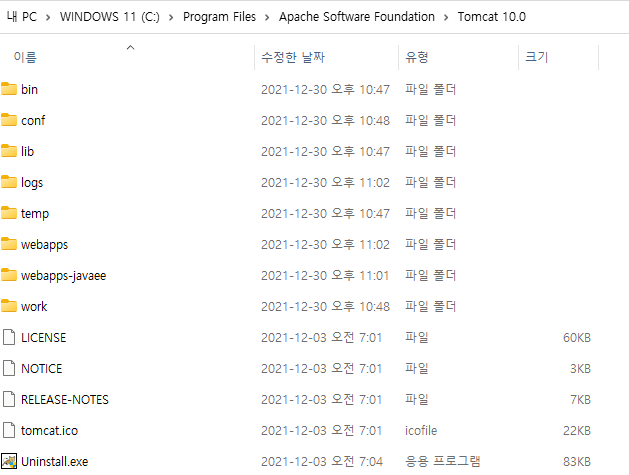
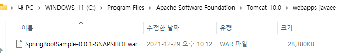
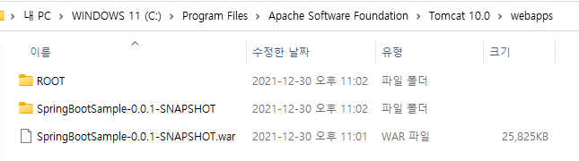

# [Spring Boot](https://spring.io/)
- 스프링 프레임워크 기반 프로젝트를 복잡한 설정없이 쉽고 빠르게 만들어주는 라이브러리
- Microservices, Reactive, Cloud, Web apps, Serverless, Event Driven, Batch


## 특징
### 기본설정이 되어있는 starter 컴포너트를 제공(Library 관리의 자동화)
- spring boot 의 Starter 라이브러리를 등록해서 라이브러리 의존성을 간단하게 관리할 수 있음

### Library 버전 자동 관리
- pom.xml에 스프링 부트 버전을 입력하면 스프링 라이브러리 뿐만 아니라 서드 파티 라이브러리들도 호환되는 버전으로 알아서 다운함

### 설정의 자동화
- spring boot 는 @EnableAutoConfiguration 어노테이션을 선언해서 spring 에서 자주 사용 했던 설정들을 알아서 등록해줌

### 내장 Tomcat
- 내장 Tomcat 를 사용하려면 특별한 설정없이 Web Starter 의존성을 추가하면 됨
  ```
		<dependency>
			<groupId>org.springframework.boot</groupId>
			<artifactId>spring-boot-starter-web</artifactId>
		</dependency>
  ```

### 독립적으로 실행 가능한 Spring Application 을 생성함(JAR)
- 웹 프로젝트라면 WAR 파일로 패키징해야하지만 spring boot 는 내장 톰캣을 지원하기 때문에 JAR 파일로 패키징해서 웹 애플리케이션을 실행시킬 수 있음

### 사용화에 필요한 통계, 상태 체크, 외부 설정 등을 제공
### 설정을 위한 XML 코드를 생성하거나 요구하지 않음

---

## SpringController Annotation
### @Controller
- 적용된 클래스는 "Controller"임을 나타나고, bean으로 등록되며 해당 클래스가 Controller로 사용됨을 Spring Framework에 알림

### @RequestMapping
- 선언된 클래스의 모든 메소드가 하나의 요청에 대한 처리를 할경우 사용함

### @RestController
- @Controller + @ResponseBody 
- 메소드의 return(반환 결과값)을 문자열(JSON) 형태로 반환
- 리턴을 view 페이지 대신 saveInfo 라는 객체를 JSON 형태로 변환한 데이터를 반환

### @ResponseBody
- 메소드에서 리턴되는 값은 View 를 통해서 출력되지 않고 HTTP Response Body 에 직접 쓰여지게 됨
- 쓰여지기 전에 리턴되는 데이터 타입에 따라 MessageConverter 에서 변환이 이뤄진 후 쓰여지게 됨

### @Autowired
- org.springframework.beans.factory.annotation.Autowired
- 필요한 의존 객체의 "Type"에 해당하는 Bean 을 찾아 주입

## Spring Boot WAR 배포하기
> [Spring Boot WAR 로 배포하기 (How to deploy with *.war file with Spring Boot)](https://4urdev.tistory.com/84)

### 1. SpringBootServletInitializer 상속받는 것으로 변경
- src/java/com/example/demo/SpringBootSampleApplication.java
- SpringBootServletInitializer 상속받기
```java
package com.example.demo;

// import com.example.demo.controller.*;
import org.springframework.boot.SpringApplication;
import org.springframework.boot.autoconfigure.SpringBootApplication;
import org.springframework.boot.builder.SpringApplicationBuilder;
import org.springframework.boot.web.servlet.support.SpringBootServletInitializer;


@SpringBootApplication
public class SpringBootSampleApplication extends SpringBootServletInitializer {
	
	public static void main(String[] args) {
		SpringApplication.run(SpringBootSampleApplication.class, args);
	}

}
```
### 2. Embed servlet 을 'provided' 로 변경
- pom.xml
```xml
		<!--  Tomcat embeded container -->
		<dependency>
			<groupId>org.springframework.boot</groupId>
			<artifactId>spring-boot-starter-tomcat</artifactId>
			<scope>provided</scope>
```
### 3. war로 빌드
- pom.xml
```xml
<packaging>war</packaging>
```

## Tomcat 에 WAR 파일 설정하기
> [Tomcat에 WAR 파일 배포해서 기동하기](https://oingdaddy.tistory.com/344)
- webapps 밑에 ROOT 디렉토리 삭제 후 ROOT.war 로 배포
- server.xml 에 "<Context> " 추가하기
### server.xml 에 <Context> 내용 추가하기
- "SpringBootSample-0.0.1-SNAPSHOT.war" 일 경우 ".war" 제거 후 아래와 같이 기술
```xml
      <Host name="localhost"  appBase="webapps" unpackWARs="true" autoDeploy="true">
        <Context path="" docBase="SpringBootSample-0.0.1-SNAPSHOT" reloadable="false" />

        <!-- Access log processes all example.
             Documentation at: /docs/config/valve.html
             Note: The pattern used is equivalent to using pattern="common" -->
        <Valve className="org.apache.catalina.valves.AccessLogValve" directory="logs"
               prefix="localhost_access_log" suffix=".txt"
               pattern="%h %l %u %t &quot;%r&quot; %s %b" />

      </Host>
    </Engine>
```

## SpringBoot Welcome Page
- Welcome Page : src/main/java/com/example/demo/resources/static/index.html

## SpringBoot Actuator
> [스프링부트 액추에이터 체험하기](http://forward.nhnent.com/hands-on-labs/java.spring-boot-actuator/index.html)  
### Actuator 추가
#### pom.xml
```
<dependency>
  <groupId>org.springframework.boot</groupId>
  <artifactId>spring-boot-starter-actuator</artifactId>
</dependency>
```
```
			<plugin>
					<groupId>pl.project13.maven</groupId>
					<artifactId>git-commit-id-plugin</artifactId>
			</plugin>
```

#### application.properties
```
# actuator
management.endpoint.health.show-details=always
info.project.version=@project.version@
info.java.version=@java.version@
info.spring.framework.version=@spring-framework.version@
info.spring.data.version=@spring-data-bom.version@
```

### 애플리케이션 정상상태 점검: /actuator/health
#### 호출결과
```
{
  status: "UP"
}
```
### 사용라이브러리 버전과 소스 코드 버전 상세 정보 : /actuator/info

### 모든 액츄에이터 엔드포인트를 웹으로 공개
```
management.endpoint.web.exposure.include=*
```

### 로깅 정보 엔드포인트 : /actuator/loggers


## Tomcat 10 에 배포시 주의할 점
>[[Tomcat] Spring Boot 프로젝트 Tomcat 10에서 배포하기](https://adg0609.tistory.com/57?category=876826)

- Tomcat 9 와 pom.xml, server.xml 은 동일하게 설정
- .war 배포시 아래의 절차대로 수행
  - $TOMCAT_HOME에 webapps-javaee 란 폴더 생성
  - webapps 폴더 내의 모든 파일 삭제
  - webapps-javaee 에 "SpringBootSample-0.0.1-SNAPSHOT.war"를 옮겨 놓음
  - tomcat 를 기동 시킴
     
    
  

### docker build & push
```
aws ecr get-login-password --region ap-northeast-2 | docker login --username AWS --password-stdin 143719223348.dkr.ecr.ap-northeast-2.amazonaws.com/springmysql
aws ecr get-login-password --region ap-northeast-2 --profile AdminRolePrd | docker login --username AWS --password-stdin 143719223348.dkr.ecr.ap-northeast-2.amazonaws.com/springmysql
docker build --tag springmysql:0.1.0 .
docker tag springmysql:0.1.0 143719223348.dkr.ecr.ap-northeast-2.amazonaws.com/springmysql:1.0.0
docker push 143719223348.dkr.ecr.ap-northeast-2.amazonaws.com/springmysql:1.0.0
```
#### docker login & push
```
PS D:\workspace\SpringBootMySQL> aws ecr get-login-password --region ap-northeast-2 --profile AdminRolePrd | docker login --username AWS --password-stdin 143719223348.dkr.ecr.ap-northeast-2.amazonaws.com/springmysql
Login Succeeded
PS D:\workspace\SpringBootMySQL> docker push 143719223348.dkr.ecr.ap-northeast-2.amazonaws.com/springmysql:1.0.0
The push refers to repository [143719223348.dkr.ecr.ap-northeast-2.amazonaws.com/springmysql]
b7fbd9673be6: Pushed
f48aea12519c: Pushed
291362926ae8: Pushing [===============================>                   ]  19.33MB/31.09MB
5f70bf18a086: Pushed
6d1751c59a5b: Pushed
1e7b298cff55: Pushed
ceaf9e1ebef5: Pushing [================>                                  ]  32.43MB/99.29MB
9b9b7f3d56a0: Pushed
f1b5933fe4b5: Pushed

```
```
PS D:\workspace\SpringBootMySQL> aws ecr get-login-password --region ap-northeast-2 --profile AdminRolePrd | docker login 
--username AWS --password-stdin 143719223348.dkr.ecr.ap-northeast-2.amazonaws.com/springmysql
Login Succeeded
PS D:\workspace\SpringBootMySQL> docker push 143719223348.dkr.ecr.ap-northeast-2.amazonaws.com/springmysql:1.0.0
The push refers to repository [143719223348.dkr.ecr.ap-northeast-2.amazonaws.com/springmysql]
b7fbd9673be6: Pushed
f48aea12519c: Pushed
291362926ae8: Pushed
5f70bf18a086: Pushed
6d1751c59a5b: Pushed
1e7b298cff55: Pushed
ceaf9e1ebef5: Pushed
9b9b7f3d56a0: Pushed
f1b5933fe4b5: Pushed
1.0.0: digest: sha256:c39c7ed171e84da5263731e54431c40ce319160060afa7f8d72c42cdcad06ace size: 2196
PS D:\workspace\SpringBootMySQL> 
```

