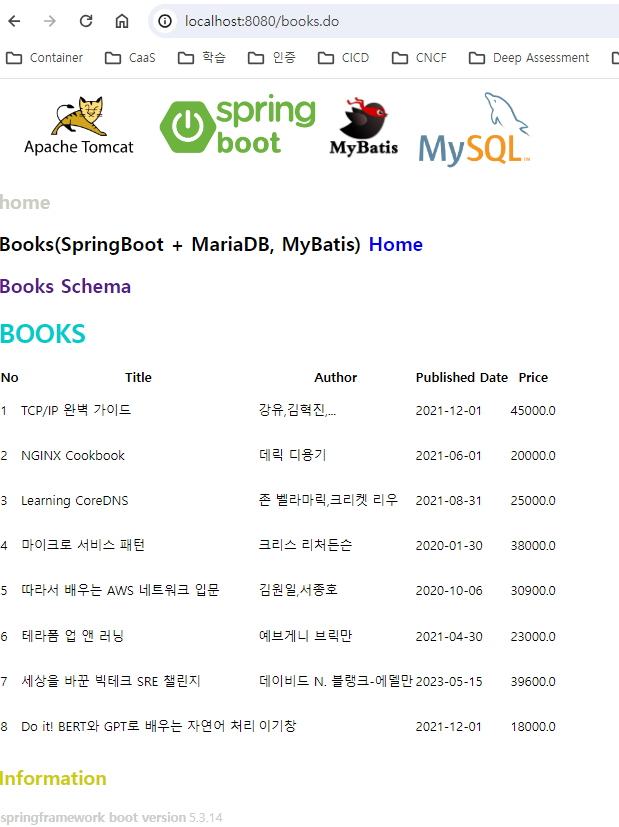

# docker composer

## Windows 에서 올려 테스트 하기

### 1. MySQL 기동

#### 1.1 MySQL 접속을 위한 환경 변수 설정
```
$Env:DB_CONNECTION='jdbc:mysql://localhost:3306/tutorial?allowPublicKeyRetrieval=true&useSSL=false&serverTimezone=Asia/Seoul&characterEncoding=UTF-8'
$Env:DB_DRIVER='com.mysql.cj.jdbc.Driver'
$Env:DB_PASSWORD='tutorial'
$Env:DB_USERNAME='tutorial'
```

#### 1.1.1 docker-compose.yaml 에서 서비스 명 (`mysql`) 을 사용해서  붙도록 수정해야 함
```
      - DB_DRIVER=com.mysql.cj.jdbc.Driver
      # - DB_CONNECTION=jdbc:mysql://localhost:3306/tutorial?allowPublicKeyRetrieval=true&useSSL=false&useUnicode=true&serverTimezone=Asia/Seoul&characterEncoding=UTF-8
      - DB_CONNECTION=jdbc:mysql://mysql:3306/tutorial?allowPublicKeyRetrieval=true&useSSL=false&serverTimezone=Asia/Seoul&characterEncoding=UTF-8
      - DB_USERNAME=tutorial
      - DB_PASSWORD=tutorial
```

#### 1.2 MySQL 올리기
```
docker-compose up mysql
```

### 2. Springboot Application 기동
```
./mvnw spring-boot:run
```

### 3. 실행 결과
  


### DB 한글 Character Set 관련
```
ALTER DATABASE tutorials DEFAULT CHARACTER SET utf8 ;
alter table books convert to character set utf8;
```


## `my.cnf` 속성 값 (Read Only)
```
PS D:\workspace\SpringBootMySQL\docker-compose\db\conf.d> attrib
A    R               D:\workspace\SpringBootMySQL\docker-compose\db\conf.d\my.cnf
A                    D:\workspace\SpringBootMySQL\docker-compose\db\conf.d\my.cnf.utf8
A                    D:\workspace\SpringBootMySQL\docker-compose\db\conf.d\my.cnf.utf8mb4
PS D:\workspace\SpringBootMySQL\docker-compose\db\conf.d> 
```

### mysql 로 접속해서 볼때 `Server`, `Db`, `Client`, `Connection` 이 같은 Character Set 이어야 함
- my.cnf 와 init.sql 에 설정으로 해결
```
PS C:\Users\07456> mysql -u root -h 127.0.0.1 -p
Enter password: *****
Welcome to the MySQL monitor.  Commands end with ; or \g.
Your MySQL connection id is 8
Server version: 8.0.30 MySQL Community Server - GPL

Copyright (c) 2000, 2022, Oracle and/or its affiliates.

Oracle is a registered trademark of Oracle Corporation and/or its
affiliates. Other names may be trademarks of their respective
owners.

Type 'help;' or '\h' for help. Type '\c' to clear the current input statement.

mysql> status
--------------
C:\tools\mysql\current\bin\mysql.exe  Ver 8.0.31 for Win64 on x86_64 (MySQL Community Server - GPL)

Connection id:          8
Current database:
Current user:           root@192.168.128.1
SSL:                    Cipher in use is TLS_AES_256_GCM_SHA384
Using delimiter:        ;
Server version:         8.0.30 MySQL Community Server - GPL
Protocol version:       10
Connection:             127.0.0.1 via TCP/IP
Server characterset:    utf8mb4
Db     characterset:    utf8mb4
Client characterset:    utf8mb4
Conn.  characterset:    utf8mb4
TCP port:               3306
Binary data as:         Hexadecimal
Uptime:                 9 sec

Threads: 2  Questions: 5  Slow queries: 0  Opens: 119  Flush tables: 3  Open tables: 38  Queries per second avg: 0.555
--------------

mysql>
```