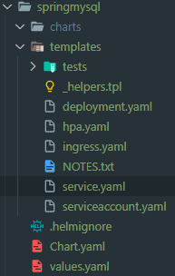

# Helm

## 환경
### 0. helm 설치
```
choco install kubernetes-helm
```

### 1. Cluster 설정
```
$Env:AWS_PROFILE="is07456" 
aws sts get-caller-identity
aws eks --region ap-northeast-2 update-kubeconfig --name skcc-07456-p-is-tf
kubectl config current-context
```


## 1. chart 기본구조 생성 
### helm create springmysql
```
PS > helm version
version.BuildInfo{Version:"v3.12.3", GitCommit:"3a31588ad33fe3b89af5a2a54ee1d25bfe6eaa5e", GitTreeState:"clean", GoVersion:"go1.20.7"}
PS > helm create springmysql
Creating springmysql
PS > tree ./springmysql
DATA 볼륨에 대한 폴더 경로의 목록입니다.
볼륨 일련 번호는 C8EC-E13F입니다.
\SPRINGMYSQL
├─charts
└─templates
    └─tests
PS > tree /f ./springmysql
DATA 볼륨에 대한 폴더 경로의 목록입니다.
볼륨 일련 번호는 C8EC-E13F입니다.
\SPRINGMYSQL
│  .helmignore
│  Chart.yaml
│  values.yaml
│
├─charts
└─templates
    │  deployment.yaml
    │  hpa.yaml
    │  ingress.yaml
    │  NOTES.txt
    │  service.yaml
    │  serviceaccount.yaml
    │  _helpers.tpl
    │
    └─tests
            test-connection.yaml

PS > 
```
  

| 이름 | Type | 설명 |  
|:---|:---|:---|  
| Chart.yaml | 파일 | Chart 에 대한 이름, 버전, 설명 등이 정의된 파일 |  
| requirements.yaml | 파일 | Chart 에 대한 종속 Chart 정보를 정의한 파일 |  
| values.yaml | 파일 | Chart 설치시 사용할 환경변수를 정의한 파일 |  
| charts/ | 폴더 | Chart 에서 사용하는 종속 Chart 들이 압축파일(tgz) 로 존재함. </br> helm dep up 명령 수행하면 requirements.yaml 참조하여 repository 에서 다운받아 생성함 |  
| templates/ | 폴더 | 설치할 resource 들의 기본 틀을 정의한 manifest yaml 파일 |  
| _helpers.tpl | 파일 | template manifest 파일들에서 공유하는 변수 정의 |  


## 2. yaml 파일 작성
### 2.1 chart.yaml 작성  
| 항목 | 설명 |  
|:---|:---|  
| apiVersion | Helm 자체의 api version 으로 항상 "1" 임 (required) |  
| name | Chart명 (required) |  
| versin | Chart 버전으로 SemVer(Semantic versioning)규칙을 준수해야 함. 즉 숫자로 된 X.X.X 형식이면 됨.(required) </br> [SemVer 규칙](https://semver.org/lang/ko/) 참조 |  
| kubeVersion | Chart 설치와 실행을 보장하는 최소 k8s 버전으로 SemVer 형식 범위로 정의 </br> ex) ">=1.15.3" (optional) |  
| description | Chart 에 대한 요약 설명 (optional) |  
| keywords | Chart 에 대한 keyword 이며, 여러개의 대시(-)로 구분된 새로운 라인으로 정의함 </br> helm search 시 keyword 도 같이 검색됨 (optional) |  
| home | Chart 프로젝트의 홈페이지 URL 임 (optional) |  
| sources | Chart 소스를 볼 수 있는 URL 임 </br> 대시로 구분된 새로운 라인으로 여러개 등록 가능함. Chart repository 주소는 아님. (optional) |  
| maintainers | name : 저작자 이름 (required for each maintainer) </br> email : 저작자 email (required for each maintainer) </br> url : 저작자의 개인 페이지 URL (required for each maintainer) |  
| engine | gotpl # yaml 파일을 생성하는 template 엔진명이며 기본값은 gotpl 임 (optional, default to gotpl) |  
| icon | svg 또는 png 포맷의 아이콘 URL이며, 카탈로그에서 차트 표시시 사용됨(optional) |  
| appVersion | Chart 이용해 서비스되는 앱의 버전이며 SemVer 형식을 따르지 않아도 됨 (optional) |  
| deprecated | deprecated 된 차트인지 여부를 true/false 로 명시. (optional, boolean) |  
| tillerVersion | 보장하는 tiller 버전의 SemVer 범위 </br> ex) ">2.0.0" (optional) |  


### 2.2 values.yaml  
template 에서 사용은 {{ .Values.image.tag }} 와 같은 사용   
필용 따라 persistentvolume, configmap 등을 설정

#### * helm 의 template 문법
{{}} 로 변수를 사용한다.   
- .Values -> values.yaml 파일에서 정의된 변수
- .Charts -> Charts.yaml 파일에서 정의된 변수
- .Release -> 배포할 때에 할당한 정보들을 사용
   - 예: - namespae test 로 install 시 .Release.Namespace 에 test 할당
- include ... ->  _helpers.tpl 파일에서 정의된 변수
- -with  ~ end -> 변수에 대한 scope 을 정하는 문법으로 해당 구간은 . 가 설정한 변수에 속함을 정의
  - 예: 아래 코드를 보면 .drink 는 .Values.favorite.drink 를 의미한다.
    ```
    {{- with .Values.favorite }}
      drink: {{ .drink | default "tea" | quote }}
      food: {{ .food | upper | quote }}
    {{- end }}
    ```
  - -toYaml -> 해당 변수를 yaml 형식으로 변경
  - quote -> string 타입으로 변경

## 3. Chart 검사하기
#### 정의한 chart 가 문법적으로 이상이 없는지 확인
문법적 오류만 점검할 뿐 문제없이 설치된다는 의미가 아님을 유의

```
helm link <Chart.yaml 경로></Chart.yaml>
```

```
PS > helm lint springmysql
==> Linting springmysql

1 chart(s) linted, 0 chart(s) failed
PS >
```

#### templates 을 기반으로 변수들 참조하여 리소스 배포시 결과 미리보기
해당 과정을 통해 배포하고자 하는 형태가 맞나 확인 가능
```
helm template <Chart.yaml 경로>

helm template springmysql
helm template springmysql springmysql
```
```
PS > helm template springmysql
---
# Source: springmysql/templates/secret.yaml
apiVersion: v1
kind: Secret
metadata:
  name: aurora-mysql-secret
type: Opaque
data:
  # Root password (base64): foobars
  # echo -n 'dlatl!00' | base64
  password: ZGxhdGwhMDA=
---
# Source: springmysql/templates/service.yaml
apiVersion: v1
kind: Service
metadata:
  name: release-name-springmysql
  labels:
    helm.sh/chart: springmysql-0.1.0
    app.kubernetes.io/name: springmysql
    app.kubernetes.io/instance: release-name
    app.kubernetes.io/version: "1.16.0"
    app.kubernetes.io/managed-by: Helm
  annotations:
   prometheus.io/scrape: 'true'
   prometheus.io/port: "8090"
spec:
  type: ClusterIP
  ports:
    - name: jmx-exporter
      port: 8090
      protocol: TCP
      targetPort: 8090
    - port: 8080
      targetPort: http
      protocol: TCP
      name: http
  selector:
    app.kubernetes.io/name: springmysql
    app.kubernetes.io/instance: release-name
---
# Source: springmysql/templates/deployment.yaml
apiVersion: apps/v1
kind: Deployment
metadata:
  name: release-name-springmysql
  labels:
    helm.sh/chart: springmysql-0.1.0
    app.kubernetes.io/name: springmysql
    app.kubernetes.io/instance: release-name
    app.kubernetes.io/version: "1.16.0"
    app.kubernetes.io/managed-by: Helm
spec:
  selector:
    matchLabels:
      app.kubernetes.io/name: springmysql
      app.kubernetes.io/instance: release-name
  template:
    metadata:
      labels:
        app.kubernetes.io/name: springmysql
        app.kubernetes.io/instance: release-name
    spec:
      securityContext:
        {}
      containers:
        - name: springmysql
          securityContext:
            {}
          image: "592806604814.dkr.ecr.ap-northeast-2.amazonaws.com/07456-p-springmysql:1.2.0"
          imagePullPolicy: Always
          ports:
            - name: http
              containerPort: 8080
              protocol: TCP
          livenessProbe:
            httpGet:
              path: /
              port: http
          readinessProbe:
            httpGet:
              path: /
              port: http
          resources:
            limits:
              cpu: 500m
              memory: 512Mi
            requests:
              cpu: 250m
              memory: 256Mi
      affinity:
        nodeAffinity:
          requiredDuringSchedulingIgnoredDuringExecution:
            nodeSelectorTerms:
            - matchExpressions:
              - key: role
                operator: In
                values:
                - worker
        podAntiAffinity:
          preferredDuringSchedulingIgnoredDuringExecution:
          - podAffinityTerm:
              labelSelector:
                matchExpressions:
                - key: app
                  operator: In
                  values:
                  - springmysql
              topologyKey: failure-domain.beta.kubernetes.io/zone
            weight: 100
      env:
        - name: TITLE
          value: release-name-springmysql
        - name: DB_DRIVER
          value: software.aws.rds.jdbc.mysql.Driver
        - name: DB_CONNECTION
          value:  jdbc:mysql:aws://rds-skcc-07456-p-aurora-mysql.cluster-cgxth7zggvw1.ap-northeast-2.rds.amazonaws.com:3306/shop?serverTimezone=UTC&characterEncoding=UTF-8&autoReconnect=true&failOverReadOnly=false&maxReconnects=10
        - name: DB_USERNAME
          value: shop
        - name: DB_PASSWORD
          valueFrom:
          secretKeyRef:
            name: aurora-mysql-secret
            key: password
        - name: DATABASESERVER_PORT
          value: 3306
        - name: ENCRYPT_KEY
          value: "IMSYMMETRIC"
---
# Source: springmysql/templates/hpa.yaml
apiVersion: autoscaling/v2
kind: HorizontalPodAutoscaler
metadata:
  name: release-name-springmysql
  labels:
    helm.sh/chart: springmysql-0.1.0
    app.kubernetes.io/name: springmysql
    app.kubernetes.io/instance: release-name
    app.kubernetes.io/version: "1.16.0"
    app.kubernetes.io/managed-by: Helm
spec:
  scaleTargetRef:
    apiVersion: apps/v1
    kind: Deployment
    name: release-name-springmysql
  minReplicas: 1
  maxReplicas: 10
  metrics:
    - type: Resource
      resource:
        name: cpu
        target:
          type: Utilization
          averageUtilization: 50
---
# Source: springmysql/templates/ingress.yaml
apiVersion: networking.k8s.io/v1
kind: Ingress
metadata:
  name: release-name-springmysql
  labels:
    helm.sh/chart: springmysql-0.1.0
    app.kubernetes.io/name: springmysql
    app.kubernetes.io/instance: release-name
    app.kubernetes.io/version: "1.16.0"
    app.kubernetes.io/managed-by: Helm
  annotations:
    alb.ingress.kubernetes.io/certificate-arn: arn:aws:acm:ap-northeast-2:592806604814:certificate/3070fce1-951c-4a55-bba0-e4b10b5e6aa5
    alb.ingress.kubernetes.io/group.name: app
    alb.ingress.kubernetes.io/listen-ports: '[{"HTTP":80, "HTTPS": 443}]'
    alb.ingress.kubernetes.io/load-balancer-name: alb-skcc-07456-p-eks-front
    alb.ingress.kubernetes.io/subnets: subnet-066909d2e2922609a, subnet-0d5e779058df9b587 
    alb.ingress.kubernetes.io/tags: Personalinformation=yes,ServiceName=is07456,Environment=prd,service=paas,Appl=paas,Stage=운영
    alb.ingress.kubernetes.io/target-type: ip
spec:
  ingressClassName: alb
  rules:
    - host: "springmysql.paas-cloud.org"
      http:
        paths:
          - path: /
            pathType: ImplementationSpecific
            backend:
              service:
                name: release-name-springmysql
                port:
                  number: 8080
---
# Source: springmysql/templates/tests/test-connection.yaml
apiVersion: v1
kind: Pod
metadata:
  name: "release-name-springmysql-test-connection"
  labels:
    helm.sh/chart: springmysql-0.1.0
    app.kubernetes.io/name: springmysql
    app.kubernetes.io/instance: release-name
    app.kubernetes.io/version: "1.16.0"
    app.kubernetes.io/managed-by: Helm
  annotations:
    "helm.sh/hook": test
spec:
  containers:
    - name: wget
      image: busybox
      command: ['wget']
      args: ['release-name-springmysql:8080']
  restartPolicy: Never
```

#### release name 을 전달한 경우
```
PS > helm template springmysql springmysql
---
# Source: springmysql/templates/secret.yaml
apiVersion: v1
kind: Secret
metadata:
  name: aurora-mysql-secret
type: Opaque
data:
  # Root password (base64): foobars
  # echo -n 'dlatl!00' | base64
  password: ZGxhdGwhMDA=
---
# Source: springmysql/templates/service.yaml
apiVersion: v1
kind: Service
metadata:
  name: springmysql
  labels:
    helm.sh/chart: springmysql-0.1.0
    app.kubernetes.io/name: springmysql
    app.kubernetes.io/instance: springmysql
    app.kubernetes.io/version: "1.16.0"
    app.kubernetes.io/managed-by: Helm
  annotations:
   prometheus.io/scrape: 'true'
   prometheus.io/port: "8090"
spec:
  type: ClusterIP
  ports:
    - name: jmx-exporter
      port: 8090
      protocol: TCP
      targetPort: 8090
    - port: 8080
      targetPort: http
      protocol: TCP
      name: http
  selector:
    app.kubernetes.io/name: springmysql
    app.kubernetes.io/instance: springmysql
---
# Source: springmysql/templates/deployment.yaml
apiVersion: apps/v1
kind: Deployment
metadata:
  name: springmysql
  labels:
    helm.sh/chart: springmysql-0.1.0
    app.kubernetes.io/name: springmysql
    app.kubernetes.io/instance: springmysql
    app.kubernetes.io/version: "1.16.0"
    app.kubernetes.io/managed-by: Helm
spec:
  selector:
    matchLabels:
      app.kubernetes.io/name: springmysql
      app.kubernetes.io/instance: springmysql
  template:
    metadata:
      labels:
        app.kubernetes.io/name: springmysql
        app.kubernetes.io/instance: springmysql
    spec:
      securityContext:
        {}
      containers:
        - name: springmysql
          securityContext:
            {}
          image: "592806604814.dkr.ecr.ap-northeast-2.amazonaws.com/07456-p-springmysql:1.2.0"
          imagePullPolicy: Always
          ports:
            - name: http
              containerPort: 8080
              protocol: TCP
          livenessProbe:
            httpGet:
              path: /
              port: http
          readinessProbe:
            httpGet:
              path: /
              port: http
          resources:
            limits:
              cpu: 500m
              memory: 512Mi
            requests:
              cpu: 250m
              memory: 256Mi
      affinity:
        nodeAffinity:
          requiredDuringSchedulingIgnoredDuringExecution:
            nodeSelectorTerms:
            - matchExpressions:
              - key: role
                operator: In
                values:
                - worker
        podAntiAffinity:
          preferredDuringSchedulingIgnoredDuringExecution:
          - podAffinityTerm:
              labelSelector:
                matchExpressions:
                - key: app
                  operator: In
                  values:
                  - springmysql
              topologyKey: failure-domain.beta.kubernetes.io/zone
            weight: 100
      env:
        - name: TITLE
          value: springmysql
        - name: DB_DRIVER
          value: software.aws.rds.jdbc.mysql.Driver
        - name: DB_CONNECTION
          value:  jdbc:mysql:aws://rds-skcc-07456-p-aurora-mysql.cluster-cgxth7zggvw1.ap-northeast-2.rds.amazonaws.com:3306/shop?serverTimezone=UTC&characterEncoding=UTF-8&autoReconnect=true&failOverReadOnly=false&maxReconnects=10
        - name: DB_USERNAME
          value: shop
        - name: DB_PASSWORD
          valueFrom:
          secretKeyRef:
            name: aurora-mysql-secret
            key: password
        - name: DATABASESERVER_PORT
          value: 3306
        - name: ENCRYPT_KEY
          value: "IMSYMMETRIC"
---
# Source: springmysql/templates/hpa.yaml
apiVersion: autoscaling/v2
kind: HorizontalPodAutoscaler
metadata:
  name: springmysql
  labels:
    helm.sh/chart: springmysql-0.1.0
    app.kubernetes.io/name: springmysql
    app.kubernetes.io/instance: springmysql
    app.kubernetes.io/version: "1.16.0"
    app.kubernetes.io/managed-by: Helm
spec:
  scaleTargetRef:
    apiVersion: apps/v1
    kind: Deployment
    name: springmysql
  minReplicas: 1
  maxReplicas: 10
  metrics:
    - type: Resource
      resource:
        name: cpu
        target:
          type: Utilization
          averageUtilization: 50
---
# Source: springmysql/templates/ingress.yaml
apiVersion: networking.k8s.io/v1
kind: Ingress
metadata:
  name: springmysql
  labels:
    helm.sh/chart: springmysql-0.1.0
    app.kubernetes.io/name: springmysql
    app.kubernetes.io/instance: springmysql
    app.kubernetes.io/version: "1.16.0"
    app.kubernetes.io/managed-by: Helm
  annotations:
    alb.ingress.kubernetes.io/certificate-arn: arn:aws:acm:ap-northeast-2:592806604814:certificate/3070fce1-951c-4a55-bba0-e4b10b5e6aa5
    alb.ingress.kubernetes.io/group.name: app
    alb.ingress.kubernetes.io/listen-ports: '[{"HTTP":80, "HTTPS": 443}]'
    alb.ingress.kubernetes.io/load-balancer-name: alb-skcc-07456-p-eks-front
    alb.ingress.kubernetes.io/subnets: subnet-066909d2e2922609a, subnet-0d5e779058df9b587 
    alb.ingress.kubernetes.io/tags: Personalinformation=yes,ServiceName=is07456,Environment=prd,service=paas,Appl=paas,Stage=운영
    alb.ingress.kubernetes.io/target-type: ip
spec:
  ingressClassName: alb
  rules:
    - host: "springmysql.paas-cloud.org"
      http:
        paths:
          - path: /
            pathType: ImplementationSpecific
            backend:
              service:
                name: springmysql
                port:
                  number: 8080
---
# Source: springmysql/templates/tests/test-connection.yaml
apiVersion: v1
kind: Pod
metadata:
  name: "springmysql-test-connection"
  labels:
    helm.sh/chart: springmysql-0.1.0
    app.kubernetes.io/name: springmysql
    app.kubernetes.io/instance: springmysql
    app.kubernetes.io/version: "1.16.0"
    app.kubernetes.io/managed-by: Helm
  annotations:
    "helm.sh/hook": test
spec:
  containers:
    - name: wget
      image: busybox
      command: ['wget']
      args: ['springmysql:8080']
  restartPolicy: Never
PS > 
```

#### chart 를 시험설치하여 오류 확인
```
heml install <release name> <Chart.yaml 경로> --debug --dry-run
```
- --dry-run : 실제 클러스터에 설치 하지 않고 chart 를 시험 설치하는 옵션
- debug : 배포를 위한 manifest 파일 내용을 보여줌

```
PS > helm install springmysql springmysql --debug --dry-run
install.go:200: [debug] Original chart version: ""
install.go:217: [debug] CHART PATH: D:\workspace\SpringBootMySQL\helm\springmysql

NAME: springmysql
LAST DEPLOYED: Fri Feb 16 13:41:03 2024
NAMESPACE: default
STATUS: pending-install
REVISION: 1
USER-SUPPLIED VALUES:
{}

COMPUTED VALUES:
affinity: {}
autoscaling:
  enabled: false
  maxReplicas: 100
  minReplicas: 1
  targetCPUUtilizationPercentage: 80
fullnameOverride: ""
image:
  pullPolicy: IfNotPresent
  repository: nginx
  tag: ""
imagePullSecrets: []
ingress:
  annotations: {}
  className: ""
  enabled: false
  hosts:
  - host: chart-example.local
    paths:
    - path: /
      pathType: ImplementationSpecific
  tls: []
nameOverride: ""
nodeSelector: {}
podAnnotations: {}
podSecurityContext: {}
replicaCount: 1
resources: {}
securityContext: {}
service:
  port: 80
  type: ClusterIP
serviceAccount:
  annotations: {}
  create: true
  name: ""
tolerations: []

HOOKS:
---
# Source: springmysql/templates/tests/test-connection.yaml
apiVersion: v1
kind: Pod
metadata:
  name: "springmysql-test-connection"
  labels:
    helm.sh/chart: springmysql-0.1.0
    app.kubernetes.io/name: springmysql
    app.kubernetes.io/instance: springmysql
    app.kubernetes.io/version: "1.16.0"
    app.kubernetes.io/managed-by: Helm
  annotations:
    "helm.sh/hook": test
spec:
  containers:
    - name: wget
      image: busybox
      command: ['wget']
      args: ['springmysql:80']
  restartPolicy: Never
MANIFEST:
---
# Source: springmysql/templates/serviceaccount.yaml
apiVersion: v1
kind: ServiceAccount
metadata:
  name: springmysql
  labels:
    helm.sh/chart: springmysql-0.1.0
    app.kubernetes.io/name: springmysql
    app.kubernetes.io/instance: springmysql
    app.kubernetes.io/version: "1.16.0"
    app.kubernetes.io/managed-by: Helm
---
# Source: springmysql/templates/service.yaml
apiVersion: v1
kind: Service
metadata:
  name: springmysql
  labels:
    helm.sh/chart: springmysql-0.1.0
    app.kubernetes.io/name: springmysql
    app.kubernetes.io/instance: springmysql
    app.kubernetes.io/version: "1.16.0"
    app.kubernetes.io/managed-by: Helm
spec:
  type: ClusterIP
  ports:
    - port: 80
      targetPort: http
      protocol: TCP
      name: http
  selector:
    app.kubernetes.io/name: springmysql
    app.kubernetes.io/instance: springmysql
---
# Source: springmysql/templates/deployment.yaml
apiVersion: apps/v1
kind: Deployment
metadata:
  name: springmysql
  labels:
    helm.sh/chart: springmysql-0.1.0
    app.kubernetes.io/name: springmysql
    app.kubernetes.io/instance: springmysql
    app.kubernetes.io/version: "1.16.0"
    app.kubernetes.io/managed-by: Helm
spec:
  replicas: 1
  selector:
    matchLabels:
      app.kubernetes.io/name: springmysql
      app.kubernetes.io/instance: springmysql
  template:
    metadata:
      labels:
        app.kubernetes.io/name: springmysql
        app.kubernetes.io/instance: springmysql
    spec:
      serviceAccountName: springmysql
      securityContext:
        {}
      containers:
        - name: springmysql
          securityContext:
            {}
          image: "nginx:1.16.0"
          imagePullPolicy: IfNotPresent
          ports:
            - name: http
              containerPort: 80
              protocol: TCP
          livenessProbe:
            httpGet:
              path: /
              port: http
          readinessProbe:
            httpGet:
              path: /
              port: http
          resources:
            {}

NOTES:
1. Get the application URL by running these commands:
  export POD_NAME=$(kubectl get pods --namespace default -l "app.kubernetes.io/name=springmysql,app.kubernetes.io/instance=springmysql" -o jsonpath="{.items[0].metadata.name}")    
  export CONTAINER_PORT=$(kubectl get pod --namespace default $POD_NAME -o jsonpath="{.spec.containers[0].ports[0].containerPort}")
  echo "Visit http://127.0.0.1:8080 to use your application"
  kubectl --namespace default port-forward $POD_NAME 8080:$CONTAINER_PORT
PS > 
```

#### Ingress 설정을 한 경우
```
PS > helm install springmysql springmysql --debug --dry-run
install.go:200: [debug] Original chart version: ""
install.go:217: [debug] CHART PATH: D:\workspace\SpringBootMySQL\helm\springmysql

NAME: springmysql
LAST DEPLOYED: Fri Feb 16 16:32:04 2024
NAMESPACE: default
STATUS: pending-install
REVISION: 1
USER-SUPPLIED VALUES:
{}

COMPUTED VALUES:
affinity:
  nodeAffinity:
    requiredDuringSchedulingIgnoredDuringExecution:
      nodeSelectorTerms:
      - matchExpressions:
        - key: role
          operator: In
          values:
          - worker
  podAntiAffinity:
    preferredDuringSchedulingIgnoredDuringExecution:
    - podAffinityTerm:
        labelSelector:
          matchExpressions:
          - key: app
            operator: In
            values:
            - springmysql
        topologyKey: failure-domain.beta.kubernetes.io/zone
      weight: 100
autoscaling:
  enabled: true
  maxReplicas: 10
  minReplicas: 1
  targetCPUUtilizationPercentage: 50
db:
  connection: jdbc:mysql:aws://rds-skcc-07456-p-aurora-mysql.cluster-cgxth7zggvw1.ap-northeast-2.rds.amazonaws.com:3306/shop?serverTimezone=UTC&characterEncoding=UTF-8&autoReconnect=true&failOverReadOnly=false&maxReconnects=10
  driver: software.aws.rds.jdbc.mysql.Driver
  password: aurora-mysql-secret
  port: 3306
  user: shop
fullnameOverride: ""
image:
  pullPolicy: Always
  repository: 592806604814.dkr.ecr.ap-northeast-2.amazonaws.com/07456-p-springmysql       
  tag: 1.2.0
imagePullSecrets: []
ingress:
  annotations:
    alb.ingress.kubernetes.io/certificate-arn: arn:aws:acm:ap-northeast-2:592806604814:certificate/3070fce1-951c-4a55-bba0-e4b10b5e6aa5
    alb.ingress.kubernetes.io/group.name: app
    alb.ingress.kubernetes.io/listen-ports: '[{"HTTP":80, "HTTPS": 443}]'
    alb.ingress.kubernetes.io/load-balancer-name: alb-skcc-07456-p-eks-front
    alb.ingress.kubernetes.io/subnets: subnet-066909d2e2922609a, subnet-0d5e779058df9b587 
    alb.ingress.kubernetes.io/tags: Personalinformation=yes,ServiceName=is07456,Environment=prd,service=paas,Appl=paas,Stage=운영
    alb.ingress.kubernetes.io/target-type: ip
  className: alb
  enabled: true
  hosts:
  - host: springmysql.paas-cloud.org
    paths:
    - path: /
      pathType: ImplementationSpecific
  tls: []
nameOverride: ""
nodeSelector: {}
podAnnotations: {}
podSecurityContext: {}
replicaCount: 1
resources:
  limits:
    cpu: 500m
    memory: 512Mi
  requests:
    cpu: 250m
    memory: 256Mi
secret:
  enabled: true
  name: aurora-mysql-secret
  string: ZGxhdGwhMDA=
securityContext: {}
service:
  port: 8080
  type: ClusterIP
serviceAccount:
  annotations: {}
  create: false
  name: ""
tolerations: []

HOOKS:
---
# Source: springmysql/templates/tests/test-connection.yaml
apiVersion: v1
kind: Pod
metadata:
  name: "springmysql-test-connection"
  labels:
    helm.sh/chart: springmysql-0.1.0
    app.kubernetes.io/name: springmysql
    app.kubernetes.io/instance: springmysql
    app.kubernetes.io/version: "1.16.0"
    app.kubernetes.io/managed-by: Helm
  annotations:
    "helm.sh/hook": test
spec:
  containers:
    - name: wget
      image: busybox
      command: ['wget']
      args: ['springmysql:8080']
  restartPolicy: Never
MANIFEST:
---
# Source: springmysql/templates/secret.yaml
apiVersion: v1
kind: Secret
metadata:
  name: aurora-mysql-secret
type: Opaque
data:
  # Root password (base64): foobars
  # echo -n 'dlatl!00' | base64
  password: ZGxhdGwhMDA=
---
# Source: springmysql/templates/service.yaml
apiVersion: v1
kind: Service
metadata:
  name: springmysql
  labels:
    helm.sh/chart: springmysql-0.1.0
    app.kubernetes.io/name: springmysql
    app.kubernetes.io/instance: springmysql
    app.kubernetes.io/version: "1.16.0"
    app.kubernetes.io/managed-by: Helm
  annotations:
   prometheus.io/scrape: 'true'
   prometheus.io/port: "8090"
spec:
  type: ClusterIP
  ports:
    - name: jmx-exporter
      port: 8090
      protocol: TCP
      targetPort: 8090
    - port: 8080
      targetPort: http
      protocol: TCP
      name: http
  selector:
    app.kubernetes.io/name: springmysql
    app.kubernetes.io/instance: springmysql
---
# Source: springmysql/templates/deployment.yaml
apiVersion: apps/v1
kind: Deployment
metadata:
  name: springmysql
  labels:
    helm.sh/chart: springmysql-0.1.0
    app.kubernetes.io/name: springmysql
    app.kubernetes.io/instance: springmysql
    app.kubernetes.io/version: "1.16.0"
    app.kubernetes.io/managed-by: Helm
spec:
  selector:
    matchLabels:
      app.kubernetes.io/name: springmysql
      app.kubernetes.io/instance: springmysql
  strategy:
    rollingUpdate:
      maxSurge: 25%
      maxUnavailable: 25%
    type: RollingUpdate
  template:
    metadata:
      labels:
        app.kubernetes.io/name: springmysql
        app.kubernetes.io/instance: springmysql
    spec:
      securityContext:
        {}
      containers:
        - name: springmysql
          securityContext:
            {}
          image: "592806604814.dkr.ecr.ap-northeast-2.amazonaws.com/07456-p-springmysql:1.2.0"
          imagePullPolicy: Always
          ports:
            - name: http
              containerPort: 8080
              protocol: TCP
          livenessProbe:
            httpGet:
              path: /
              port: http
          readinessProbe:
            httpGet:
              path: /
              port: http
          resources:
            limits:
              cpu: 500m
              memory: 512Mi
            requests:
              cpu: 250m
              memory: 256Mi
      affinity:
        nodeAffinity:
          requiredDuringSchedulingIgnoredDuringExecution:
            nodeSelectorTerms:
            - matchExpressions:
              - key: role
                operator: In
                values:
                - worker
        podAntiAffinity:
          preferredDuringSchedulingIgnoredDuringExecution:
          - podAffinityTerm:
              labelSelector:
                matchExpressions:
                - key: app
                  operator: In
                  values:
                  - springmysql
              topologyKey: failure-domain.beta.kubernetes.io/zone
            weight: 100
      env:
        - name: TITLE
          value: springmysql
        - name: DB_DRIVER
          value: software.aws.rds.jdbc.mysql.Driver
        - name: DB_CONNECTION
          value:  jdbc:mysql:aws://rds-skcc-07456-p-aurora-mysql.cluster-cgxth7zggvw1.ap-northeast-2.rds.amazonaws.com:3306/shop?serverTimezone=UTC&characterEncoding=UTF-8&autoReconnect=true&failOverReadOnly=false&maxReconnects=10
        - name: DB_USERNAME
          value: shop
        - name: DB_PASSWORD
          valueFrom:
          secretKeyRef:
            name: aurora-mysql-secret
            key: password
        - name: DATABASESERVER_PORT
          value: 3306
        - name: ENCRYPT_KEY
          value: "IMSYMMETRIC"
---
# Source: springmysql/templates/hpa.yaml
apiVersion: autoscaling/v2
kind: HorizontalPodAutoscaler
metadata:
  name: springmysql
  labels:
    helm.sh/chart: springmysql-0.1.0
    app.kubernetes.io/name: springmysql
    app.kubernetes.io/instance: springmysql
    app.kubernetes.io/version: "1.16.0"
    app.kubernetes.io/managed-by: Helm
spec:
  scaleTargetRef:
    apiVersion: apps/v1
    kind: Deployment
    name: springmysql
  minReplicas: 1
  maxReplicas: 10
  metrics:
    - type: Resource
      resource:
        name: cpu
        target:
          type: Utilization
          averageUtilization: 50
---
# Source: springmysql/templates/ingress.yaml
apiVersion: networking.k8s.io/v1
kind: Ingress
metadata:
  name: springmysql
  labels:
    helm.sh/chart: springmysql-0.1.0
    app.kubernetes.io/name: springmysql
    app.kubernetes.io/instance: springmysql
    app.kubernetes.io/version: "1.16.0"
    app.kubernetes.io/managed-by: Helm
  annotations:
    alb.ingress.kubernetes.io/certificate-arn: arn:aws:acm:ap-northeast-2:592806604814:certificate/3070fce1-951c-4a55-bba0-e4b10b5e6aa5
    alb.ingress.kubernetes.io/group.name: app
    alb.ingress.kubernetes.io/listen-ports: '[{"HTTP":80, "HTTPS": 443}]'
    alb.ingress.kubernetes.io/load-balancer-name: alb-skcc-07456-p-eks-front
    alb.ingress.kubernetes.io/subnets: subnet-066909d2e2922609a, subnet-0d5e779058df9b587 
    alb.ingress.kubernetes.io/tags: Personalinformation=yes,ServiceName=is07456,Environment=prd,service=paas,Appl=paas,Stage=운영
    alb.ingress.kubernetes.io/target-type: ip
spec:
  ingressClassName: alb
  rules:
    - host: "springmysql.paas-cloud.org"
      http:
        paths:
          - path: /
            pathType: ImplementationSpecific
            backend:
              service:
                name: springmysql
                port:
                  number: 8080

NOTES:
1. Get the application URL by running these commands:
  http://springmysql.paas-cloud.org/
PS >
```

## 4. Chart 생성하고 repo 에 등록하기
helm repository 는 차트 저장소의 각 차트의 대한 정보를 담고 있는 index.yaml 파일이 있어야 한다.  
index.yaml 이 존재하는 폴더에서 아래와 같은 명령어를 통해 패키징하여 chart 생성  
```
helm package <Chart.yaml 경로> 
```
Chart.yaml 에 정의한 <name>-<version>.tgz 로 압축파일이 생성

* 저장소에 등록하지 않고 생성한 압축파일로 로컬에서 사용할거라면 helm install <name> 가능하다.

chart 를 생성하였으니 차트정보를 담고 있는 index 파일 업데이트
```
helm repo index <index 파일 경로>  
```

깃협 repository 인 경우 git push 를 진행한 후,  
```
helm repo update
```
chart 목록을 repository 에서 다시 가져와 업데이트를 진행.

업데이트되었는지 검색하여 확인을 진행.
```
helm search repo 차트명
```
검색단어는 키워드 정도로 해당단어가 포함되는 차트와 차트의 repository 목록이 출력된다.


## 5. 생성한 Chart 를 이용해 설치하기
생성한 차트를 아래 명령어로 설치한다.
```
helm install 배포할이름 레포지토리명/chart명 -n 네임스페이스
```

