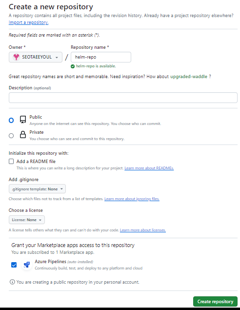
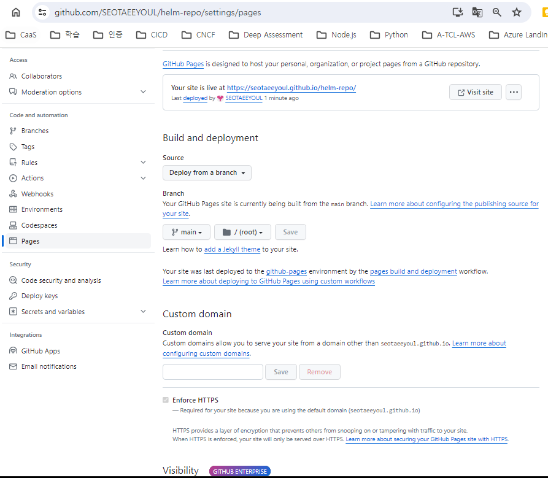
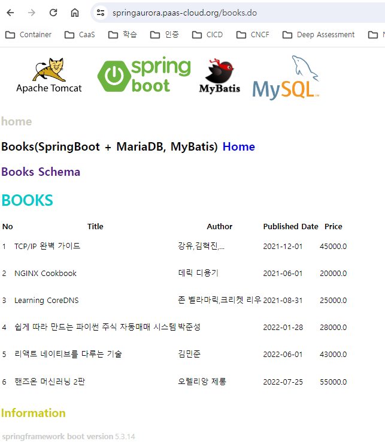

# [taeyeol-repo :: helm repo](https://seotaeeyoul.github.io/helm-repo/)  
> [taeyeol-repo :: helm repo](https://github.com/SEOTAEEYOUL/helm-repo)  
> [GitHub Pages 사이트의 사용자 지정 도메인 관리](https://docs.github.com/articles/setting-up-your-pages-site-repository/)  

## 1. github 에 새로운 Repository 생성
- helm-repo 생성
  

## 2. 해당 Repository 접근을 위한 URL 을 설정
- https://seotaeeyoul.github.io/helm-repo/
  

## 3. Local 에 Git Repository 생성
```
PS > git clone https://github.com/SEOTAEEYOUL/helm-repo.git
Cloning into 'helm-repo'...
warning: You appear to have cloned an empty repository.
PS > 
```

## 4. chart 패키징 작업 및 github 에 패키지 파일 업로드
```
PS > git add .
warning: in the working copy of 'springmysql/.helmignore', LF will be replaced by CRLF the next time Git touches it
warning: in the working copy of 'springmysql/Chart.yaml', LF will be replaced by CRLF the next time Git touches it
warning: in the working copy of 'springmysql/templates/NOTES.txt', LF will be replaced by CRLF the next time 
Git touches it
warning: in the working copy of 'springmysql/templates/_helpers.tpl', LF will be replaced by CRLF the next time Git touches it
warning: in the working copy of 'springmysql/templates/deployment.yaml', LF will be replaced by CRLF the next time Git touches it
warning: in the working copy of 'springmysql/templates/hpa.yaml', LF will be replaced by CRLF the next time Git touches it
warning: in the working copy of 'springmysql/templates/ingress.yaml', LF will be replaced by CRLF the next time Git touches it
warning: in the working copy of 'springmysql/templates/service.yaml', LF will be replaced by CRLF the next time Git touches it
warning: in the working copy of 'springmysql/templates/serviceaccount.yaml', LF will be replaced by CRLF the 
next time Git touches it
warning: in the working copy of 'springmysql/templates/tests/test-connection.yaml', LF will be replaced by CRLF the next time Git touches it
warning: in the working copy of 'springmysql/values.yaml', LF will be replaced by CRLF the next time Git touches it
PS > git commit -m "20230216 springmysql repo 추가"
[main (root-commit) 21a9c80] 20230216 springmysql repo 추가
 13 files changed, 520 insertions(+)
 create mode 100644 README.md
 create mode 100644 springmysql/.helmignore
 create mode 100644 springmysql/Chart.yaml
 create mode 100644 springmysql/templates/NOTES.txt
 create mode 100644 springmysql/templates/_helpers.tpl
 create mode 100644 springmysql/templates/deployment.yaml
 create mode 100644 springmysql/templates/hpa.yaml
 create mode 100644 springmysql/templates/ingress.yaml
 create mode 100644 springmysql/templates/secret.yaml
 create mode 100644 springmysql/templates/service.yaml
 create mode 100644 springmysql/templates/serviceaccount.yaml
 create mode 100644 springmysql/templates/tests/test-connection.yaml
 create mode 100644 springmysql/values.yaml
PS > git push
Enumerating objects: 18, done.
Counting objects: 100% (18/18), done.
Delta compression using up to 16 threads
Compressing objects: 100% (16/16), done.
Writing objects: 100% (18/18), 7.05 KiB | 516.00 KiB/s, done.
Total 18 (delta 0), reused 0 (delta 0), pack-reused 0
To https://github.com/SEOTAEEYOUL/helm-repo.git
 * [new branch]      main -> main
PS > git add .
PS > git commit -m "20230216 springmysql repo 추가"
[main f707523] 20230216 springmysql repo 추가
 1 file changed, 0 insertions(+), 0 deletions(-)
 create mode 100644 index.html
PS D:\workspace\helm-repo> git push 
Enumerating objects: 4, done.
Counting objects: 100% (4/4), done.
Delta compression using up to 16 threads
Compressing objects: 100% (2/2), done.
Writing objects: 100% (3/3), 334 bytes | 25.00 KiB/s, done.
Total 3 (delta 0), reused 0 (delta 0), pack-reused 0
To https://github.com/SEOTAEEYOUL/helm-repo.git
   21a9c80..f707523  main -> main
PS > helm package springmysql 
Successfully packaged chart and saved it to: D:\workspace\helm-repo\springmysql-0.1.0.tgz
PS > helm repo index .
PS > ls

    Directory: D:\workspace\helm-repo

Mode                 LastWriteTime         Length Name
----                 -------------         ------ ----
d----        2024-02-16  오후 5:40                springmysql
-a---        2024-02-16  오후 5:43              0 index.html
-a---        2024-02-16  오후 5:57            499 index.yaml
-a---        2024-02-16  오후 5:40             17 README.md
-a---        2024-02-16  오후 5:57           5151 springmysql-0.1.0.tgz

PS >          
```

#### Chart Packing 작업 : helm package springmysql 
#### helm 초기화 : helm repo index .
- index.yaml 에 package 정보 관리
#### git 에 올리기 : git add .; git commmit -m "springmysql 추가"; git push

- index.yaml 를 확인 -> 아래와 같이 차트 파일을 관리
```
apiVersion: v1
entries:
  springmysql:
  - apiVersion: v2
    appVersion: 1.16.0
    created: "2024-02-16T17:57:14.232815+09:00"
    description: A Helm chart for Kubernetes - SpringBoot 예제
    digest: 4b5609052f9a90ab126e5bcc78cbd1afcfe355d3cf006b1a71e1ae221ec80636
    icon: https://github.com/SEOTAEEYOUL/SpringBootMySQL/tree/main/icon/logo.png
    name: springmysql
    type: application
    urls:
    - springmysql-0.1.0.tgz
    version: 0.1.0
generated: "2024-02-16T17:57:14.230611+09:00"
```

### Helm Chart Upgrade
```
helm package springmysql
```


#### 1. Chart.yaml 에 버전 바꾸기 (0.1.0 -> 0.1.1)
#### 2. Helm Packaging
```
helm package springmysql
helm repo index --url https://seotaeeyoul.github.io/helm-repo/ .


git add .
git commit -m "20240217 springmysql 0.1.1 - Timezone 추가"
git push

helm repo update
helm search repo
```

#### 3. index.yaml 갱신하기 
```
helm repo index --url https://seotaeeyoul.github.io/helm-repo/ .
```
- index.yaml
    ```
    apiVersion: v1
    entries:
    springmysql:
    - apiVersion: v2
        appVersion: 1.16.0
        created: "2024-02-16T23:59:30.3678427+09:00"
        description: A Helm chart for Kubernetes - SpringBoot 예제
        digest: 974a61508394af3e2feb7535f6f542d3be88799f2d0321c7453ee95aeaa49d68
        icon: https://github.com/SEOTAEEYOUL/SpringBootMySQL/tree/main/icon/logo.png
        name: springmysql
        type: application
        urls:
        - https://seotaeeyoul.github.io/helm-repo/springmysql-0.1.1.tgz
        version: 0.1.1
    - apiVersion: v2
        appVersion: 1.16.0
        created: "2024-02-16T23:59:30.3673165+09:00"
        description: A Helm chart for Kubernetes - SpringBoot 예제
        digest: 8280560e172bbe00d6a04681abcb62d6940a544b0c97711e7ca5da5d85266d0e
        icon: https://github.com/SEOTAEEYOUL/SpringBootMySQL/tree/main/icon/logo.png
        name: springmysql
        type: application
        urls:
        - https://seotaeeyoul.github.io/helm-repo/springmysql-0.1.0.tgz
        version: 0.1.0
    generated: "2024-02-16T23:59:30.3667916+09:00"
    ```

#### 4. git 에 올리기
```
git add .
git commit -m "20240217 springmysql 0.1.1 - Timezone 추가"
git push
```

#### 5. repo update 및 검색
```
helm repo update
helm search repo
```
```
PS > helm repo update
Hang tight while we grab the latest from your chart repositories...
...Successfully got an update from the "taeyeol-repo" chart repository
Update Complete. ⎈Happy Helming!⎈
PS > helm search repo  
NAME                            CHART VERSION   APP VERSION     DESCRIPTION
taeyeol-repo/springmysql        0.1.1           1.16.0          A Helm chart for Kubernetes - SpringBoot 예제        
PS > 
```

#### 6. 신규 버전 배포하기
```
helm upgrade springaurora taeyeol-repo/springmysql -f custom-values.yaml
helm upgrade springaurora taeyeol-repo/springmysql -f custom-values.yaml --version 0.1.1
```

## 5. helm chart 를 등록하고 클러스터에 배포
```
helm repo add taeyeol-repo https://seotaeeyoul.github.io/helm-repo/
helm repo list 
helm search repo 
helm search repo taeyeol-repo
helm install springaurora taeyeol-repo/springmysql
helm ls 
kubectl get secret,pods,svc,ep,ing
helm upgrade springaurora taeyeol-repo/springmysql -f custom-values.yaml
```

```
PS > helm repo add taeyeol-repo https://seotaeeyoul.github.io/helm-repo/
"taeyeol-repo" has been added to your repositories
PS D:\workspace\SpringBootMySQL> helm repo update
Hang tight while we grab the latest from your chart repositories...
...Successfully got an update from the "taeyeol-repo" chart repository
Update Complete. ⎈Happy Helming!⎈
PS > helm repo list  
NAME            URL
taeyeol-repo    https://seotaeeyoul.github.io/helm-repo/
PS > helm search repo
NAME                            CHART VERSION   APP VERSION     DESCRIPTION

taeyeol-repo/springmysql        0.1.0           1.16.0          A Helm chart for Kubernetes - SpringBoot 예제
PS > helm search repo taeyeol-repo
NAME                            CHART VERSION   APP VERSION     DESCRIPTION

taeyeol-repo/springmysql        0.1.0           1.16.0          A Helm chart for Kubernetes - SpringBoot 예제
PS > helm install springaurora taeyeol-repo/springmysql
W0216 18:07:36.889430   26108 warnings.go:70] unknown field "spec.template.spec.env"
NAME: springaurora
LAST DEPLOYED: Fri Feb 16 18:07:36 2024
NAMESPACE: default
STATUS: deployed
REVISION: 1
NOTES:
1. Get the application URL by running these commands:
  http://springaurora.paas-cloud.org/
PS > helm ls
NAME            NAMESPACE       REVISION        UPDATED                                 STATUS    CHART                   APP VERSION
springaurora    default         1               2024-02-16 18:07:36.3009969 +0900 KST   deployed  springmysql-0.1.0       1.16.0
PS > kubectl get secret,pods,svc,ep,ing
NAME                                        TYPE                 DATA   AGE
secret/aurora-mysql-secret                  Opaque               1      69s
secret/sh.helm.release.v1.springaurora.v1   helm.sh/release.v1   1      69s

NAME                                            READY   STATUS    RESTARTS   AGE
pod/springaurora-springmysql-5f576b5858-c49th   1/1     Running   0          69s

NAME                               TYPE        CLUSTER-IP      EXTERNAL-IP   PORT(S)      
       AGE
service/kubernetes                 ClusterIP   172.20.0.1      <none>        443/TCP      
       156d
service/springaurora-springmysql   ClusterIP   172.20.170.53   <none>        8090/TCP,8080/TCP   70s

NAME                                 ENDPOINTS                             AGE
endpoints/kubernetes                 10.70.17.224:443,10.70.22.10:443      156d
endpoints/springaurora-springmysql   10.70.22.234:8090,10.70.22.234:8080   70s

NAME                                                 CLASS   HOSTS
 ADDRESS                                                                 PORTS   AGE      
ingress.networking.k8s.io/springaurora-springmysql   alb     springaurora.paas-cloud.org  
 alb-skcc-07456-p-eks-front-820588840.ap-northeast-2.elb.amazonaws.com   80      70s      
PS > 
```

## 6. 배포 확인, 정상적으로 chart 패키지 파일이 배포된 것을 확인 할 수 있음
```
PS > curl springaurora.paas-cloud.org
<html>
<head>
<meta http-equiv="Context-Type" content="text/html" charset="UTF-8" />
<title>MAIN PAGE</title>
<!-- link rel="icon" type="image/x-icon" href="/favicon.ico" -->
<link rel="icon" type="image/x-icon" href="/ico/favicon.ico">
<!--
<script type="text/javascript">
  location.href="/home.do";
</script>
-->
</head>
  
  <H1> <font color="#232F3E">Books(SpringBoot + MariaDB, MyBatis) Home </font></H1>       
  <H2> <font color="#232F3E"><a href="/home.do" style="text-decoration:none">Books Schema</a></font></H2>
  <H2> <font color="#232F3E"><a href="/books.do" style="text-decoration:none">Books</a></font></H2>
  <!--
  <table>
  <tr>
  <th>Name</th>
  <th>Property</th>
  <th>Length</th>
  </tr>
  <tr> <td> seqNo </td><td> int </td><td>4 Byte, -2,147,483,648 ~ 2,147,483,647</td> </tr>  <tr> <td> title </td><td> string </td><td>80</td> </tr>
  <tr> <td> author </td><td> string </td><td>40</td> </tr>
  <tr> <td> published_date </td><td> Date </td><td>yyyy-MM-dd</td></tr>
  <tr> <td> price </td><td> double </td><td>8 byte, (+/-)4.9E-324 ~ (+/-)1.7976931348623157E308</td></tr>
  </table>
  -->
  </br>
  <div class="column">
    <h1> <font color="#cc0000"> Information</font> | <font color="#FF9900">AWS Resource </font></h1>
  </div>
  <script src="https://d3js.org/d3.v3.min.js"></script>
  <script src="https://rawgit.com/jasondavies/d3-cloud/master/build/d3.layout.cloud.js" type="text/JavaScript"></script>
  <script>
    var width = 960,
        height = 500

    var svg = d3.select("body").append("svg")
        .attr("width", width)
        .attr("height", height);
    d3.csv("worddata.csv", function (data) {
        showCloud(data)
        setInterval(function(){
              showCloud(data)
        },2000)
    });
    //scale.linear: 선형적인 스케일로 표준화를 시킨다.
    //domain: 데이터의 범위, 입력 크기
    //range: 표시할 범위, 출력 크기
    //clamp: domain의 범위를 넘어간 값에 대하여 domain의 최대값으로 고정시킨다.
    wordScale = d3.scale.linear().domain([0, 100]).range([0, 150]).clamp(true);
    var keywords = ["IAM", "Elastic Kubernetes Service", "IaC"]
    width = 800
    var svg = d3.select("svg")
                .append("g")
                .attr("transform", "translate(" + width / 2 + "," + height / 2 + ")")     

    function showCloud(data) {
      d3.layout.cloud().size([width, height])
        //클라우드 레이아웃에 데이터 전달
        .words(data)
        .rotate(function (d) {
          return d.text.length > 3 ? 0 : 90;
        })
        //스케일로 각 단어의 크기를 설정
        .fontSize(function (d) {
          return wordScale(d.frequency);
        })
        //클라우드 레이아웃을 초기화 > end이벤트 발생 > 연결된 함수 작동
        .on("end", draw)
        .start();

      function draw(words) {
          var cloud = svg.selectAll("text").data(words)
          //Entering words
          cloud.enter()
            .append("text")
            .style("font-family", "overwatch")
            .style("fill", function (d) {
                return (keywords.indexOf(d.text) > -1 ? "#FF9900" : "#232F3E");
            })
            .style("fill-opacity", .5)
            .attr("text-anchor", "middle")
            .attr('font-size', 1)
            .text(function (d) {
                return d.text;
            });
          cloud
            .transition()
            .duration(600)
            .style("font-size", function (d) {
                return d.size + "px";
            })
            .attr("transform", function (d) {
                return "translate(" + [d.x, d.y] + ")rotate(" + d.rotate + ")";
            })
            .style("fill-opacity", 1);
      }
    }
  </script>
</body>
</html>
PS > kubectl get pods
NAME                                        READY   STATUS    RESTARTS   AGE
springaurora-springmysql-5f576b5858-c49th   1/1     Running   0          3m54s
PS > kubectl logs -f springaurora-springmysql-5f576b5858-c49th

  .   ____          _            __ _ _
 /\\ / ___'_ __ _ _(_)_ __  __ _ \ \ \ \
( ( )\___ | '_ | '_| | '_ \/ _` | \ \ \ \
 \\/  ___)| |_)| | | | | || (_| |  ) ) ) )
  '  |____| .__|_| |_|_| |_\__, | / / / /
 =========|_|==============|___/=/_/_/_/
 :: Spring Boot ::                (v2.6.2)

[2024-02-16 09:07:43:4691][main] INFO  c.e.demo.SpringBootSampleApplication - Starting SpringBootSampleApplication v0.0.1-SNAPSHOT using Java 17.0.2 on springaurora-springmysql-5f576b5858-c49th with PID 1 (/home/spring/app.war started by spring in /home/spring)
[2024-02-16 09:07:43:4695][main] INFO  c.e.demo.SpringBootSampleApplication - The following profiles are active: local
[2024-02-16 09:07:53:13903][main] INFO  o.s.b.w.e.tomcat.TomcatWebServer - Tomcat initialized with port(s): 8080 (http)
[2024-02-16 09:07:53:13991][main] INFO  o.a.coyote.http11.Http11NioProtocol - Initializing ProtocolHandler ["http-nio-8080"]
[2024-02-16 09:07:53:13992][main] INFO  o.a.catalina.core.StandardService - Starting service [Tomcat]
[2024-02-16 09:07:53:13993][main] INFO  o.a.catalina.core.StandardEngine - Starting Servlet engine: [Apache Tomcat/9.0.56]
09:07:56,384 |-INFO in ch.qos.logback.access.tomcat.LogbackValve[null] - Could NOT configuration file [/tmp/tomcat.8080.6411387041110104253/logback-access.xml] using property "catalina.base"
09:07:56,384 |-INFO in ch.qos.logback.access.tomcat.LogbackValve[null] - Could NOT configuration file [/tmp/tomcat.8080.6411387041110104253/logback-access.xml] using property "catalina.home"
09:07:56,385 |-INFO in ch.qos.logback.access.tomcat.LogbackValve[null] - Found [logback-access.xml] as a resource.
09:07:56,387 |-INFO in ch.qos.logback.core.joran.spi.ConfigurationWatchList@d8305c2 - URL 
[jar:file:/home/spring/app.war!/WEB-INF/classes!/logback-access.xml] is not of type file  
09:07:56,442 |-INFO in ch.qos.logback.access.joran.action.ConfigurationAction - debug attribute not set
09:07:56,442 |-INFO in ch.qos.logback.core.joran.action.AppenderAction - About to instantiate appender of type [ch.qos.logback.core.ConsoleAppender]
09:07:56,442 |-INFO in ch.qos.logback.core.joran.action.AppenderAction - Naming appender as [STDOUT]
09:07:56,442 |-INFO in ch.qos.logback.core.joran.action.NestedComplexPropertyIA - Assuming default type [ch.qos.logback.access.PatternLayoutEncoder] for [encoder] property
09:07:56,459 |-INFO in ch.qos.logback.core.joran.action.AppenderRefAction - Attaching appender named [STDOUT] to ch.qos.logback.access.tomcat.LogbackValve[null]
09:07:56,459 |-INFO in ch.qos.logback.access.joran.action.ConfigurationAction - End of configuration.
09:07:56,459 |-INFO in ch.qos.logback.access.joran.JoranConfigurator@56bca85b - Registering current configuration as safe fallback point
09:07:56,459 |-INFO in ch.qos.logback.access.tomcat.LogbackValve[null] - Done configuring 
[2024-02-16 09:07:59:20597][main] INFO  org.apache.jasper.servlet.TldScanner - At least one JAR was scanned for TLDs yet contained no TLDs. Enable debug logging for this logger for a complete list of JARs that were scanned but no TLDs were found in them. Skipping unneeded JARs during scanning can improve startup time and JSP compilation time.
[2024-02-16 09:08:00:21742][main] INFO  o.a.c.c.C.[Tomcat].[localhost].[/] - Initializing 
Spring embedded WebApplicationContext
[2024-02-16 09:08:00:21743][main] INFO  o.s.b.w.s.c.ServletWebServerApplicationContext - Root WebApplicationContext: initialization completed in 16633 ms
[2024-02-16 09:08:06:26996][main] INFO  o.s.b.a.w.s.WelcomePageHandlerMapping - Adding welcome page: class path resource [static/index.html]
[2024-02-16 09:08:08:28797][main] INFO  o.s.b.a.e.web.EndpointLinksResolver - Exposing 13 
endpoint(s) beneath base path '/actuator'
[2024-02-16 09:08:08:28993][main] INFO  o.a.coyote.http11.Http11NioProtocol - Starting ProtocolHandler ["http-nio-8080"]
[2024-02-16 09:08:08:29110][main] INFO  o.s.b.w.e.tomcat.TomcatWebServer - Tomcat started 
on port(s): 8080 (http) with context path ''
[2024-02-16 09:08:08:29292][main] INFO  c.e.demo.SpringBootSampleApplication - Started SpringBootSampleApplication in 27.9 seconds (JVM running for 30.432)
[2024-02-16 09:08:12:33309][http-nio-8080-exec-2] INFO  o.a.c.c.C.[Tomcat].[localhost].[/] - Initializing Spring DispatcherServlet 'dispatcherServlet'
[2024-02-16 09:08:12:33310][http-nio-8080-exec-2] INFO  o.s.web.servlet.DispatcherServlet 
- Initializing Servlet 'dispatcherServlet'
[2024-02-16 09:08:12:33312][http-nio-8080-exec-2] INFO  o.s.web.servlet.DispatcherServlet 
- Completed initialization in 2 ms
[ACCESS] 10.70.18.132 - - 2024-02-16 09:08:13.237 200 - 3834 793 ms
[ACCESS] 10.70.18.132 - - 2024-02-16 09:08:13.162 200 - 3834 719 ms
[ACCESS] 10.70.18.132 - - 2024-02-16 09:08:17.384 200 - 3834 6 ms
[ACCESS] 10.70.18.132 - - 2024-02-16 09:08:17.395 200 - 3834 18 ms
[ACCESS] 10.70.18.132 - - 2024-02-16 09:08:22.386 200 - 3834 9 ms
[ACCESS] 10.70.18.132 - - 2024-02-16 09:08:22.408 200 - 3834 11 ms
[ACCESS] 10.70.16.46 - - 2024-02-16 09:08:24.965 200 - 3834 12 ms
[ACCESS] 10.70.17.109 - - 2024-02-16 09:08:25.001 200 - 3834 16 ms
[ACCESS] 10.70.18.132 - - 2024-02-16 09:08:27.393 200 - 3834 15 ms
[ACCESS] 10.70.18.132 - - 2024-02-16 09:08:27.397 200 - 3834 19 ms
[ACCESS] 10.70.18.132 - - 2024-02-16 09:08:32.383 200 - 3834 5 ms
[ACCESS] 10.70.18.132 - - 2024-02-16 09:08:32.384 200 - 3834 6 ms
[ACCESS] 10.70.18.132 - - 2024-02-16 09:08:37.389 200 - 3834 11 ms
[ACCESS] 10.70.18.132 - - 2024-02-16 09:08:37.391 200 - 3834 13 ms
[ACCESS] 10.70.16.46 - - 2024-02-16 09:08:39.960 200 - 3834 4 ms
[ACCESS] 10.70.17.109 - - 2024-02-16 09:08:39.985 200 - 3834 5 ms
[ACCESS] 10.70.18.132 - - 2024-02-16 09:08:42.382 200 - 3834 5 ms
[ACCESS] 10.70.18.132 - - 2024-02-16 09:08:42.383 200 - 3834 4 ms
[ACCESS] 10.70.18.132 - - 2024-02-16 09:08:47.385 200 - 3834 8 ms
[ACCESS] 10.70.18.132 - - 2024-02-16 09:08:47.396 200 - 3834 19 ms
[ACCESS] 10.70.18.132 - - 2024-02-16 09:08:52.388 200 - 3834 11 ms
[ACCESS] 10.70.18.132 - - 2024-02-16 09:08:52.389 200 - 3834 11 ms
[ACCESS] 10.70.16.46 - - 2024-02-16 09:08:54.968 200 - 3834 4 ms
[ACCESS] 10.70.17.109 - - 2024-02-16 09:08:54.988 200 - 3834 4 ms
[ACCESS] 10.70.18.132 - - 2024-02-16 09:08:57.383 200 - 3834 5 ms
[ACCESS] 10.70.18.132 - - 2024-02-16 09:08:57.384 200 - 3834 7 ms
[ACCESS] 10.70.18.132 - - 2024-02-16 09:09:02.381 200 - 3834 4 ms
[ACCESS] 10.70.18.132 - - 2024-02-16 09:09:02.385 200 - 3834 8 ms
[ACCESS] 10.70.18.132 - - 2024-02-16 09:09:07.387 200 - 3834 7 ms
[ACCESS] 10.70.18.132 - - 2024-02-16 09:09:07.388 200 - 3834 9 ms
[ACCESS] 10.70.16.46 - - 2024-02-16 09:09:09.970 200 - 3834 5 ms
[ACCESS] 10.70.17.109 - - 2024-02-16 09:09:09.995 200 - 3834 4 ms
[ACCESS] 10.70.18.132 - - 2024-02-16 09:09:12.381 200 - 3834 3 ms
[ACCESS] 10.70.18.132 - - 2024-02-16 09:09:12.382 200 - 3834 5 ms
[ACCESS] 10.70.18.132 - - 2024-02-16 09:09:17.382 200 - 3834 5 ms
[ACCESS] 10.70.18.132 - - 2024-02-16 09:09:17.385 200 - 3834 8 ms
[ACCESS] 10.70.18.132 - - 2024-02-16 09:09:22.383 200 - 3834 5 ms
[ACCESS] 10.70.18.132 - - 2024-02-16 09:09:22.384 200 - 3834 7 ms
[ACCESS] 10.70.16.46 - - 2024-02-16 09:09:24.974 200 - 3834 3 ms
[ACCESS] 10.70.17.109 - - 2024-02-16 09:09:25.003 200 - 3834 3 ms
[ACCESS] 10.70.18.132 - - 2024-02-16 09:09:27.382 200 - 3834 5 ms
[ACCESS] 10.70.18.132 - - 2024-02-16 09:09:27.381 200 - 3834 3 ms
[ACCESS] 10.70.18.132 - - 2024-02-16 09:09:32.381 200 - 3834 4 ms
[ACCESS] 10.70.18.132 - - 2024-02-16 09:09:32.390 200 - 3834 6 ms
[ACCESS] 10.70.18.132 - - 2024-02-16 09:09:37.383 200 - 3834 6 ms
[ACCESS] 10.70.18.132 - - 2024-02-16 09:09:37.384 200 - 3834 7 ms
[ACCESS] 10.70.16.46 - - 2024-02-16 09:09:39.983 200 - 3834 5 ms
[ACCESS] 10.70.17.109 - - 2024-02-16 09:09:40.011 200 - 3834 4 ms
[ACCESS] 10.70.18.132 - - 2024-02-16 09:09:42.382 200 - 3834 4 ms
[ACCESS] 10.70.18.132 - - 2024-02-16 09:09:42.385 200 - 3834 7 ms
[ACCESS] 10.70.18.132 - - 2024-02-16 09:09:47.382 200 - 3834 4 ms
[ACCESS] 10.70.18.132 - - 2024-02-16 09:09:47.382 200 - 3834 4 ms
[ACCESS] 10.70.18.132 - - 2024-02-16 09:09:52.384 200 - 3834 6 ms
[ACCESS] 10.70.18.132 - - 2024-02-16 09:09:52.412 200 - 3834 7 ms
[ACCESS] 10.70.16.46 - - 2024-02-16 09:09:54.991 200 - 3834 4 ms
[ACCESS] 10.70.17.109 - - 2024-02-16 09:09:55.019 200 - 3834 4 ms
[ACCESS] 10.70.18.132 - - 2024-02-16 09:09:57.381 200 - 3834 4 ms
[ACCESS] 10.70.18.132 - - 2024-02-16 09:09:57.385 200 - 3834 8 ms
[ACCESS] 10.70.18.132 - - 2024-02-16 09:10:02.381 200 - 3834 4 ms
[ACCESS] 10.70.18.132 - - 2024-02-16 09:10:02.382 200 - 3834 3 ms
[ACCESS] 10.70.18.132 - - 2024-02-16 09:10:07.380 200 - 3834 3 ms
[ACCESS] 10.70.18.132 - - 2024-02-16 09:10:07.380 200 - 3834 2 ms
[ACCESS] 10.70.16.46 - - 2024-02-16 09:10:10.006 200 - 3834 12 ms
[ACCESS] 10.70.17.109 - - 2024-02-16 09:10:10.049 200 - 3834 17 ms
[ACCESS] 211.45.60.5 - - 2024-02-16 09:10:11.131 200 - 3834 5 ms
[ACCESS] 10.70.18.132 - - 2024-02-16 09:10:12.384 200 - 3834 6 ms
[ACCESS] 10.70.18.132 - - 2024-02-16 09:10:12.389 200 - 3834 12 ms
[ACCESS] 10.70.18.132 - - 2024-02-16 09:10:17.381 200 - 3834 4 ms
[ACCESS] 10.70.18.132 - - 2024-02-16 09:10:17.385 200 - 3834 4 ms
[ACCESS] 10.70.18.132 - - 2024-02-16 09:10:22.381 200 - 3834 4 ms
[ACCESS] 10.70.18.132 - - 2024-02-16 09:10:22.387 200 - 3834 10 ms
[ACCESS] 10.70.16.46 - - 2024-02-16 09:10:24.997 200 - 3834 2 ms
[ACCESS] 10.70.17.109 - - 2024-02-16 09:10:25.035 200 - 3834 3 ms
[ACCESS] 10.70.18.132 - - 2024-02-16 09:10:27.380 200 - 3834 3 ms
[ACCESS] 10.70.18.132 - - 2024-02-16 09:10:27.380 200 - 3834 2 ms
[ACCESS] 10.70.18.132 - - 2024-02-16 09:10:32.380 200 - 3834 2 ms
[ACCESS] 10.70.18.132 - - 2024-02-16 09:10:32.382 200 - 3834 5 ms
[ACCESS] 10.70.18.132 - - 2024-02-16 09:10:37.381 200 - 3834 4 ms
[ACCESS] 10.70.18.132 - - 2024-02-16 09:10:37.382 200 - 3834 5 ms
[ACCESS] 10.70.16.46 - - 2024-02-16 09:10:40.000 200 - 3834 3 ms
[ACCESS] 10.70.17.109 - - 2024-02-16 09:10:40.038 200 - 3834 3 ms
[ACCESS] 10.70.18.132 - - 2024-02-16 09:10:42.381 200 - 3834 4 ms
[ACCESS] 10.70.18.132 - - 2024-02-16 09:10:42.382 200 - 3834 5 ms
[ACCESS] 10.70.18.132 - - 2024-02-16 09:10:47.381 200 - 3834 4 ms
[ACCESS] 10.70.18.132 - - 2024-02-16 09:10:47.381 200 - 3834 4 ms
[ACCESS] 10.70.18.132 - - 2024-02-16 09:10:52.380 200 - 3834 4 ms
[ACCESS] 10.70.18.132 - - 2024-02-16 09:10:52.382 200 - 3834 3 ms
[ACCESS] 10.70.16.46 - - 2024-02-16 09:10:55.005 200 - 3834 4 ms
[ACCESS] 10.70.17.109 - - 2024-02-16 09:10:55.047 200 - 3834 4 ms
[ACCESS] 10.70.18.132 - - 2024-02-16 09:10:57.381 200 - 3834 3 ms
[ACCESS] 10.70.18.132 - - 2024-02-16 09:10:57.384 200 - 3834 7 ms
[ACCESS] 10.70.18.132 - - 2024-02-16 09:11:02.384 200 - 3834 2 ms
[ACCESS] 10.70.18.132 - - 2024-02-16 09:11:02.385 200 - 3834 9 ms
[ACCESS] 10.70.18.132 - - 2024-02-16 09:11:07.381 200 - 3834 4 ms
[ACCESS] 10.70.18.132 - - 2024-02-16 09:11:07.382 200 - 3834 5 ms
[ACCESS] 10.70.16.46 - - 2024-02-16 09:11:10.009 200 - 3834 3 ms
[ACCESS] 10.70.17.109 - - 2024-02-16 09:11:10.054 200 - 3834 3 ms
[2024-02-16 09:11:11:211913][http-nio-8080-exec-9] INFO  com.zaxxer.hikari.HikariDataSource - HikariPool-1 - Starting...
[ACCESS] 10.70.18.132 - - 2024-02-16 09:11:12.446 200 - 3834 6 ms
[ACCESS] 10.70.18.132 - - 2024-02-16 09:11:12.450 200 - 3834 13 ms
[2024-02-16 09:11:14:215219][http-nio-8080-exec-9] INFO  com.zaxxer.hikari.HikariDataSource - HikariPool-1 - Start completed.
[ACCESS] 10.70.18.132 - - 2024-02-16 09:11:17.443 200 - 3834 3 ms
[ACCESS] 10.70.18.132 - - 2024-02-16 09:11:17.448 200 - 3834 11 ms
[2024-02-16 09:11:19:220288][http-nio-8080-exec-7] WARN  o.a.c.util.SessionIdGeneratorBase - Creation of SecureRandom instance for session ID generation using [SHA1PRNG] took [178] milliseconds.
[ACCESS] 211.45.60.5 - - 2024-02-16 09:11:19.553 200 https://springaurora.paas-cloud.org/ 
- 9326 ms
[ACCESS] 211.45.60.5 - - 2024-02-16 09:11:19.555 200 https://springaurora.paas-cloud.org/ 
- 6918 ms
[ACCESS] 211.45.60.5 - - 2024-02-16 09:11:19.561 200 https://springaurora.paas-cloud.org/ 
- 8625 ms
[ACCESS] 10.70.18.132 - - 2024-02-16 09:11:22.382 200 - 3834 5 ms
[ACCESS] 10.70.18.132 - - 2024-02-16 09:11:22.385 200 - 3834 8 ms
[ACCESS] 10.70.16.46 - - 2024-02-16 09:11:25.016 200 - 3834 5 ms
[ACCESS] 10.70.17.109 - - 2024-02-16 09:11:25.062 200 - 3834 3 ms
[ACCESS] 10.70.18.132 - - 2024-02-16 09:11:27.385 200 - 3834 6 ms
[ACCESS] 10.70.18.132 - - 2024-02-16 09:11:27.395 200 - 3834 16 ms
[ACCESS] 10.70.18.132 - - 2024-02-16 09:11:32.381 200 - 3834 3 ms
[ACCESS] 10.70.18.132 - - 2024-02-16 09:11:32.381 200 - 3834 3 ms
[ACCESS] 10.70.18.132 - - 2024-02-16 09:11:37.389 200 - 3834 10 ms
[ACCESS] 10.70.18.132 - - 2024-02-16 09:11:37.390 200 - 3834 13 ms
[ACCESS] 10.70.16.46 - - 2024-02-16 09:11:40.020 200 - 3834 3 ms
[ACCESS] 10.70.17.109 - - 2024-02-16 09:11:40.070 200 - 3834 3 ms
[ACCESS] 10.70.18.132 - - 2024-02-16 09:11:42.381 200 - 3834 4 ms
[ACCESS] 10.70.18.132 - - 2024-02-16 09:11:42.381 200 - 3834 3 ms
[ACCESS] 10.70.18.132 - - 2024-02-16 09:11:47.385 200 - 3834 5 ms
[ACCESS] 10.70.18.132 - - 2024-02-16 09:11:47.386 200 - 3834 6 ms
[ACCESS] 10.70.18.132 - - 2024-02-16 09:11:52.383 200 - 3834 5 ms
[ACCESS] 10.70.18.132 - - 2024-02-16 09:11:52.384 200 - 3834 6 ms
PS > 
```

  


```
PS > helm upgrade springaurora taeyeol-repo/springmysql -f custom-values.yaml
Release "springaurora" has been upgraded. Happy Helming!
NAME: springaurora
LAST DEPLOYED: Sat Feb 17 01:57:09 2024
NAMESPACE: default
STATUS: deployed
REVISION: 4
NOTES:
1. Get the application URL by running these commands:
  http://springaurora.paas-cloud.org/
PS > 
PS > kubectl get deploy 
NAME                       READY   UP-TO-DATE   AVAILABLE   AGE
springaurora-springmysql   3/3     3            3           19m
PS > kubectl get deploy springaurora-springmysql -o yaml
apiVersion: apps/v1
kind: Deployment
metadata:
  annotations:
    deployment.kubernetes.io/revision: "3"
    meta.helm.sh/release-name: springaurora
    meta.helm.sh/release-namespace: default
  creationTimestamp: "2024-02-16T16:39:20Z"
  generation: 6
  labels:
    app.kubernetes.io/instance: springaurora
    app.kubernetes.io/managed-by: Helm
    app.kubernetes.io/name: springmysql
    app.kubernetes.io/version: 1.16.0
    helm.sh/chart: springmysql-0.1.3
  name: springaurora-springmysql
  namespace: default
  resourceVersion: "51451976"
  uid: ba9aa36a-8347-4753-ac53-152c701ee230
spec:
  progressDeadlineSeconds: 600
  replicas: 3
  revisionHistoryLimit: 10
  selector:
    matchLabels:
      app.kubernetes.io/instance: springaurora
      app.kubernetes.io/name: springmysql
  strategy:
    rollingUpdate:
      maxSurge: 25%
      maxUnavailable: 25%
    type: RollingUpdate
  template:
    metadata:
      creationTimestamp: null
      labels:
        app.kubernetes.io/instance: springaurora
        app.kubernetes.io/name: springmysql
    spec:
      affinity:
        nodeAffinity:
          requiredDuringSchedulingIgnoredDuringExecution:
            nodeSelectorTerms:
            - matchExpressions:
              - key: role
                operator: In
                values:
                - worker
        podAntiAffinity:
          preferredDuringSchedulingIgnoredDuringExecution:
          - podAffinityTerm:
              labelSelector:
                matchExpressions:
                - key: app
                  operator: In
                  values:
                  - springmysql
              topologyKey: failure-domain.beta.kubernetes.io/zone
            weight: 100
      containers:
      - env:
        - name: TITLE
          value: springaurora-springmysql
        - name: DB_DRIVER
          value: software.aws.rds.jdbc.mysql.Driver
        - name: DB_CONNECTION
          value: jdbc:mysql:aws://rds-skcc-07456-p-aurora-mysql.cluster-cgxth7zggvw1.ap-northeast-2.rds.amazonaws.com:3306/tutorial?serverTimezone=UTC&serverTimezone=UTC&characterEncoding=UTF-8&autoReconnect=true&failOverReadOnly=false&maxReconnects=10&characterEncoding=UTF-8
        - name: DB_USERNAME
          value: tutorial
        - name: DB_PASSWORD
          valueFrom:
            secretKeyRef:
              key: password
              name: aurora-mysql-secret
        - name: DATABASESERVER_PORT
          value: "3306"
        - name: TZ
          value: Asia/Seoul
        image: taeeyoul/springmysql:2.0.0
        imagePullPolicy: Always
        livenessProbe:
          failureThreshold: 3
          httpGet:
            path: /
            port: 8080
            scheme: HTTP
          initialDelaySeconds: 30
          periodSeconds: 5
          successThreshold: 1
          timeoutSeconds: 2
        name: springmysql
        ports:
        - containerPort: 8080
          name: http
          protocol: TCP
        readinessProbe:
          failureThreshold: 3
          httpGet:
            path: /
            port: 8080
            scheme: HTTP
          initialDelaySeconds: 30
          periodSeconds: 5
          successThreshold: 1
          timeoutSeconds: 2
        resources:
          limits:
            cpu: 500m
            memory: 512Mi
          requests:
            cpu: 250m
            memory: 256Mi
        securityContext: {}
        terminationMessagePath: /dev/termination-log
        terminationMessagePolicy: File
      dnsPolicy: ClusterFirst
      restartPolicy: Always
      schedulerName: default-scheduler
      securityContext: {}
      terminationGracePeriodSeconds: 30
status:
  availableReplicas: 3
  conditions:
  - lastTransitionTime: "2024-02-16T16:57:08Z"
    lastUpdateTime: "2024-02-16T16:57:08Z"
    message: Deployment has minimum availability.
    reason: MinimumReplicasAvailable
    status: "True"
    type: Available
  - lastTransitionTime: "2024-02-16T16:39:20Z"
    lastUpdateTime: "2024-02-16T16:58:58Z"
    message: ReplicaSet "springaurora-springmysql-545bf88cd4" has successfully progressed.
    reason: NewReplicaSetAvailable
    status: "True"
    type: Progressing
  observedGeneration: 6
  readyReplicas: 3
  replicas: 3
  updatedReplicas: 3
PS > 
```

```
PS > kubectl logs -f springaurora-springmysql-545bf88cd4-rsh9v

  .   ____          _            __ _ _
 /\\ / ___'_ __ _ _(_)_ __  __ _ \ \ \ \
( ( )\___ | '_ | '_| | '_ \/ _` | \ \ \ \
 \\/  ___)| |_)| | | | | || (_| |  ) ) ) )
  '  |____| .__|_| |_|_| |_\__, | / / / /
 =========|_|==============|___/=/_/_/_/
 :: Spring Boot ::                (v2.6.2)

[2024-02-17 01:57:54:5155][main] INFO  c.e.demo.SpringBootSampleApplication - Starting SpringBootSampleApplication v0.0.1-SNAPSHOT using Java 17.0.2 on springaurora-springmysql-545bf88cd4-rsh9v with PID 1 (/home/spring/app.war started by spring in /home/spring)
[2024-02-17 01:57:54:5218][main] INFO  c.e.demo.SpringBootSampleApplication - The following profiles are active: local
[2024-02-17 01:58:04:15096][main] INFO  o.s.b.w.e.tomcat.TomcatWebServer - Tomcat initialized with port(s): 8080 (http)
[2024-02-17 01:58:04:15121][main] INFO  o.a.coyote.http11.Http11NioProtocol - Initializing ProtocolHandler ["http-nio-8080"]
[2024-02-17 01:58:04:15122][main] INFO  o.a.catalina.core.StandardService - Starting service [Tomcat]
[2024-02-17 01:58:04:15123][main] INFO  o.a.catalina.core.StandardEngine - Starting Servlet engine: [Apache Tomcat/9.0.56]
01:58:08,224 |-INFO in ch.qos.logback.access.tomcat.LogbackValve[null] - Could NOT configuration file [/tmp/tomcat.8080.5623292367130629751/logback-access.xml] using property "catalina.base"
01:58:08,224 |-INFO in ch.qos.logback.access.tomcat.LogbackValve[null] - Could NOT configuration file [/tmp/tomcat.8080.5623292367130629751/logback-access.xml] using property "catalina.home"
01:58:08,224 |-INFO in ch.qos.logback.access.tomcat.LogbackValve[null] - Found [logback-access.xml] as a resource.   
01:58:08,225 |-INFO in ch.qos.logback.core.joran.spi.ConfigurationWatchList@75d0911a - URL [jar:file:/home/spring/app.war!/WEB-INF/classes!/logback-access.xml] is not of type file
01:58:08,230 |-INFO in ch.qos.logback.access.joran.action.ConfigurationAction - debug attribute not set
01:58:08,230 |-INFO in ch.qos.logback.core.joran.action.AppenderAction - About to instantiate appender of type [ch.qos.logback.core.ConsoleAppender]
01:58:08,230 |-INFO in ch.qos.logback.core.joran.action.AppenderAction - Naming appender as [STDOUT]
01:58:08,231 |-INFO in ch.qos.logback.core.joran.action.NestedComplexPropertyIA - Assuming default type [ch.qos.logback.access.PatternLayoutEncoder] for [encoder] property
01:58:08,241 |-INFO in ch.qos.logback.core.joran.action.AppenderRefAction - Attaching appender named [STDOUT] to ch.qos.logback.access.tomcat.LogbackValve[null]
01:58:08,241 |-INFO in ch.qos.logback.access.joran.action.ConfigurationAction - End of configuration.
01:58:08,241 |-INFO in ch.qos.logback.access.joran.JoranConfigurator@75e91545 - Registering current configuration as safe fallback point
01:58:08,241 |-INFO in ch.qos.logback.access.tomcat.LogbackValve[null] - Done configuring
[2024-02-17 01:58:11:22014][main] INFO  org.apache.jasper.servlet.TldScanner - At least one JAR was scanned for TLDs yet contained no TLDs. Enable debug logging for this logger for a complete list of JARs that were scanned but no TLDs were found in them. Skipping unneeded JARs during scanning can improve startup time and JSP compilation time.       
[2024-02-17 01:58:12:23414][main] INFO  o.a.c.c.C.[Tomcat].[localhost].[/] - Initializing Spring embedded WebApplicationContext
[2024-02-17 01:58:12:23414][main] INFO  o.s.b.w.s.c.ServletWebServerApplicationContext - Root WebApplicationContext: initialization completed in 17904 ms
[2024-02-17 01:58:18:28522][main] INFO  o.s.b.a.w.s.WelcomePageHandlerMapping - Adding welcome page: class path resource [static/index.html]
[2024-02-17 01:58:20:30700][main] INFO  o.s.b.a.e.web.EndpointLinksResolver - Exposing 13 endpoint(s) beneath base path '/actuator'
[2024-02-17 01:58:20:30907][main] INFO  o.a.coyote.http11.Http11NioProtocol - Starting ProtocolHandler ["http-nio-8080"]
[2024-02-17 01:58:20:31005][main] INFO  o.s.b.w.e.tomcat.TomcatWebServer - Tomcat started on port(s): 8080 (http) with context path ''
[2024-02-17 01:58:20:31107][main] INFO  c.e.demo.SpringBootSampleApplication - Started SpringBootSampleApplication in 29.303 seconds (JVM running for 32.271)
[2024-02-17 01:58:21:31916][http-nio-8080-exec-1] INFO  o.a.c.c.C.[Tomcat].[localhost].[/] - Initializing Spring DispatcherServlet 'dispatcherServlet'
[2024-02-17 01:58:21:31917][http-nio-8080-exec-1] INFO  o.s.web.servlet.DispatcherServlet - Initializing Servlet 'dispatcherServlet'
[2024-02-17 01:58:21:31920][http-nio-8080-exec-1] INFO  o.s.web.servlet.DispatcherServlet - Completed initialization in 3 ms
[ACCESS] 10.70.19.157 - - 2024-02-17 01:58:22.022 200 - 3938 694 ms
[ACCESS] 10.70.19.157 - - 2024-02-17 01:58:22.021 200 - 3938 704 ms
[ACCESS] 10.70.19.157 - - 2024-02-17 01:58:26.151 200 - 3938 37 ms
[ACCESS] 10.70.19.157 - - 2024-02-17 01:58:26.163 200 - 3938 30 ms
[ACCESS] 10.70.19.157 - - 2024-02-17 01:58:31.121 200 - 3938 7 ms
[ACCESS] 10.70.19.157 - - 2024-02-17 01:58:31.129 200 - 3938 6 ms
[ACCESS] 10.70.17.109 - - 2024-02-17 01:58:33.473 200 - 3938 37 ms
[ACCESS] 10.70.16.46 - - 2024-02-17 01:58:33.483 200 - 3938 26 ms
[ACCESS] 10.70.19.157 - - 2024-02-17 01:58:36.129 200 - 3938 16 ms
[ACCESS] 10.70.19.157 - - 2024-02-17 01:58:36.144 200 - 3938 19 ms
[ACCESS] 10.70.19.157 - - 2024-02-17 01:58:41.134 200 - 3938 13 ms
[ACCESS] 10.70.19.157 - - 2024-02-17 01:58:41.134 200 - 3938 16 ms
[ACCESS] 10.70.19.157 - - 2024-02-17 01:58:46.129 200 - 3938 15 ms
[ACCESS] 10.70.19.157 - - 2024-02-17 01:58:46.129 200 - 3938 15 ms
[ACCESS] 10.70.17.109 - - 2024-02-17 01:58:48.442 200 - 3938 8 ms
[ACCESS] 10.70.16.46 - - 2024-02-17 01:58:48.440 200 - 3938 4 ms
[ACCESS] 10.70.19.157 - - 2024-02-17 01:58:51.128 200 - 3938 11 ms
[ACCESS] 10.70.19.157 - - 2024-02-17 01:58:51.131 200 - 3938 18 ms
[ACCESS] 10.70.19.157 - - 2024-02-17 01:58:56.127 200 - 3938 12 ms
[ACCESS] 10.70.19.157 - - 2024-02-17 01:58:56.128 200 - 3938 13 ms
```